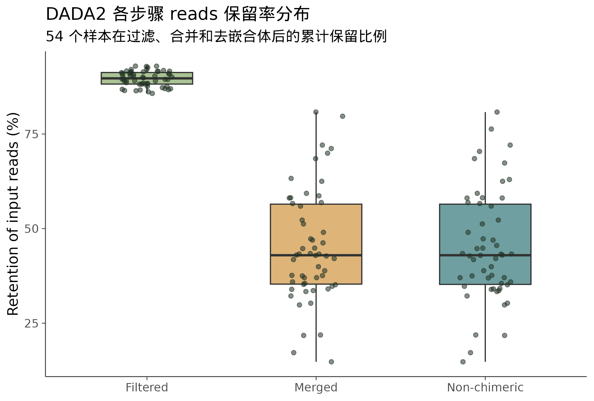
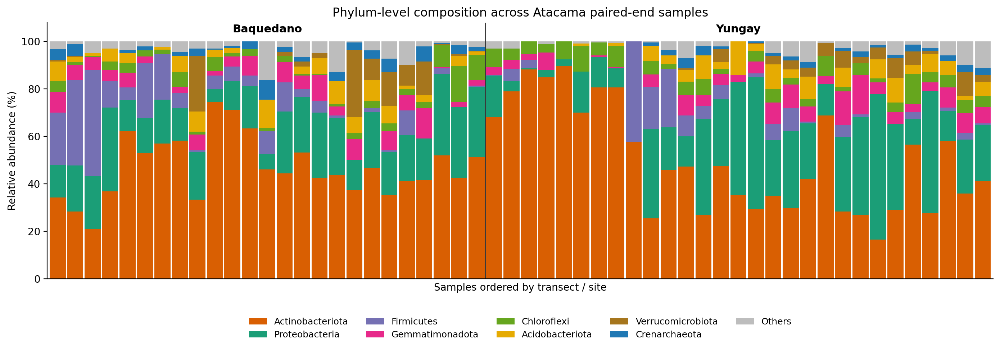
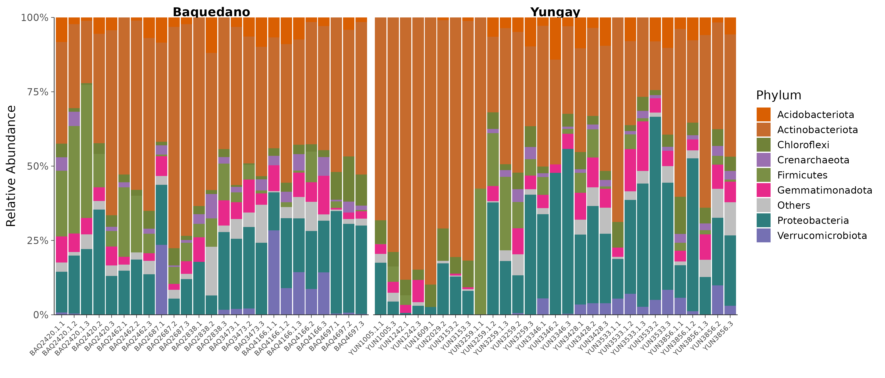
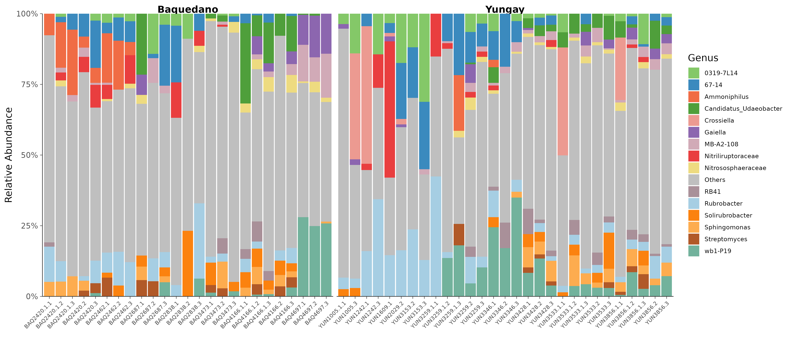
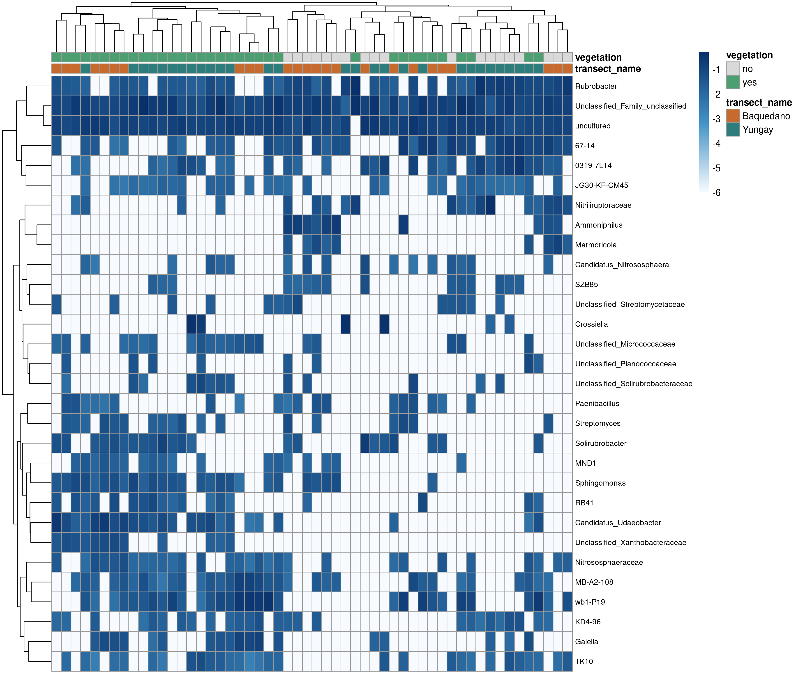
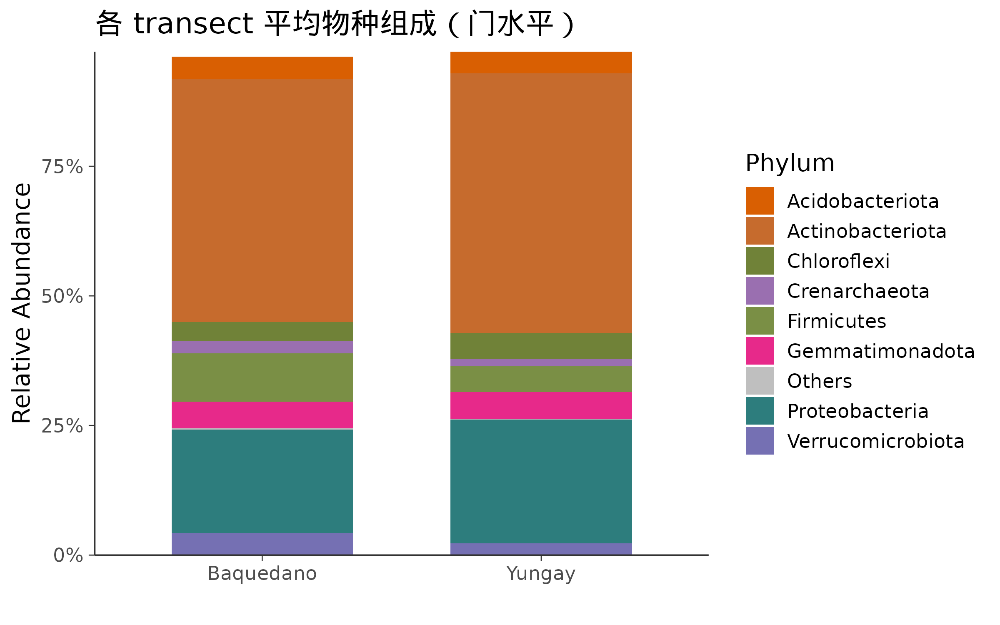
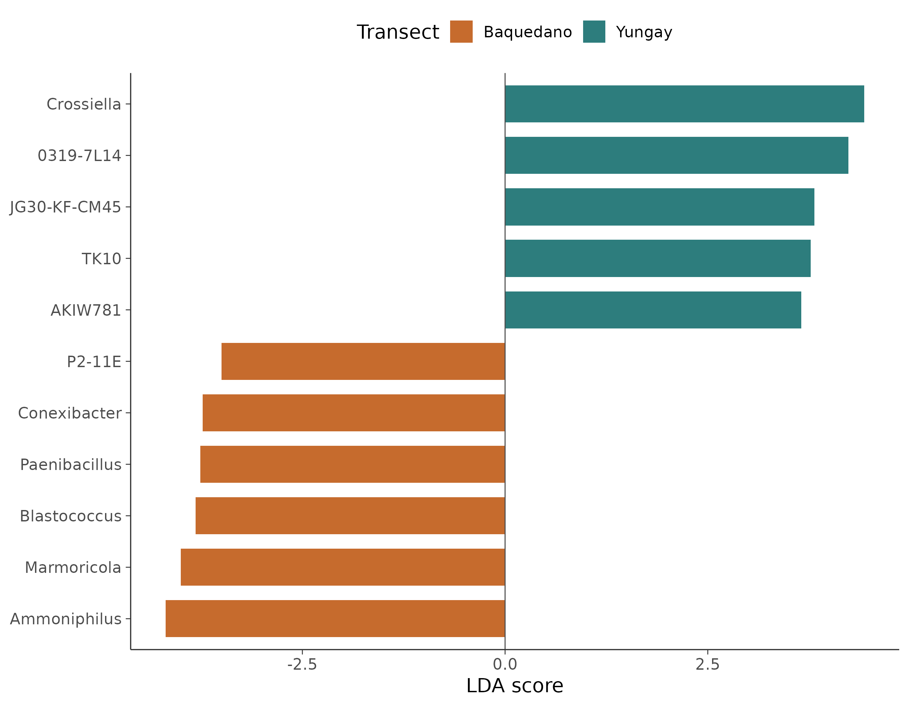
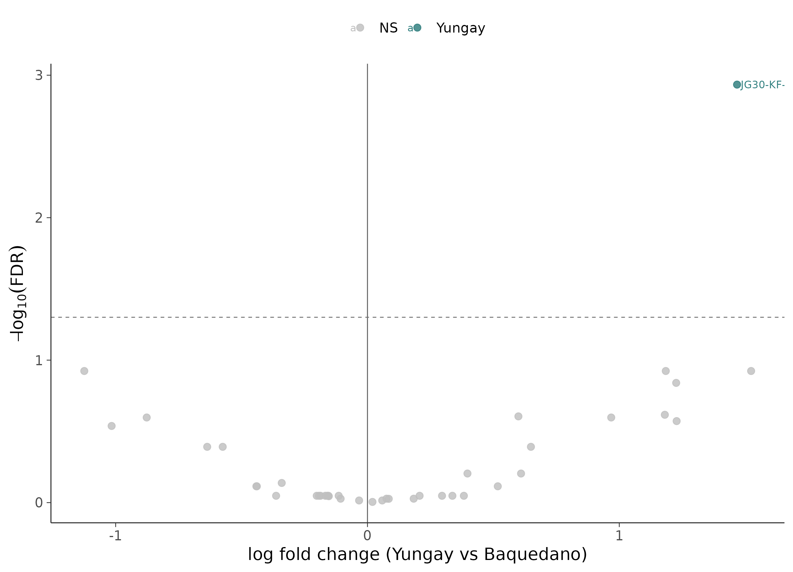
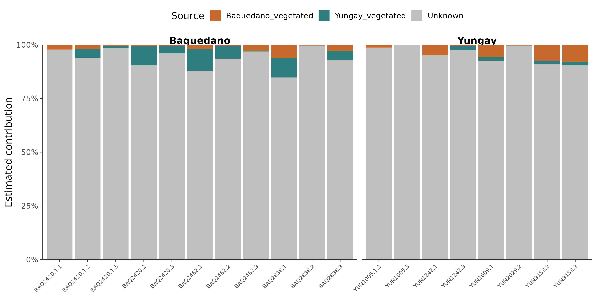

# 图表总览

下面汇总当前正文页面中实际嵌入的结果图，点击章节标题可跳回原文上下文。

## [16S 微生物组最佳实践系列（一）：只测一个基因，怎么就能知道有哪些细菌](series/01.md)

- 图数：0

## [16S 微生物组最佳实践系列（二）：搭建环境，拿到数据](series/02.md)

- 图数：2

## [16S 微生物组最佳实践系列（三）：DADA2 去噪——从噪声中找到真实序列](series/03.md)

- 图数：3

## [16S 微生物组最佳实践系列（四）：物种注释——给每个 ASV 一个名字](series/04.md)

- 图数：1

## [16S 微生物组最佳实践系列（五）：多样性分析——你的样本有多"丰富"，彼此有多"不同"](series/05.md)

- 图数：5

## [16S 微生物组最佳实践系列（六）：物种组成可视化——谁占了多少](series/06.md)

- 图数：4

## [16S 微生物组最佳实践系列（七）：差异物种分析——谁真的变了](series/07.md)

- 图数：2

## [16S 微生物组最佳实践系列（八）：PICRUSt2 功能预测——它们能做什么](series/08.md)

- 图数：2

## [16S 微生物组最佳实践系列（九）：共现网络分析——谁和谁总在一起](series/09.md)

- 图数：2

## [16S 微生物组最佳实践系列（十）：随机森林 Biomarker 筛选——谁最能代表这个群落](series/10.md)

- 图数：2

## [16S 微生物组最佳实践系列（十一）：SourceTracker 溯源分析——它们从哪里来](series/11.md)

- 图数：1

## [16S 微生物组最佳实践系列（十二）：微生物组-代谢组联合分析——跨组学的对话](series/12.md)

- 图数：2

## [16S 微生物组最佳实践系列（十三）：发表级图表与结果整合——最后一公里](series/13.md)

- 图数：1

