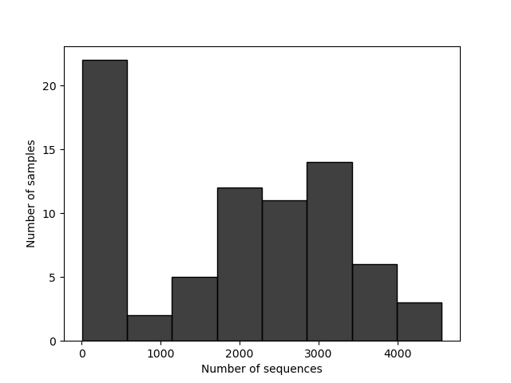

# 16S 微生物组最佳实践系列（二）：搭建环境，拿到数据

> 📋 教程信息
> - GitHub：[petemeng/16S-Tutorial](https://github.com/petemeng/16S-Tutorial)（完整代码与环境文件）
> - 数据来源：QIIME2 "Atacama soils" 教程数据集（双端土壤微生物组，V4 区）
> - 预计阅读：25 分钟 | 实操：30 分钟
> - 难度：⭐（5 星制）
> - 前置知识：读过本系列第 1 篇，会打开终端

---

## 本篇目标

上一篇我们搞清楚了 16S 分析的核心概念。这一篇我们开始动手——搭环境、下数据、和 QIIME2 打个照面。

读完这一篇，你会：

1. 在你的电脑或服务器上安装好 QIIME2
2. 理解 QIIME2 的 artifact 系统——它为什么存在、怎么用
3. 下载一个真实的 16S 数据集并导入 QIIME2
4. 第一次看到你的测序数据长什么样

---

## 我们选了什么数据

我们使用 QIIME2 官方的 **"Atacama soils"** 双端教程数据集。它来自智利阿塔卡马沙漠土壤样本，包含 Baquedano 和 Yungay 两条 transect 的多点采样，配套完整的 barcode 元数据和 EMP 双端测序文件。

为什么选这个？

**第一，它是真正的双端官方教程数据。** 既然这一套教程要讲标准双端流程，就不该再硬套单端的 Moving Pictures。Atacama 是 QIIME2 官方现成的 paired-end 教程路径，从导入、解复用、DADA2 到多样性分析都有标准做法。

**第二，它足够小，但不是玩具数据。** 官方提供的是 10% 子集，下载量大约 300 MB，几分钟内就能拿到；但元数据、环境梯度、样本数都是真实研究规模，后面做差异分析和多样性分析不会像 mock dataset 一样失真。

**第三，它的生物学问题很适合教学。** 这不是"肠道 vs 手掌"那种一眼分团的超强效应，而是更接近真实项目的环境梯度比较：不同 transect、不同 site、不同 depth 的土壤群落有差异，但差异没有夸张到遮住方法学细节。你会更清楚地看到"统计显著"和"视觉分离"不一定是同一回事。

---

## 安装 QIIME2

QIIME2 的安装有多种方式。我们用 conda——和 RNA-seq 系列保持一致，也是最省心的方式。

```bash
# ============================================================
# 安装 QIIME2（2024.5 版本）
# 这台服务器上直接走 defaults 源不稳定，所以先把官方 YAML
# 改写成清华镜像版，再创建环境
# ============================================================

# 如果你还没有 conda，先安装 Miniconda
# （RNA-seq 系列第 2 篇有详细步骤，这里不重复）

# 下载官方环境文件
curl --http1.1 -fL --retry 20 --retry-all-errors --retry-delay 2 \
    -o /tmp/qiime2-amplicon-2024.5.yml \
    https://data.qiime2.org/distro/amplicon/qiime2-amplicon-2024.5-py39-linux-conda.yml

# 改写 channel，避免 defaults / repo.anaconda.com 在服务器上卡住
python - <<'PY'
from pathlib import Path

src = Path("/tmp/qiime2-amplicon-2024.5.yml")
dst = Path("/tmp/qiime2-amplicon-2024.5-mirrored.yml")
lines = src.read_text(encoding="utf-8").splitlines()

out = []
in_channels = False
for line in lines:
    if line.startswith("channels:"):
        out.append(line)
        in_channels = True
        continue
    if in_channels and line.startswith("dependencies:"):
        out.extend([
            "- https://packages.qiime2.org/qiime2/2024.5/amplicon/released",
            "- bioconda",
            "- conda-forge",
            "- https://mirrors.tuna.tsinghua.edu.cn/anaconda/pkgs/main",
            "- https://mirrors.tuna.tsinghua.edu.cn/anaconda/pkgs/r",
        ])
        out.append(line)
        in_channels = False
        continue
    if not in_channels:
        out.append(line)

dst.write_text("\n".join(out) + "\n", encoding="utf-8")
print(dst)
PY

# 创建环境
conda env create -n qiime2-amplicon-2024.5 \
    --file /tmp/qiime2-amplicon-2024.5-mirrored.yml

# 激活环境
CONDA_BASE=$(conda info --base)
source "$CONDA_BASE/etc/profile.d/conda.sh"
conda activate qiime2-amplicon-2024.5

# 验证安装
qiime --version
```

```
📊 输出：
q2cli version 2024.5.0 Run `qiime info` for more version details.
```

如果你看到了版本号，说明安装成功了。

⚠️ **踩坑预警：安装失败的常见原因**

> **内存不足：** QIIME2 环境的解析（solving environment）阶段很吃内存。如果你的机器内存 < 4 GB，可能会卡住或报错。解决方案：用 `mamba` 替代 `conda` 做环境解析——速度快得多，内存占用也小：
>
> ```bash
> conda install -n base mamba -y
> mamba env create -n qiime2-amplicon-2024.5 \
>     --file qiime2-amplicon-2024.5-py39-linux-conda.yml
> ```
>
> **网络超时：** 国内服务器下载 conda 包可能很慢。配置清华镜像源（RNA-seq 系列第 2 篇有详细步骤）可以大幅加速。
>
> **版本冲突：** 如果你之前装过老版本的 QIIME2，不要在同一个环境里升级——直接创建一个新环境。不同版本的 QIIME2 依赖的包版本差异很大，混装会导致各种奇怪的报错。

---

## QIIME2 的 artifact 系统：先搞懂再动手

在下载数据之前，我们需要先理解 QIIME2 最独特的一个设计——artifact 系统。如果你不理解这个概念，后面每一条命令都会让你困惑。

### 什么是 artifact

在大多数生信工具里，输入是文件（FASTQ、BAM、TSV），输出也是文件。你可以随时用 `head`、`cat` 或 Excel 打开它们。

QIIME2 不一样。它把所有数据都包装成了一种特殊格式，后缀名是 **`.qza`**（QIIME2 Artifact）。`.qza` 文件本质上是一个 zip 压缩包，里面包含了：

1. **数据本身**（比如 FASTQ 文件、feature table、分类学注释等）
2. **元数据**（数据的类型是什么、用了什么方法生成的）
3. **完整的分析溯源记录**（provenance）——这份数据是从哪一步来的、每一步用了什么参数

另外还有 **`.qzv`** 文件（QIIME2 Visualization），专门用来存储可视化结果。你可以把 `.qzv` 文件拖到 https://view.qiime2.org 在浏览器里查看。

### 为什么要搞这么复杂

你可能觉得"直接用 FASTQ 和 TSV 不好吗，干嘛要包一层？"

**原因一：防止误用。** QIIME2 的每个命令都会检查输入数据的"语义类型"（semantic type）。比如 `qiime dada2 denoise-paired` 只接受 `SampleData[PairedEndSequencesWithQuality]` 类型的输入——如果你不小心传了一个 feature table，它会立刻报错，而不是默默地给你一个没有意义的结果。

**原因二：可追溯性。** 每个 `.qza` 文件都记录了它从哪里来、经过了哪些处理步骤。如果你半年后回头看一个分析结果，不用翻笔记本——打开 `.qza` 的 provenance 就能看到完整的分析历史。

**原因三：可复现性。** provenance 里不仅记录了你做了什么，还记录了每一步用的 QIIME2 版本和插件版本。这意味着别人拿到你的 `.qza` 文件就能知道怎么复现你的分析。

### 日常操作中你需要记住的

```
.qza = 数据（不能直接看，需要导出或者用 QIIME2 命令处理）
.qzv = 可视化（拖到 view.qiime2.org 就能看）
```

如果你想看 `.qza` 里到底装了什么，可以用 `qiime tools export` 把数据导出为常规格式（FASTQ、BIOM、TSV 等）。我们后面会经常用到这个操作——尤其是把数据导出到 R 做下游分析的时候。

---

## 创建项目目录

```bash
# ============================================================
# 创建项目目录结构
# ============================================================

mkdir -p ~/16s-atacama-tutorial/{data/raw/emp-paired-end-sequences,results,logs}
cd ~/16s-atacama-tutorial

# 记录版本信息
echo "=== Tool Versions ===" > logs/versions.log
echo "QIIME2: $(qiime --version)" >> logs/versions.log
echo "Date: $(date)" >> logs/versions.log
cat logs/versions.log
```

```
📊 输出：
=== Tool Versions ===
QIIME2: q2cli version 2024.5.0 Run `qiime info` for more version details.
Date: Mon Mar 16 13:18:12 CST 2026
```

---

## 下载数据

Atacama soils 数据集可以直接从 QIIME2 的数据服务器下载。

```bash
# ============================================================
# 下载 Atacama soils 10% paired-end 教程数据
# 包含：
#   - barcode FASTQ
#   - forward / reverse FASTQ
#   - 样本元数据文件（记录 transect、site、depth 等环境信息）
# ============================================================

# 如需代理加速，可取消下面两行注释
# export http_proxy="http://iyun70.com:7890"
# export https_proxy="http://iyun70.com:7890"

curl --http1.1 -fL --retry 20 --retry-all-errors --retry-delay 2 \
    -o data/sample-metadata.tsv \
    https://data.qiime2.org/2024.5/tutorials/atacama-soils/sample_metadata.tsv

curl --http1.1 -fL --retry 20 --retry-all-errors --retry-delay 2 \
    -o data/raw/emp-paired-end-sequences/forward.fastq.gz \
    https://data.qiime2.org/2024.5/tutorials/atacama-soils/10p/forward.fastq.gz

curl --http1.1 -fL --retry 20 --retry-all-errors --retry-delay 2 \
    -o data/raw/emp-paired-end-sequences/reverse.fastq.gz \
    https://data.qiime2.org/2024.5/tutorials/atacama-soils/10p/reverse.fastq.gz

curl --http1.1 -fL --retry 20 --retry-all-errors --retry-delay 2 \
    -o data/raw/emp-paired-end-sequences/barcodes.fastq.gz \
    https://data.qiime2.org/2024.5/tutorials/atacama-soils/10p/barcodes.fastq.gz

du -sh data/raw/emp-paired-end-sequences
ls -lh data/raw/emp-paired-end-sequences/
```

```
📊 输出：
310M    data/raw/emp-paired-end-sequences
-rw-rw-r-- 1 tly9658 tly9658  20M  barcodes.fastq.gz
-rw-rw-r-- 1 tly9658 tly9658 137M  forward.fastq.gz
-rw-rw-r-- 1 tly9658 tly9658 154M  reverse.fastq.gz
```

三个文件：`forward.fastq.gz`（正向 reads）、`reverse.fastq.gz`（反向 reads）和 `barcodes.fastq.gz`（条形码序列，用于拆分样本）。

这个数据集的测序方式是典型的 EMP 多样本混合测序：所有样本的 reads 先混在一起，再通过 barcode 序列解复用。和 RNA-seq 常见的"每个样本一对 FASTQ"不同，但在 16S 扩增子数据里非常常见。

### 看一眼样本元数据

```bash
# ============================================================
# 查看样本元数据——这是整个分析最重要的文件之一
# 它记录了每个样本的分组信息、采样时间等
# ============================================================

head -10 data/sample-metadata.tsv | column -t
echo ""
echo "样本总数："
tail -n +2 data/sample-metadata.tsv | wc -l
echo ""
echo "transect 分布："
tail -n +3 data/sample-metadata.tsv | \
    cut -f7 | sort | uniq -c | sort -rn
echo ""
echo "depth 分布："
tail -n +3 data/sample-metadata.tsv | \
    cut -f9 | sort -n | uniq -c
```

```
📊 输出：
sample-id    barcode-sequence  elevation  extract-concen  amplicon-concentration  extract-group-no  transect-name  site-name  depth  ph    ...
#q2:types    categorical       numeric    numeric         numeric                  categorical       categorical    categorical numeric numeric ...
BAQ1370.1.2  GCCCAAGTTCAC      1370       0.019           0.950                    B                 Baquedano      BAQ1370    2      7.98  ...
BAQ1370.3    GCGCCGAATCTT      1370       0.124           17.460                   E                 Baquedano      BAQ1370    2            ...
BAQ1370.1.3  ATAAAGAGGAGG      1370       1.200           0.960                    J                 Baquedano      BAQ1370    3      8.13  ...
BAQ1552.1.1  ATCCCAGCATGC      1552       0.722           18.830                   J                 Baquedano      BAQ1552    1      7.87  ...
BAQ1552.2    GCTTCCAGACAA      1552       0.017           2.000                    B                 Baquedano      BAQ1552    2            ...
BAQ2420.1.1  ACACAGTCCTGA      2420       0.350           7.400                    H                 Baquedano      BAQ2420    1      9.33  ...
BAQ2420.1.2  ATTATACGGCGC      2420       0.108           11.420                   H                 Baquedano      BAQ2420    2      9.36  ...
BAQ2420.2    TAAACGCGACTC      2420       0.089           10.060                   A                 Baquedano      BAQ2420    2      9.36  ...

样本总数：
75

transect 分布：
     43 Yungay
     32 Baquedano

depth 分布：
      8 1
     59 2
      8 3
```

这份元数据不是简单的"分组标签"，而是完整的环境信息表。最直接的两个变量是 `transect-name`（Baquedano vs Yungay）和 `depth`（1/2/3）。后面做 alpha、beta 多样性和差异分析时，我们会先从 `transect-name` 这条主线讲起。

💡 **关于样本元数据文件的格式**

> QIIME2 对元数据文件格式有严格要求：
>
> - 必须是 TSV（制表符分隔）格式
> - 第一列必须是 `sample-id`
> - **第二行必须是数据类型声明**（`#q2:types`），标注每一列是 `categorical`（分类型）还是 `numeric`（数值型）
> - 不允许有空行或不完整的行
>
> 格式错误是初学者最常遇到的 QIIME2 报错来源之一。如果你自己准备元数据文件，建议用 Keemei（一个 Google Sheets 插件）做格式检查，或者直接用 `qiime metadata tabulate` 验证。

---

## 将数据导入 QIIME2

原始 FASTQ 文件不能直接被 QIIME2 的分析命令使用——需要先导入为 `.qza` artifact。

```bash
# ============================================================
# 将 FASTQ 文件导入 QIIME2 artifact
# --type: 告诉 QIIME2 这是双端测序的多样本混合数据
# --input-format: 数据格式是 EMP 协议的双端测序
# ============================================================

qiime tools import \
    --type EMPPairedEndSequences \
    --input-path data/raw/emp-paired-end-sequences \
    --output-path data/emp-paired-end-sequences.qza

ls -lh data/emp-paired-end-sequences.qza
```

```
📊 输出：
-rw-rw-r-- 1 tly9658 tly9658 310M data/emp-paired-end-sequences.qza
```

310 MB 的 `.qza` 文件——里面包含了原始的 FASTQ 数据加上 QIIME2 的元数据。

### 按条形码拆分样本

这个数据集是多样本混合测序的，我们需要用 barcode 把不同样本的 reads 拆分开来：

```bash
# ============================================================
# 解复用（demultiplexing）：用 barcode 把 reads 分配到样本
# --p-rev-comp-mapping-barcodes: barcode 序列是反向互补的
#   （这取决于建库方案，EMP 协议需要这个参数）
# ============================================================

qiime demux emp-paired \
    --i-seqs data/emp-paired-end-sequences.qza \
    --m-barcodes-file data/sample-metadata.tsv \
    --m-barcodes-column barcode-sequence \
    --p-rev-comp-mapping-barcodes \
    --o-per-sample-sequences data/demux-full.qza \
    --o-error-correction-details data/demux-details.qza

# 官方 Atacama 教程会先做一次 30% 下采样，便于快速查看质量图
qiime demux subsample-paired \
    --i-sequences data/demux-full.qza \
    --p-fraction 0.3 \
    --o-subsampled-sequences data/demux-subsample.qza

qiime demux summarize \
    --i-data data/demux-subsample.qza \
    --o-visualization results/demux-subsample.qzv

qiime tools export \
    --input-path results/demux-subsample.qzv \
    --output-path demux-subsample/

# 过滤掉下采样后 reads 太少的样本，得到后续真正用于 DADA2 的 demux.qza
qiime demux filter-samples \
    --i-demux data/demux-subsample.qza \
    --m-metadata-file demux-subsample/per-sample-fastq-counts.tsv \
    --p-where 'CAST([forward sequence count] AS INT) > 100' \
    --o-filtered-demux data/demux.qza

qiime demux summarize \
    --i-data data/demux.qza \
    --o-visualization results/demux-summary.qzv

echo "解复用完成。可视化文件：results/demux-summary.qzv"
echo "用浏览器打开 https://view.qiime2.org 查看"
```

```
📊 输出：
Saved SampleData[PairedEndSequencesWithQuality] to: data/demux-full.qza
Saved ErrorCorrectionDetails to: data/demux-details.qza
Saved SampleData[PairedEndSequencesWithQuality] to: data/demux-subsample.qza
Saved Visualization to: results/demux-subsample.qzv
Exported results/demux-subsample.qzv as Visualization to directory demux-subsample/
Saved SampleData[PairedEndSequencesWithQuality] to: data/demux.qza
Saved Visualization to: results/demux-summary.qzv
解复用完成。可视化文件：results/demux-summary.qzv
```

⚠️ **踩坑预警：如果你的数据已经按样本拆分了**

> 很多测序公司会直接给你按样本拆分好的 FASTQ 文件（每个样本一对 `_R1.fastq.gz` 和 `_R2.fastq.gz`），而不是混合的 EMP 格式。这种情况下你不需要解复用，直接用另一种方式导入：
>
> ```bash
> qiime tools import \
>     --type 'SampleData[PairedEndSequencesWithQuality]' \
>     --input-path data/raw/ \
>     --input-format CasavaOneEightSingleLanePerSampleDirFmt \
>     --output-path data/demux.qza
> ```
>
> **关键区别**：`--type` 和 `--input-format` 的选择取决于你的数据格式。搞错了会报错，或者更糟——不报错但数据被错误解析。不确定的时候，先用 `ls` 看看你的文件命名格式，然后去 QIIME2 文档查对应的导入方式。

---

## 第一次看你的数据

解复用完成后，我们先看看数据的基本情况。把 `results/demux-summary.qzv` 拖到 https://view.qiime2.org（或者用 `qiime tools view results/demux-summary.qzv`），你会看到一个交互式的质量报告。

但我们也可以用命令行快速看几个关键数字：

```bash
# ============================================================
# 查看每个样本的 reads 数量
# 这里直接复用 demux-subsample 导出的 per-sample-fastq-counts.tsv
# ============================================================

echo "下采样后元数据样本数："
tail -n +3 data/sample-metadata.tsv | wc -l
echo ""
echo "downsample 后保留 >100 forward reads 的样本数："
awk -F '\t' 'NR>1 && $2>100 {n++} END {print n}' \
    demux-subsample/per-sample-fastq-counts.tsv
echo ""
echo "forward reads 概要："
awk -F '\t' 'NR>1 {print $2}' demux-subsample/per-sample-fastq-counts.tsv | \
    sort -n | awk '
        NR==1 {min=$1}
        {a[NR]=$1; sum+=$1}
        END {
            print "  最小:", min
            print "  最大:", a[NR]
            print "  中位数:", a[int((NR+1)/2)]
            print "  平均:", int(sum/NR)
        }'
```

在 `results/demux-subsample.qzv` 的可视化中，你会看到两张关键图：

**每个样本的 reads 数量分布。** 这套数据在下采样后依然差异很大——有的样本几乎没有 reads，有的样本还有四千多条。为了避免后续 DADA2 被低深度样本拖累，我们只保留 `forward sequence count > 100` 的 54 个样本进入下一篇。

**碱基质量随 reads 位置的变化。** 和 RNA-seq 类似，reads 末端的质量通常会下降。但在 16S 分析中，这张图还帮你决定一个关键参数：**在 DADA2 去噪时，正向和反向 reads 分别在哪个位置截断。** 这是下一篇的核心内容。

<!-- 图 1 位置：正向 reads 质量图 -->


<!-- 图 2 位置：反向 reads 质量图 -->


---

## 当前项目结构

```bash
find ~/16s-atacama-tutorial -maxdepth 2 -type f | \
    sed "s|$HOME/16s-atacama-tutorial/||" | sort
```

```
📊 输出：
data/demux-details.qza
data/demux-full.qza
data/demux-subsample.qza
data/demux.qza
data/emp-paired-end-sequences.qza
data/sample-metadata.tsv
logs/versions.log
results/demux-subsample.qzv
results/demux-summary.qzv
```

---

## 本篇小结

我们完成了三件事：安装了 QIIME2、下载并导入了 Atacama soils 双端数据集、完成了解复用和低深度样本过滤，并第一次查看了数据的基本质量。

更重要的是，我们理解了 QIIME2 的 artifact 系统——`.qza` 不是普通文件，而是带有类型检查和溯源记录的数据包。这个设计在刚接触时会觉得多此一举，但随着分析的推进，你会越来越体会到它在防错和追溯上的价值。

## 下一篇预告

数据到手了，接下来我们进入 16S 分析最关键的一步：**DADA2 去噪**。这一步从解复用后的双端 reads 中，推断出真实的 ASV 序列。去噪的质量直接决定了后续所有分析的可靠性。

下一篇我们会详细讲：DADA2 内部在做什么？正向和反向 reads 的截断位置怎么选？去噪后应该剩下多少 reads 才正常？以及——如果你的样本在去噪后 reads 数量暴跌，应该先查什么？

下篇见。

---

> 📌 本篇所有命令均来自实际运行记录。完整的脚本文件和日志可在 GitHub 仓库获取。

---

## 本系列导航

| 篇目 | 主题 | 状态 |
|------|------|------|
| 第 1 篇 | 只测一个基因，怎么就能知道有哪些细菌 | ✅ 已发布 |
| **第 2 篇** | **搭建环境，拿到数据** | **📍 本篇** |
| 第 3 篇 | DADA2 去噪——从噪声中找到真实序列 | 🔜 下一篇 |
| 第 4 篇 | 物种注释与系统发育树 | 即将发布 |
| 第 5 篇 | Alpha 和 Beta 多样性分析 | 即将发布 |
| 第 6 篇 | 物种组成可视化 | 即将发布 |
| 第 7 篇 | 差异物种分析：LEfSe + ANCOM-BC | 即将发布 |
| 第 8 篇 | PICRUSt2 功能预测 | 即将发布 |
| 第 9 篇 | 共现网络分析 | 即将发布 |
| 第 10 篇 | 随机森林 biomarker 筛选 | 即将发布 |
| 第 11 篇 | SourceTracker 溯源分析 | 即将发布 |
| 第 12 篇 | 微生物组-代谢组联合分析 | 即将发布 |
| 第 13 篇 | 发表级图表与结果整合 | 即将发布 |
