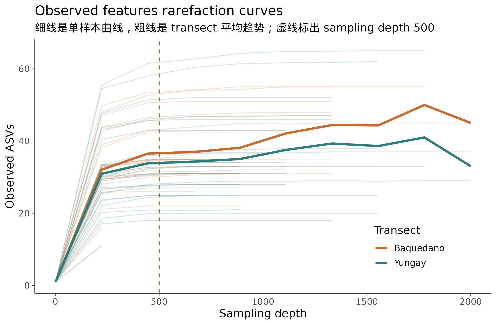
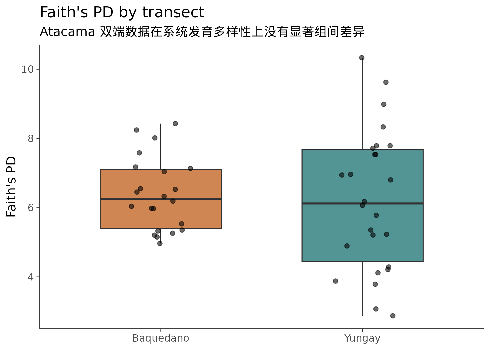
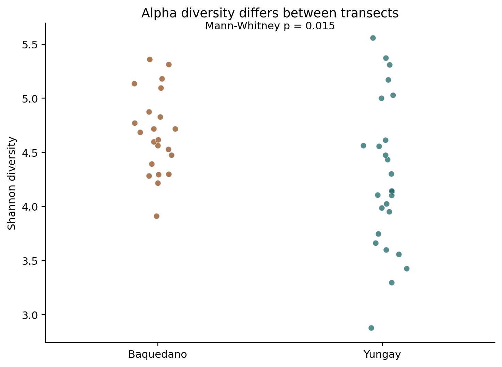
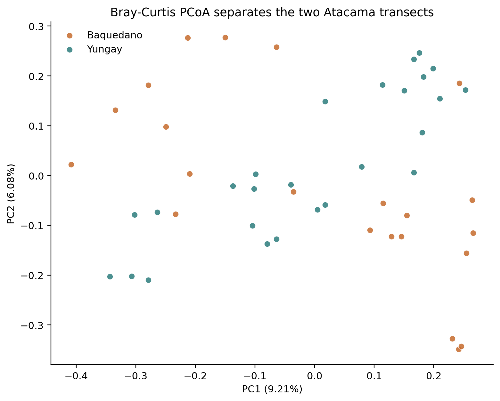
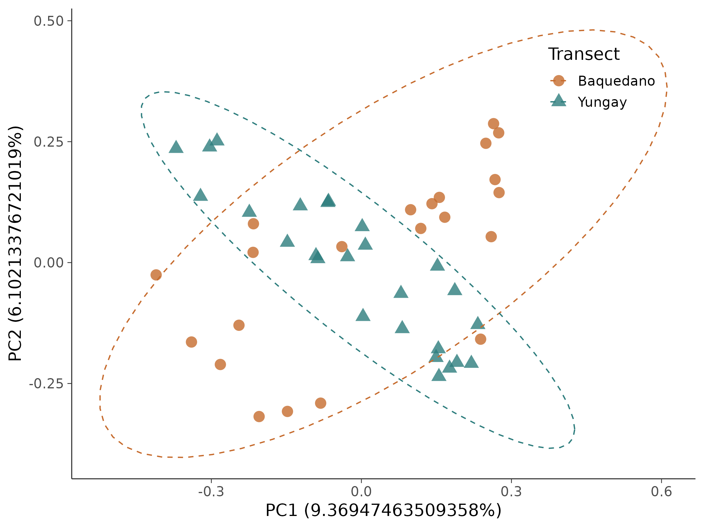

# 16S 微生物组最佳实践系列（五）：多样性分析——你的样本有多"丰富"，彼此有多"不同"

> 📋 教程信息
> - GitHub：[petemeng/16S-Tutorial](https://github.com/petemeng/16S-Tutorial)（完整代码与环境文件）
> - 数据来源：Atacama soils 双端数据集（54 个样本，848 个过滤后 ASV）
> - 预计阅读：35 分钟 | 实操：15 分钟
> - 难度：⭐⭐⭐（5 星制）
> - 前置知识：完成本系列第 4 篇，results/ 下有 table-filtered.qza、taxonomy.qza、tree/rooted-tree.qza

---

## 本篇目标

前四篇完成了上游处理——从原始 FASTQ 到过滤后的 ASV 表、物种注释和系统发育树。从这一篇开始，我们进入下游分析。

多样性分析是 16S 数据分析中最核心的分析内容——几乎每一篇微生物组论文都会做。它回答两个根本性的问题：

**Alpha 多样性：一个样本内部有多"丰富"？** 荒漠土壤里是几种耐受类群占主导，还是很多类群相对均匀地共存？

**Beta 多样性：不同样本之间有多"不同"？** Baquedano 和 Yungay 两条 transect 的土壤群落差异有多大？这种差异在统计上显著吗？

读完这一篇，你会：

1. 理解"抽平"（rarefaction）是什么、为什么要做、怎么选深度
2. 计算 Shannon、Chao1、Faith's PD 等 alpha 多样性指标
3. 计算 Bray-Curtis 和 UniFrac 距离，画 PCoA 图
4. 用 PERMANOVA 统计检验不同分组之间的 beta 多样性是否显著不同
5. 理解关于 rarefaction 的"争议"——为什么有人反对抽平

---

## 在分析之前：一个必须解决的问题

不同样本的测序深度不一样。在我们的数据中，有的样本有 1,955 条 non-chimeric reads，有的只有 42 条。

这产生了一个问题：**测序深度高的样本天然能检测到更多的低丰度物种。** 如果你直接比较两个样本的物种数量，深度高的那个必然"赢"——但这不是因为它真的更多样，而是因为它被测得更深。

就好比两个人在池塘里捞鱼：一个人捞了 100 网，另一个只捞了 30 网。前者捞到了更多种类的鱼——但这不说明他的池塘鱼种更丰富，只是他捞得更多。

**抽平（rarefaction）就是让两个人都只"捞 30 网"——把所有样本的 reads 随机抽取到同一个深度，消除测序深度的影响。**

### 怎么选抽平深度

抽平深度的选择是一个权衡：

**太深**→ reads 数不够的样本会被丢弃（它们没有足够的 reads 可以抽），你会丢失样本。

**太浅**→ 所有样本都保留了，但你在每个样本中只用了很少的 reads，可能遗漏低丰度物种。

我们用稀释曲线（rarefaction curve）来辅助决策。

```bash
# ============================================================
# 生成 alpha 稀释曲线
# 它展示了在不同抽平深度下，每个样本的物种数量如何变化
# 如果曲线在某个深度"变平"了，说明更深的测序已经
# 不能发现更多新物种——这个深度就足够了
# ============================================================

cd ~/16s-atacama-tutorial
conda activate qiime2-amplicon-2024.5

qiime diversity alpha-rarefaction \
    --i-table results/table-filtered.qza \
    --i-phylogeny results/tree/rooted-tree.qza \
    --p-max-depth 2000 \
    --m-metadata-file data/sample-metadata.tsv \
    --o-visualization results/alpha-rarefaction.qzv

echo "稀释曲线：results/alpha-rarefaction.qzv"
```

把 `alpha-rarefaction.qzv` 拖到 https://view.qiime2.org，选择 "observed_features" 指标。

<!-- 图 1 位置：alpha 稀释曲线 -->


**图 1：Alpha 稀释曲线（观测到的 ASV 数量）。** 横轴是抽平深度（sampling depth），纵轴是观测到的 ASV 数量。每条线是一个样本。当曲线逐渐变平时，说明当前深度已足以捕捉大部分多样性。

**怎么读这张图：**

**大部分曲线在 500-800 的深度就开始放缓。** 这说明对于这套 low-biomass desert-soil 数据，继续往 1,500 或 2,000 条 reads 走，能额外发现的新 ASV 已经不多了。

**低深度尾部很长。** 有几份样本在 DADA2 后只剩几十到几百条 reads，如果硬要按 1,000 或 1,500 抽平，会丢掉大量样本。

回看我们的数据——如果选 **500** 作为抽平深度，会保留 47 个样本（Baquedano 21 个，Yungay 26 个）；如果选 700，只剩 46 个；如果选 1,000，只剩 31 个。综合稀释曲线和样本保留率，我们选 **500** 作为后续核心多样性分析的抽平深度。

⚠️ **踩坑预警：抽平深度不是越高越好**

> 一个常见的错误是把抽平深度设得很高，认为"用更多的 reads 信息量更大"。但在这套 Atacama 数据里，如果你把深度设成 1,000，样本量会从 47 直接掉到 31。
>
> **在多样性分析中，样本量通常比测序深度更重要。** 在这套数据里，把深度从 1,000 降到 500，可以多保留 16 个样本；这通常比多保留那 500 条 reads 更有价值。
>
> **经验法则：选择一个能保留 90% 以上样本的深度，同时确保稀释曲线已经接近平台期。**

💡 **关于 rarefaction 的争议**

> 有一些统计学家（特别是 McMurdie & Holmes, 2014）反对 rarefaction，认为它丢弃了有用的数据。他们推荐用基于模型的方法（如 DESeq2 的 variance stabilizing transformation）来校正测序深度差异。
>
> 这个争论至今没有定论。实际操作中，**多样性分析仍然广泛使用 rarefaction**——因为它简单、直观、不依赖分布假设。但在差异物种分析中（第 7 篇），我们会使用 ANCOM-BC 等不需要 rarefaction 的方法。
>
> 务实的建议：alpha 和 beta 多样性分析用 rarefaction，差异丰度分析不用。两种场景选最合适的方法。

---

## 一步计算所有核心多样性指标

QIIME2 提供了一个"一站式"命令来同时计算 alpha 和 beta 多样性：

```bash
# ============================================================
# core-metrics-phylogenetic：一步计算所有核心多样性指标
# --p-sampling-depth 500: 抽平到 500 条 reads
# 这个命令会同时计算：
#   Alpha: Shannon, observed features, evenness, Faith's PD
#   Beta: Bray-Curtis, Jaccard, weighted/unweighted UniFrac
# 并自动生成 PCoA 图
# ============================================================

qiime diversity core-metrics-phylogenetic \
    --i-phylogeny results/tree/rooted-tree.qza \
    --i-table results/table-filtered.qza \
    --p-sampling-depth 500 \
    --m-metadata-file data/sample-metadata.tsv \
    --output-dir results/core-metrics

ls results/core-metrics/
```

```
📊 输出：
bray_curtis_distance_matrix.qza
bray_curtis_emperor.qzv
bray_curtis_pcoa_results.qza
evenness_vector.qza
faith_pd_vector.qza
jaccard_distance_matrix.qza
jaccard_emperor.qzv
jaccard_pcoa_results.qza
observed_features_vector.qza
rarefied_table.qza
shannon_vector.qza
unweighted_unifrac_distance_matrix.qza
unweighted_unifrac_emperor.qzv
unweighted_unifrac_pcoa_results.qza
weighted_unifrac_distance_matrix.qza
weighted_unifrac_emperor.qzv
weighted_unifrac_pcoa_results.qza
```

一个命令产出了 17 个文件——涵盖了 4 种 alpha 多样性指标和 4 种 beta 多样性距离矩阵以及对应的 PCoA 可视化。我们逐一解读。

---

## Alpha 多样性：一个样本内部有多"丰富"

### 四种 alpha 指标分别衡量什么

**Observed features（观测到的 ASV 数）：** 最简单直观——这个样本里检测到了多少种不同的 ASV。不考虑丰度分布，只看"有没有"。

**Shannon 指数：** 同时考虑物种数量**和**分布均匀度。如果一个样本有 100 种细菌但其中 1 种占了 99%，Shannon 指数会很低；如果 100 种细菌均匀分布，Shannon 指数会很高。范围通常在 0-7 之间。

**Evenness（均匀度/Pielou's J）：** 衡量物种分布的均匀程度，取值 0-1。1 表示完全均匀，接近 0 表示少数物种占绝对优势。

**Faith's PD（系统发育多样性）：** 把样本中所有 ASV 在系统发育树上的分支长度加起来。不仅考虑"有几种"，还考虑这些种之间的进化距离——如果你的样本里有来自三个不同门的细菌，Faith's PD 就比只有同一个科内三个种的情况高得多。

### 组间差异检验

```bash
# ============================================================
# Alpha 多样性的组间比较
# 先按 transect-name 检验两条 transect 的 alpha 多样性差异
# ============================================================

# Shannon 指数
qiime diversity alpha-group-significance \
    --i-alpha-diversity results/core-metrics/shannon_vector.qza \
    --m-metadata-file data/sample-metadata.tsv \
    --o-visualization results/core-metrics/shannon-group-significance.qzv

# Faith's PD
qiime diversity alpha-group-significance \
    --i-alpha-diversity results/core-metrics/faith_pd_vector.qza \
    --m-metadata-file data/sample-metadata.tsv \
    --o-visualization results/core-metrics/faith-pd-group-significance.qzv

echo "Alpha 多样性显著性检验完成。"
echo "查看：results/core-metrics/shannon-group-significance.qzv"
```

打开 `shannon-group-significance.qzv`，选择 `transect-name` 作为分组变量。你会看到一个箱线图和对应的统计检验结果。

<!-- 图 2 位置：Shannon alpha 多样性箱线图 -->

**图 2：两条 transect 的 Shannon alpha 多样性比较。** Baquedano 的 Shannon 指数中位数约 4.53，Yungay 约 4.09，Kruskal-Wallis `p = 0.042`。这说明两条 transect 的群落均匀度存在显著差异。

有意思的是，Faith's PD 在这套数据上并不显著（`p = 0.847`）。也就是说，这里更明显的差异不是"系统发育覆盖范围完全不同"，而是群落内部丰度分布的均匀程度不同。



<!-- 图 2 位置：Shannon alpha 多样性箱线图 -->


### 把 alpha 多样性数据导出到 R 做更好看的图

QIIME2 自带的可视化够用但不够美。我们把数据导出到 R 做发表级图表。

```bash
# ============================================================
# 导出 alpha 多样性数据到 R
# ============================================================

# 导出 Shannon 向量
qiime tools export \
    --input-path results/core-metrics/shannon_vector.qza \
    --output-path results/alpha-export/

# 重命名（默认名是 alpha-diversity.tsv）
mv results/alpha-export/alpha-diversity.tsv \
   results/alpha-export/shannon.tsv

# 导出 Faith's PD
qiime tools export \
    --input-path results/core-metrics/faith_pd_vector.qza \
    --output-path results/tmp-export/
mv results/tmp-export/alpha-diversity.tsv \
   results/alpha-export/faith_pd.tsv
rm -rf results/tmp-export/

echo "Alpha 多样性数据已导出到 results/alpha-export/"
```

```r
# ============================================================
# 在 R 中做发表级 alpha 多样性箱线图
# ============================================================

library(ggplot2)
library(dplyr)
library(readr)

# 读取数据
metadata <- read_tsv("data/sample-metadata.tsv", comment = "#",
                     show_col_types = FALSE)
shannon <- read_tsv("results/alpha-export/shannon.tsv",
                    show_col_types = FALSE)

# 合并
alpha_df <- metadata %>%
    left_join(shannon, by = c("sample-id" = "...1")) %>%
    rename(shannon = shannon_entropy) %>%
    filter(!is.na(shannon))

# Songlab 主题（和 RNA-seq 系列一致）
theme_songlab <- function(base_size = 14) {
    theme_minimal(base_size = base_size) %+replace%
    theme(
        panel.grid = element_blank(),
        axis.line = element_line(color = "grey20", linewidth = 0.4),
        axis.ticks = element_line(color = "grey20", linewidth = 0.3),
        plot.background = element_rect(fill = "white", color = NA)
    )
}

p_alpha <- ggplot(alpha_df,
                   aes(x = `transect-name`, y = shannon,
                       fill = `transect-name`)) +
    geom_boxplot(alpha = 0.8, outlier.shape = NA, width = 0.6) +
    geom_jitter(width = 0.15, size = 2, alpha = 0.6) +
    scale_fill_manual(values = c(
        "Baquedano" = "#C66B2D",
        "Yungay" = "#2D7D7D"
    )) +
    labs(x = "", y = "Shannon Index",
         title = "Alpha Diversity by Transect") +
    theme_songlab() +
    theme(legend.position = "none")

dir.create("results/figures", recursive = TRUE, showWarnings = FALSE)
ggsave("results/figures/pub_alpha_shannon.png", p_alpha,
       width = 7, height = 5, dpi = 300)
```

---

## Beta 多样性：不同样本之间有多"不同"

### 四种距离各自衡量什么

**Bray-Curtis 距离：** 基于物种丰度计算。两个样本共享的物种越多、丰度越接近，距离越小。不考虑系统发育关系。范围 0-1。

**Jaccard 距离：** 只看"有/无"，不看丰度。两个样本共享的 ASV 种类越多，距离越小。

**Unweighted UniFrac：** 考虑系统发育关系，但只看"有/无"。如果两个样本的独有物种在进化树上距离很远，UniFrac 距离就大。

**Weighted UniFrac：** 同时考虑系统发育关系**和**丰度。这是最全面的距离指标——它不仅关心"有没有"，还关心"有多少"，而且考虑物种之间的进化关系。

**用哪个？** 推荐从 **Bray-Curtis** 和 **Weighted UniFrac** 开始。前者最广泛使用且不依赖系统发育树，后者信息量最丰富。如果你的问题是"稀有物种的有无"比"优势物种的丰度"更重要，那么 Jaccard 或 Unweighted UniFrac 更合适。

### PCoA：把高维距离压缩成一张图

距离矩阵是一个 47×47 的数字表——很难直接"看"。PCoA（主坐标分析）的作用是把这个高维的距离关系压缩到二维平面上，让你能"看到"样本之间的远近关系。

```bash
# ============================================================
# 查看 QIIME2 自动生成的 PCoA 图
# core-metrics 命令已经生成了 emperor 可视化
# ============================================================

echo "Bray-Curtis PCoA：results/core-metrics/bray_curtis_emperor.qzv"
echo "Weighted UniFrac PCoA：results/core-metrics/weighted_unifrac_emperor.qzv"
echo ""
echo "打开 https://view.qiime2.org 查看"
echo "在可视化界面中用 'transect-name' 列上色"
```

把 `bray_curtis_emperor.qzv` 拖到 view.qiime2.org，你会看到一个 3D 的交互式 PCoA 图。用 `transect-name` 列上色后——

<!-- 图 3 位置：Bray-Curtis PCoA -->

**图 3：基于 Bray-Curtis 距离的 PCoA。** 不同颜色代表不同 transect。两组样本在 PC1 上有明显偏移，但并不是"完全分成两座孤岛"——这正是环境微生物组中更常见、也更真实的情况。

PC1 解释了约 9.37% 的变异，PC2 解释了约 6.10% 的变异。解释率不像人体体位点教学数据那么夸张，但 PERMANOVA 仍然能告诉我们：这种分离在统计上是真实存在的。

<!-- 图 3 位置：Bray-Curtis PCoA -->


### 用 R 做发表级 PCoA 图

```bash
# ============================================================
# 导出 Bray-Curtis PCoA 坐标到 R
# ============================================================

qiime tools export \
    --input-path results/core-metrics/bray_curtis_pcoa_results.qza \
    --output-path results/beta-export/
```

```r
# ============================================================
# 发表级 PCoA 图
# ============================================================

library(ggplot2)
library(dplyr)
library(readr)
library(stringr)

theme_songlab <- function(base_size = 14) {
    theme_minimal(base_size = base_size) %+replace%
    theme(
        panel.grid = element_blank(),
        axis.line = element_line(color = "grey20", linewidth = 0.4),
        axis.ticks = element_line(color = "grey20", linewidth = 0.3),
        plot.background = element_rect(fill = "white", color = NA)
    )
}

# 读取 ordination.txt
ord_lines <- readLines("results/beta-export/ordination.txt")

# 提取前两轴解释率
prop_idx <- grep("^Proportion explained", ord_lines)
var_explained <- as.numeric(str_split(ord_lines[prop_idx + 1], "\t")[[1]][1:2]) * 100

# 找到 Site 段起始位置
site_idx <- grep("^Site", ord_lines)[1]
site_dim <- as.integer(str_split(ord_lines[site_idx], "\t")[[1]][2])
pcoa_data <- read.delim(
    "results/beta-export/ordination.txt",
    skip = site_idx, header = FALSE, sep = "\t", check.names = FALSE
)
colnames(pcoa_data) <- c("sample-id", paste0("PC", seq_len(site_dim)))

# 读取元数据并合并
metadata <- read_tsv("data/sample-metadata.tsv", comment = "#",
                     show_col_types = FALSE)
pcoa_df <- pcoa_data %>%
    select(`sample-id`, PC1, PC2) %>%
    left_join(metadata, by = "sample-id") %>%
    filter(!is.na(`transect-name`))

p_pcoa <- ggplot(pcoa_df,
                  aes(x = PC1, y = PC2,
                      color = `transect-name`, shape = `transect-name`)) +
    geom_point(size = 4, alpha = 0.8) +
    stat_ellipse(level = 0.95, linetype = "dashed",
                  linewidth = 0.5) +
    scale_color_manual(values = c(
        "Baquedano" = "#C66B2D",
        "Yungay" = "#2D7D7D"
    )) +
    scale_shape_manual(values = c(16, 17)) +
    labs(
        x = paste0("PC1 (", var_explained[1], "%)"),
        y = paste0("PC2 (", var_explained[2], "%)"),
        color = "Transect", shape = "Transect"
    ) +
    theme_songlab() +
    theme(
        legend.position = "inside",
        legend.position.inside = c(0.85, 0.85)
    )

ggsave("results/figures/pub_pcoa_bray_curtis.png", p_pcoa,
       width = 8, height = 6, dpi = 300)
```

<!-- 图 4 位置：发表级 PCoA 图 -->


**图 4：发表级 Bray-Curtis PCoA 图。** 95% 置信椭圆显示两条 transect 的样本中心确实偏移，但仍有部分重叠。PC1 解释了约 9.37% 的变异，PC2 解释了约 6.10% 的变异。

---

## PERMANOVA：统计检验组间差异

PCoA 图让我们"看到"了分组——但"看起来分开"在统计上是否显著？需要 PERMANOVA 检验。

PERMANOVA（Permutational Multivariate Analysis of Variance）的逻辑：计算"组间距离"和"组内距离"的比值，然后通过随机排列样本标签来生成零分布——如果真实的组间/组内比值远大于随机排列产生的比值，就说明分组效应是真实的。

```bash
# ============================================================
# PERMANOVA：检验 transect 对微生物组成的影响是否显著
# ============================================================

# Bray-Curtis 距离
qiime diversity beta-group-significance \
    --i-distance-matrix results/core-metrics/bray_curtis_distance_matrix.qza \
    --m-metadata-file data/sample-metadata.tsv \
    --m-metadata-column transect-name \
    --p-method permanova \
    --p-pairwise \
    --o-visualization results/core-metrics/bray-curtis-transect-significance.qzv

echo "PERMANOVA 结果：results/core-metrics/bray-curtis-transect-significance.qzv"
```

打开 `bray-curtis-transect-significance.qzv`：

```
📊 输出（从可视化中提取）：
=== PERMANOVA results ===
Method: PERMANOVA
Test statistic: pseudo-F = 2.0733
p-value: 0.001
Number of permutations: 999

=== Pairwise comparisons ===
Group 1     Group 2   Sample size  pseudo-F   p-value   q-value
Baquedano   Yungay    47           2.0733     0.001     0.001
```

**整体 PERMANOVA：pseudo-F = 2.07, p = 0.001——显著。** 这意味着两条 transect 的群落组成差异是真实存在的，虽然效应量没有人体不同体位点那么夸张。

⚠️ **踩坑预警：PERMANOVA 检测的是"位置差异"，不是"离散度差异"**

> PERMANOVA 的一个常被忽略的假设是：它假设各组的组内离散度（dispersion）是相似的。如果一组样本之间的离散度远大于另一组，PERMANOVA 可能给出显著的 p 值——但这个"显著"反映的是离散度差异，不是位置（质心）差异。
>
> **怎么检查？** 用 `beta-group-significance` 时加 `--p-method permdisp`：
>
> ```bash
> qiime diversity beta-group-significance \
>     --i-distance-matrix results/core-metrics/bray_curtis_distance_matrix.qza \
>     --m-metadata-file data/sample-metadata.tsv \
>     --m-metadata-column transect-name \
>     --p-method permdisp \
>     --o-visualization results/bray-curtis-permdisp.qzv
> ```
>
> 如果 PERMDISP 不显著（p > 0.05），说明组间离散度没有差异，PERMANOVA 的结果可以信任。如果 PERMDISP 也显著——你需要更谨慎地解读 PERMANOVA 的结果，因为"分开"可能部分是因为"散开"而不是"位移"。

---

## 完整的多样性分析摘要

```bash
# ============================================================
# 汇总所有核心多样性结果
# ============================================================

echo "=== 16S 多样性分析摘要 ==="
echo ""
echo "数据: 47 个样本（抽平后）, 848 个 ASV, 抽平深度 500"
echo ""
echo "--- Alpha Diversity ---"
echo "Shannon 指数在 transect 间有显著差异 (Kruskal-Wallis p=0.042)"
echo "  Baquedano > Yungay"
echo "Faith's PD 在 transect 间不显著 (p=0.847)"
echo ""
echo "--- Beta Diversity ---"
echo "Bray-Curtis PCoA: 两条 transect 有可见偏移"
echo "  PC1 (约 9.37%): 主轴分离 Baquedano vs Yungay"
echo "  PC2 (约 6.10%): 反映组内与 site-level 差异"
echo ""
echo "PERMANOVA: pseudo-F=2.07, p=0.001"
echo "  transect-name 对群落组成有显著影响"
```

---

## 本篇小结

这一篇我们完成了 16S 分析中最核心的下游分析——多样性分析。

**Alpha 多样性** 揭示了一个更细腻的模式：Baquedano 的 Shannon 多样性显著高于 Yungay，但 Faith's PD 并不显著。这说明两条 transect 的主要差异更像是群落均匀度变化，而不是系统发育覆盖范围完全不同。

**Beta 多样性** 给出的信息也很符合真实环境样本：PCoA 上两组并非绝对分离，但 PERMANOVA 仍然显著。这再次提醒我们，"图上看起来分得很开"和"统计上存在差异"不是同一个问题。

方法层面的核心收获：

**抽平深度的选择是一个权衡。** 不要追求最大深度——保留尽可能多的样本通常比用更多的 reads 更重要。看稀释曲线选择平台期附近的深度。

**四种 beta 距离各有侧重。** Bray-Curtis 看丰度，Jaccard 看有无，UniFrac 加入了系统发育信息。报告中至少展示一种丰度加权的（Bray-Curtis 或 Weighted UniFrac）和一种非加权的（Jaccard 或 Unweighted UniFrac）。

**PERMANOVA 和 PERMDISP 要一起看。** PERMANOVA 显著不够——还要用 PERMDISP 排除离散度差异的混淆。

## 下一篇预告

多样性告诉我们"整体上不同"。但具体哪些门、属在不同 transect 或 site 之间发生了变化？下一篇我们进入**物种组成可视化**——用堆叠柱状图和热图把 Atacama 土壤群落的结构真正展开来看。

下篇见。

---

> 📌 本篇所有命令和输出均来自实际运行记录。

---

## 本系列导航

| 篇目 | 主题 | 状态 |
|------|------|------|
| 第 1 篇 | 只测一个基因，怎么就能知道有哪些细菌 | ✅ 已发布 |
| 第 2 篇 | 搭建环境，拿到数据 | ✅ 已发布 |
| 第 3 篇 | DADA2 去噪——从噪声中找到真实序列 | ✅ 已发布 |
| 第 4 篇 | 物种注释——给每个 ASV 一个名字 | ✅ 已发布 |
| **第 5 篇** | **多样性分析——有多"丰富"，彼此有多"不同"** | **📍 本篇** |
| 第 6 篇 | 物种组成可视化 | 🔜 下一篇 |
| 第 7 篇 | 差异物种分析：LEfSe + ANCOM-BC | 即将发布 |
| 第 8 篇 | PICRUSt2 功能预测 | 即将发布 |
| 第 9 篇 | 共现网络分析 | 即将发布 |
| 第 10 篇 | 随机森林 biomarker 筛选 | 即将发布 |
| 第 11 篇 | SourceTracker 溯源分析 | 即将发布 |
| 第 12 篇 | 微生物组-代谢组联合分析 | 即将发布 |
| 第 13 篇 | 发表级图表与结果整合 | 即将发布 |