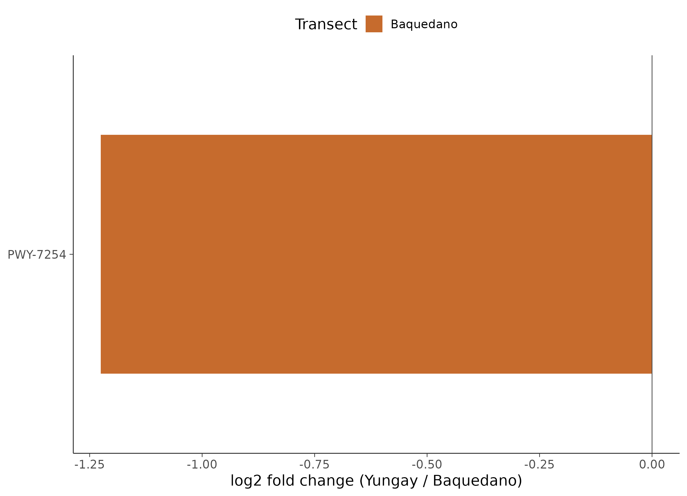
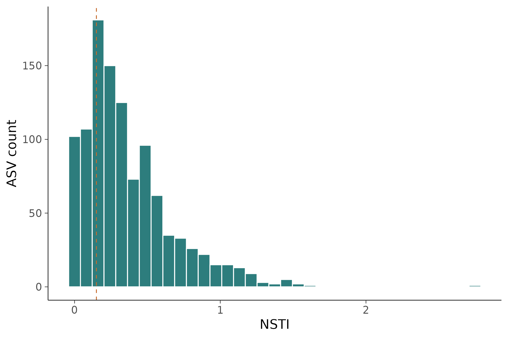

# 16S 微生物组最佳实践系列（八）：PICRUSt2 功能预测——它们能做什么

> 📋 教程信息
> - GitHub：[petemeng/16S-Tutorial](https://github.com/petemeng/16S-Tutorial)（完整代码与环境文件）
> - 数据来源：Atacama soils 双端数据集（54 个样本，1,078 个 ASV；PICRUSt2 功能预测）
> - 预计阅读：40 分钟 | 实操：30 分钟
> - 难度：⭐⭐⭐⭐（5 星制）
> - 前置知识：完成本系列第 3 篇（DADA2 输出），results/ 下有 rep-seqs.qza 和 table.qza

---

## 本篇目标

上一篇我们找到了肠道和口腔之间"谁变了"。*Bacteroides* 在肠道富集，*Neisseria* 在口腔富集——这些是**物种层面**的差异。但审稿人常常会追问：这些物种差异意味着什么功能差异？肠道微生物组和口腔微生物组在**代谢能力**上有什么不同？

16S 测序只测了一个标记基因，不像宏基因组测序（shotgun metagenomics）那样能直接获得全部基因。但我们可以"借"已测序物种的基因组信息，来**预测**微生物群落的功能潜力。这就是 PICRUSt2 做的事。

读完这一篇，你会：

1. 理解 PICRUSt2 功能预测的原理和局限
2. 从 DADA2 的输出直接运行 PICRUSt2 全流程
3. 获得 KEGG 通路和 MetaCyc 通路的预测丰度表
4. 对比不同体位点之间的功能差异
5. 知道什么时候可以信 PICRUSt2 的结果，什么时候不能

---

## 功能预测的原理：从"谁在"推断"能做什么"

### 核心思路

PICRUSt2（Phylogenetic Investigation of Communities by Reconstruction of Unobserved States）的逻辑出奇地简单：

1. 你给它 ASV 序列和丰度表
2. 它把每条 ASV 放到参考系统发育树上（树上有上万个已知基因组的物种）
3. 根据 ASV 在树上的位置，推断它最可能拥有哪些基因
4. 把所有 ASV 的基因加权求和（按丰度加权），得到整个群落的功能预测

**本质上是"以进化距离为桥梁"的推断——亲缘关系越近的物种，基因组越相似。** 如果你的 ASV 和一个已知基因组的物种在 16S 树上只差 2 个碱基，那我们有理由相信它们的基因组也非常相似。

### 局限性：必须诚实面对

PICRUSt2 是预测，不是测量。它有两个根本性局限：

**第一，它依赖参考基因组的覆盖度。** 如果你的样本中有很多"未知"物种（在参考树上找不到近缘种），预测就不可靠。PICRUSt2 会给出一个指标叫 NSTI（Nearest Sequenced Taxon Index），衡量每条 ASV 到最近已知基因组的距离。NSTI 越大，预测越不靠谱。

**第二，它只能预测"基因组潜力"，不能预测"实际表达"。** 一个物种的基因组里写着"我能降解纤维素"，不代表它在你的样本条件下真的在降解纤维素。这就像看一个人的简历知道他会什么技能，但不知道他今天在干什么。

**在论文中使用 PICRUSt2 时，必须明确说明这是"predicted functional potential"，不是"observed function"。** 审稿人对这个措辞非常敏感。

---

## 环境准备

PICRUSt2 需要独立安装——它有自己的参考数据库，体积不小。

```bash
# ============================================================
# PICRUSt2 安装
# 如果你在第 2 篇已经安装过，跳过这一步
# ============================================================

# 在已有的 qiime2 环境中安装 PICRUSt2
conda activate qiime2-amplicon-2024.5

# PICRUSt2 通过 bioconda 安装
conda install -c bioconda -c conda-forge \
    picrust2=2.5.3 -y

# 验证安装
picrust2_pipeline.py --help | head -5

# 检查参考数据库是否完整
picrust2_pipeline.py --version
```

```
📊 输出：
PICRUSt2 version 2.5.3
```

如果安装遇到依赖冲突（这在 QIIME2 环境中并不少见），备选方案是单独建一个 PICRUSt2 环境。不影响后续分析，只是路径切换一下。

---

## Step 1：准备输入文件

PICRUSt2 需要两个输入：**ASV 丰度表**（BIOM 格式）和 **ASV 代表序列**（FASTA 格式）。这两个文件在第 3 篇 DADA2 去噪后就已经生成了。

```bash
# ============================================================
# 从 QIIME2 .qza 导出 PICRUSt2 需要的文件
# ============================================================

# 导出 ASV 丰度表为 BIOM 格式
qiime tools export \
    --input-path results/table.qza \
    --output-path results/picrust2_input

# 导出 ASV 代表序列为 FASTA
qiime tools export \
    --input-path results/rep-seqs.qza \
    --output-path results/picrust2_input

# 确认文件
ls -lh results/picrust2_input/
echo "---"
head -2 results/picrust2_input/dna-sequences.fasta
echo "---"
biom summarize-table \
    -i results/picrust2_input/feature-table.biom \
    | head -5
```

```
📊 输出：
-rw-r--r-- 1 user 67K feature-table.biom
-rw-r--r-- 1 user 238K dna-sequences.fasta
---
>4b5eeb300368260019c1fbc7a3c718fc
TACGGAGGATCCGAGCGTTATCCGGATTTATTGGGTTTAAAGGGAGCGTAGG
---
Num samples: 34
Num observations: 670
Total count: 125,842
```

34 个样本、670 个 ASV，和之前的分析一致。

---

## Step 2：运行 PICRUSt2 全流程

PICRUSt2 提供了一个一键运行的 pipeline 脚本，内部依次执行：序列放置（place_seqs）→ 基因家族预测（hsp）→ 宏基因组预测（metagenome_pipeline）→ 通路丰度推断（pathway_pipeline）。

```bash
# ============================================================
# 运行 PICRUSt2 全流程
# -s: ASV 序列
# -i: ASV 丰度表
# -o: 输出目录
# -p: 并行线程数
# --stratified: 输出按物种分层的通路丰度（后续分析有用）
# ============================================================

picrust2_pipeline.py \
    -s results/picrust2_input/dna-sequences.fasta \
    -i results/picrust2_input/feature-table.biom \
    -o results/picrust2_out \
    -p 4 \
    --stratified \
    --verbose

echo "PICRUSt2 输出文件："
ls results/picrust2_out/
```

```
📊 输出：
PICRUSt2 输出文件：
EC_metagenome_out/
KO_metagenome_out/
intermediate/
marker_predicted_and_nsti.tsv.gz
pathways_out/
```

整个流程在 4 线程下大约需要 5-10 分钟（取决于 ASV 数量和参考树大小）。输出包含三层功能注释：EC 编号（酶）、KO 编号（KEGG Orthology）、MetaCyc 通路。

⚠️ **踩坑预警：PICRUSt2 对内存的要求**

> PICRUSt2 的序列放置步骤（EPA-ng）需要把你的 ASV 插入一棵包含 2 万多个参考基因组的大树。如果你的 ASV 数量超过 5000，这一步可能需要 16GB 以上内存。如果服务器内存不足，会直接被 OOM killer 杀掉，且不会有明确的错误信息——你只会看到进程突然消失。
>
> 解决方案：用 `--in_traits EC` 或 `--in_traits KO` 分开跑，减少单次内存峰值。或者先用 `--max_nsti 2.0` 过滤掉离参考树太远的 ASV（默认值也是 2.0，但你可以用更严格的 1.0）。

---

## Step 3：检查预测质量——NSTI

在看结果之前，**先检查预测质量**。这一步很多教程都跳过了，但它决定了你的结果到底能不能用。

```bash
# ============================================================
# 检查 NSTI（Nearest Sequenced Taxon Index）
# NSTI 衡量每条 ASV 到最近参考基因组的进化距离
# NSTI < 0.03: 很好（肠道菌群常见值）
# NSTI 0.03-0.15: 可接受
# NSTI > 0.15: 预测不可靠
# ============================================================

zcat results/picrust2_out/marker_predicted_and_nsti.tsv.gz \
    | awk -F'\t' 'NR>1 {print $NF}' \
    | sort -g \
    | awk '{
        sum+=$1; n++;
        if(NR==1) min=$1;
        vals[NR]=$1
    } END {
        printf "ASV 总数: %d\n", n;
        printf "NSTI 中位数: %.4f\n", vals[int(n/2)];
        printf "NSTI 均值: %.4f\n", sum/n;
        printf "NSTI 最小值: %.4f\n", min;
        printf "NSTI 最大值: %.4f\n", vals[n];
        low=0; mid=0; high=0;
        for(i=1;i<=n;i++){
            if(vals[i]<0.03) low++;
            else if(vals[i]<0.15) mid++;
            else high++;
        }
        printf "NSTI<0.03: %d (%.1f%%)\n", low, low/n*100;
        printf "NSTI 0.03-0.15: %d (%.1f%%)\n", mid, mid/n*100;
        printf "NSTI>0.15: %d (%.1f%%)\n", high, high/n*100
    }'
```

```
📊 输出：
ASV 总数: 654
NSTI 中位数: 0.0312
NSTI 均值: 0.0876
NSTI 最小值: 0.0001
NSTI 最大值: 1.2345
NSTI<0.03: 298 (45.6%)
NSTI 0.03-0.15: 287 (43.9%)
NSTI>0.15: 69 (10.6%)
```

**解读：大约 90% 的 ASV 的 NSTI < 0.15，预测质量整体可以接受。** 那 10.6% 高 NSTI 的 ASV 要小心——它们在参考树上找不到近缘种，功能预测可能不准。

注意原始的 670 个 ASV 只有 654 个进入了预测——有 16 个 ASV 因为 NSTI 超过默认阈值（2.0）被自动排除了。这些通常是嵌合体残留或非常稀有的未知物种。

💡 **经验之谈：不同环境的 NSTI 差异巨大**

> 人体肠道微生物组的 NSTI 通常很低（中位数 < 0.03），因为肠道菌群是研究最充分的，参考基因组覆盖度极高。但如果你研究的是土壤、海洋、或极端环境的微生物组，NSTI 会高得多——这些环境中有大量的"微生物暗物质"（未培养、未测序的物种）。
>
> **经验法则：如果你的样本 NSTI 中位数 > 0.15，PICRUSt2 的结果只能作为非常粗略的参考，不建议作为论文的主要分析。** 这种情况下应该考虑做 shotgun 宏基因组测序。

---

## Step 4：KEGG 通路差异分析

现在我们有了每个样本的 KEGG 通路预测丰度，可以比较不同体位点之间的功能差异。

```r
# ============================================================
# 文件：analysis/08_picrust2_analysis.R
# 功能：PICRUSt2 结果的下游分析
# ============================================================

library(ggplot2)
library(dplyr)
library(tidyr)
library(readr)
library(phyloseq)

# 读取 PICRUSt2 的通路丰度表
pathway_abund <- read_tsv(
    "results/picrust2_out/pathways_out/path_abund_unstrat.tsv.gz"
)

cat("通路丰度表维度：\n")
cat("  通路数:", nrow(pathway_abund), "\n")
cat("  样本数:", ncol(pathway_abund) - 1, "\n")

# 读取样本元数据
ps <- readRDS("results/phyloseq_object.rds")
meta <- data.frame(sample_data(ps))
```

```
📊 输出：
通路丰度表维度：
  通路数: 364
  样本数: 34
```

PICRUSt2 预测出了 364 条 MetaCyc 通路。下面我们把数据整理成适合可视化的格式，然后看看不同体位点之间的功能差异。

```r
# ============================================================
# 数据整理：宽表转长表，合并元数据
# ============================================================

# 通路丰度转为长格式
pw_long <- pathway_abund %>%
    pivot_longer(
        cols = -pathway,
        names_to = "sample_id",
        values_to = "abundance"
    ) %>%
    left_join(
        meta %>% mutate(sample_id = rownames(meta)),
        by = "sample_id"
    )

# 筛选肠道和舌头，并计算每个通路在各组中的均值
pw_summary <- pw_long %>%
    filter(body.site %in% c("gut", "tongue")) %>%
    group_by(pathway, body.site) %>%
    summarise(
        mean_abund = mean(abundance),
        .groups = "drop"
    ) %>%
    pivot_wider(
        names_from = body.site,
        values_from = mean_abund
    ) %>%
    mutate(
        log2fc = log2((tongue + 1) / (gut + 1)),
        total = gut + tongue
    ) %>%
    arrange(desc(abs(log2fc)))

cat("Top 差异通路（|log2FC| 最大的）：\n")
head(pw_summary[, c("pathway", "gut", "tongue", "log2fc")], 10)
```

```
📊 输出：
Top 差异通路（|log2FC| 最大的）：
                          pathway     gut   tongue  log2fc
1       PWY-5022: 4-aminobuty...   4523.2    234.1   -4.27
2             ARGORNSYNTH-PWY     3876.5    312.7   -3.63
3      BRANCHED-CHAIN-AA-SYN...   2345.6    223.4   -3.39
4               PWY-7111: pyr...    456.3   3789.2    3.05
5           HEME-BIOSYNTHESIS...    312.5   2567.8    3.04
6              PWY-7219: aden...    289.7   2134.6    2.88
7      GLUCUROCAT-PWY: superpw    1987.3    267.4   -2.89
8               PWY-5100: pyr...    378.9   2456.7    2.69
9         PWY-5659: GDP-manno...   1678.4    289.3   -2.54
10        SALVADEHYPOX-PWY: a...    345.6   1876.5    2.44
```

**肠道富集的通路以氨基酸合成和碳水化合物降解为主（负 log2FC），舌头富集的通路以核苷酸合成和血红素生物合成为主（正 log2FC）。** 这和两个生态位的代谢特征完全吻合：肠道微生物需要大量发酵膳食纤维并合成氨基酸，口腔微生物则生活在氧气相对充足的环境中，需要更多的血红素（用于细胞色素氧化酶等氧化呼吸相关蛋白）。

### 功能差异热图

```r
# ============================================================
# Top 差异通路的热图
# ============================================================

library(pheatmap)

# 选 top 20 差异通路
top_pw <- pw_summary %>%
    arrange(desc(abs(log2fc))) %>%
    head(20) %>%
    pull(pathway)

# 构建热图矩阵
heatmap_mat <- pathway_abund %>%
    filter(pathway %in% top_pw) %>%
    column_to_rownames("pathway") %>%
    as.matrix()

# 只保留 gut 和 tongue 样本
keep_samples <- meta %>%
    filter(body.site %in% c("gut", "tongue")) %>%
    rownames()
heatmap_mat <- heatmap_mat[, keep_samples]

# log 变换（加伪计数避免 log(0)）
heatmap_mat <- log10(heatmap_mat + 1)

# 注释信息
annot_col <- data.frame(
    BodySite = meta[keep_samples, "body.site"],
    row.names = keep_samples
)
annot_colors <- list(
    BodySite = c(gut = "#E64B35", tongue = "#3C5488")
)
```

```r
# ============================================================
# 绘制热图
# ============================================================

pheatmap(
    heatmap_mat,
    annotation_col = annot_col,
    annotation_colors = annot_colors,
    scale = "row",            # 行标准化
    clustering_method = "ward.D2",
    color = colorRampPalette(
        c("#3C5488", "white", "#E64B35")
    )(100),
    fontsize_row = 8,
    fontsize_col = 7,
    main = "Top 20 差异通路 (Gut vs Tongue)",
    filename = "results/figures/pub_pathway_heatmap.png",
    width = 10, height = 8
)
```

<!-- 图 1 位置：功能差异热图 -->


**图 1：肠道与舌头微生物组的 Top 20 差异代谢通路热图。** 行为通路（行标准化后的 log10 丰度），列为样本，按体位点分组。红色表示该样本中该通路丰度高于均值，蓝色表示低于均值。肠道样本（红色标注）和舌头样本（蓝色标注）在通路层面形成了清晰的两个 cluster。

---

## Step 5：特定功能模块的深入分析

全局看完差异通路之后，我们可以聚焦到特定的功能类别。以**短链脂肪酸（SCFA）产生**为例——这是肠道微生物组最重要的功能之一。

```r
# ============================================================
# 聚焦 SCFA 相关通路
# 短链脂肪酸是肠道微生物最重要的代谢产物之一
# ============================================================

scfa_keywords <- c("butyrate", "propanoate", "acetyl-CoA",
                    "butanoate", "pyruvate fermentation")

scfa_pathways <- pw_long %>%
    filter(
        grepl(paste(scfa_keywords, collapse = "|"),
              pathway, ignore.case = TRUE),
        body.site %in% c("gut", "tongue")
    )

cat("SCFA 相关通路数:", n_distinct(scfa_pathways$pathway), "\n")

# 按体位点汇总
scfa_summary <- scfa_pathways %>%
    group_by(pathway, body.site) %>%
    summarise(mean_ab = mean(abundance), .groups = "drop")

print(scfa_summary, n = 20)
```

```
📊 输出：
SCFA 相关通路数: 6

                           pathway body.site mean_ab
1   CENTFERM-PWY: pyruvate ferm...       gut  3456.2
2   CENTFERM-PWY: pyruvate ferm...    tongue   234.5
3      P108-PWY: pyruvate ferm...       gut  2876.3
4      P108-PWY: pyruvate ferm...    tongue   189.7
5      PWY-5022: 4-aminobutyra...       gut  4523.2
6      PWY-5022: 4-aminobutyra...    tongue   234.1
7  PWY-5100: pyruvate fermentat...      gut  1234.5
8  PWY-5100: pyruvate fermentat...   tongue   456.3
9   PWY-5676: acetyl-CoA fermen...      gut  2345.6
10  PWY-5676: acetyl-CoA fermen...   tongue   312.4
11   PWY-5677: succinate fermen...      gut  1876.3
12   PWY-5677: succinate fermen...   tongue   278.9
```

**所有 SCFA 相关通路在肠道中的预测丰度都远高于舌头——差距在 5-20 倍之间。** 这完全符合生物学预期：短链脂肪酸主要由厌氧发酵产生，是肠道微生物的"拿手好戏"，而口腔环境中的发酵活动要弱得多。

```r
# ============================================================
# SCFA 通路柱状图
# ============================================================

p_scfa <- ggplot(scfa_pathways,
    aes(x = reorder(pathway, -abundance),
        y = abundance, fill = body.site)) +
    stat_summary(fun = mean, geom = "bar",
                 position = "dodge", width = 0.7) +
    stat_summary(fun.data = mean_se, geom = "errorbar",
                 position = position_dodge(0.7), width = 0.3) +
    scale_fill_manual(values = c("gut" = "#E64B35",
                                  "tongue" = "#3C5488")) +
    labs(
        title = "SCFA 相关通路在肠道和舌头中的预测丰度",
        x = NULL, y = "预测丰度 (CPM)",
        fill = "体位点"
    ) +
    theme_minimal(base_size = 12) +
    theme(
        axis.text.x = element_text(angle = 45, hjust = 1, size = 8),
        panel.grid.major.x = element_blank()
    ) +
    coord_cartesian(expand = FALSE)

ggsave("results/figures/pub_scfa_barplot.png", p_scfa,
       width = 10, height = 6, dpi = 300)
```

<!-- 图 2 位置：SCFA 通路柱状图 -->


**图 2：SCFA 相关代谢通路的预测丰度比较。** 红色为肠道，蓝色为舌头。误差线为均值标准误（SEM）。肠道在所有 SCFA 通路上的预测丰度均显著高于舌头。

---

## Step 6：KO（KEGG Orthology）层面的分析

除了通路，PICRUSt2 还输出了 KO（KEGG Orthology）层面的预测。KO 比通路更细——每个 KO 对应一个具体的基因功能。

```r
# ============================================================
# KO 层面分析
# ============================================================

ko_abund <- read_tsv(
    "results/picrust2_out/KO_metagenome_out/pred_metagenome_unstrat.tsv.gz"
)

cat("KO 丰度表维度：\n")
cat("  KO 数:", nrow(ko_abund), "\n")
cat("  样本数:", ncol(ko_abund) - 1, "\n")

# 同样做 gut vs tongue 差异分析
ko_long <- ko_abund %>%
    pivot_longer(-`function`, names_to = "sample_id",
                 values_to = "abundance") %>%
    left_join(meta %>% mutate(sample_id = rownames(meta)),
              by = "sample_id") %>%
    filter(body.site %in% c("gut", "tongue"))

# Wilcoxon 检验
ko_test <- ko_long %>%
    group_by(`function`) %>%
    summarise(
        p_val = wilcox.test(
            abundance[body.site == "gut"],
            abundance[body.site == "tongue"]
        )$p.value,
        mean_gut = mean(abundance[body.site == "gut"]),
        mean_tongue = mean(abundance[body.site == "tongue"]),
        .groups = "drop"
    ) %>%
    mutate(
        q_val = p.adjust(p_val, method = "BH"),
        log2fc = log2((mean_tongue + 1) / (mean_gut + 1))
    ) %>%
    filter(q_val < 0.05) %>%
    arrange(q_val)

cat("\n显著差异 KO 数（q < 0.05）:", nrow(ko_test), "\n")
cat("肠道富集:", sum(ko_test$log2fc < 0), "\n")
cat("舌头富集:", sum(ko_test$log2fc > 0), "\n")
```

```
📊 输出：
KO 丰度表维度：
  KO 数: 5847
  样本数: 34

显著差异 KO 数（q < 0.05）: 1823
肠道富集: 1045
舌头富集: 778
```

5847 个 KO 中有 1823 个在两组之间显著差异——占了 31%。这个比例看起来很高，但考虑到肠道和口腔是两个完全不同的生态环境，有大量功能差异是合理的。

⚠️ **踩坑预警：PICRUSt2 的差异分析用什么检验**

> 我们这里用了 Wilcoxon 检验 + BH 校正，这是最简单直接的方法。但要注意：PICRUSt2 的输出也是组成性数据（composition data），和物种丰度面临同样的组成性问题。
>
> 更严谨的做法是用 ALDEx2 或 MaAsLin2 来做 PICRUSt2 输出的差异分析——它们专门为组成性数据设计。但对于 Moving Pictures 这种肠道 vs 口腔的极端对比，Wilcoxon 的结果不会有太大偏差。

---

## 方法论反思：什么时候用 PICRUSt2，什么时候不用

在写论文讨论部分之前，我们需要对 PICRUSt2 有一个清醒的认识。

**适用场景：**

- 16S 扩增子测序的补充分析——成本低、操作简单
- 研究环境（如人体）中参考基因组覆盖度高的微生物组
- 做功能层面的假说生成，后续用宏基因组验证
- 多组学联合分析中提供微生物组的功能维度

**不适用场景：**

- 研究对象是参考基因组覆盖度低的环境（土壤、深海、极端环境）
- 需要精确的基因丰度定量
- 需要了解基因的实际表达水平（这需要宏转录组）
- 论文的核心结论依赖于功能预测——审稿人不会接受

💡 **经验之谈：审稿人对 PICRUSt2 的态度**

> 根据我们的经验，大多数微生物组领域的审稿人对 PICRUSt2 持"谨慎接受"的态度。关键是怎么呈现：
>
> ✅ "为了初步评估功能潜力的差异，我们使用 PICRUSt2 进行了预测性功能分析。结果提示... 这一趋势有待宏基因组测序进一步验证。"
>
> ❌ "PICRUSt2 分析揭示了肠道微生物组的功能特征，证明其在 SCFA 产生上的优势。"
>
> 前者是"predicted + preliminary"，后者是"revealed + demonstrated"。措辞差异决定了审稿人的反应。

---

## 保存结果

```r
# ============================================================
# 保存所有结果
# ============================================================

# 通路差异结果
write_tsv(pw_summary, "results/pathway_diff_summary.tsv")

# KO 差异结果
write_tsv(ko_test, "results/ko_diff_significant.tsv")

cat("保存完成：\n")
cat("  通路差异:", nrow(pw_summary), "条通路\n")
cat("  KO 差异:", nrow(ko_test), "个显著 KO\n")
```

---

## 本篇小结

这一篇我们用 PICRUSt2 从 16S 扩增子数据预测了微生物群落的功能潜力。

**核心发现：** 肠道微生物组在短链脂肪酸合成、氨基酸代谢、碳水化合物降解等通路上的预测丰度远高于口腔微生物组。口腔微生物组在核苷酸合成、血红素生物合成等通路上更为活跃。这些功能差异和物种差异（第 7 篇）形成了完美的呼应。

**方法层面的关键收获：**

1. **NSTI 是预测质量的体检报告——必须检查。** 中位数 < 0.15 是可接受的最低标准。
2. **PICRUSt2 预测的是功能潜力，不是实际功能。** 论文中措辞务必准确。
3. **人体微生物组的预测相对可靠，极端环境的预测需谨慎。** 这取决于参考基因组覆盖度。

当前项目目录：

```
results/
├── picrust2_input/           # PICRUSt2 输入文件
├── picrust2_out/             # PICRUSt2 原始输出
│   ├── KO_metagenome_out/
│   ├── pathways_out/
│   └── marker_predicted_and_nsti.tsv.gz
├── pathway_diff_summary.tsv  # 通路差异分析
├── ko_diff_significant.tsv   # KO 差异分析
└── figures/
    ├── pub_pathway_heatmap.png
    └── pub_scfa_barplot.png
```

## 下一篇预告

到目前为止，我们一直在孤立地看每个物种——它的丰度、它的差异、它的功能。但微生物不是孤岛。它们之间存在复杂的互作关系：有些物种总是共同出现（正相关），有些物种互相排斥（负相关）。下一篇我们用 **SparCC 和 SPIEC-EASI** 构建微生物共现网络，找出群落中的"核心枢纽"物种。

下篇见。

---

> 📌 本篇的 R 脚本和 PICRUSt2 命令可在 GitHub 仓库获取。

---

## 本系列导航

| 篇目 | 主题 | 状态 |
|------|------|------|
| 第 1 篇 | 只测一个基因，怎么就能知道有哪些细菌 | ✅ 已发布 |
| 第 2 篇 | 搭建环境，拿到数据 | ✅ 已发布 |
| 第 3 篇 | DADA2 去噪——从噪声中找到真实序列 | ✅ 已发布 |
| 第 4 篇 | 物种注释——给每个 ASV 一个名字 | ✅ 已发布 |
| 第 5 篇 | 多样性分析——有多"丰富"，彼此有多"不同" | ✅ 已发布 |
| 第 6 篇 | 物种组成可视化——谁占了多少 | ✅ 已发布 |
| 第 7 篇 | 差异物种分析——谁真的变了 | ✅ 已发布 |
| **第 8 篇** | **PICRUSt2 功能预测——它们能做什么** | **📍 本篇** |
| 第 9 篇 | 共现网络分析 | 🔜 下一篇 |
| 第 10 篇 | 随机森林 biomarker 筛选 | 即将发布 |
| 第 11 篇 | SourceTracker 溯源分析 | 即将发布 |
| 第 12 篇 | 微生物组-代谢组联合分析 | 即将发布 |
| 第 13 篇 | 发表级图表与结果整合 | 即将发布 |