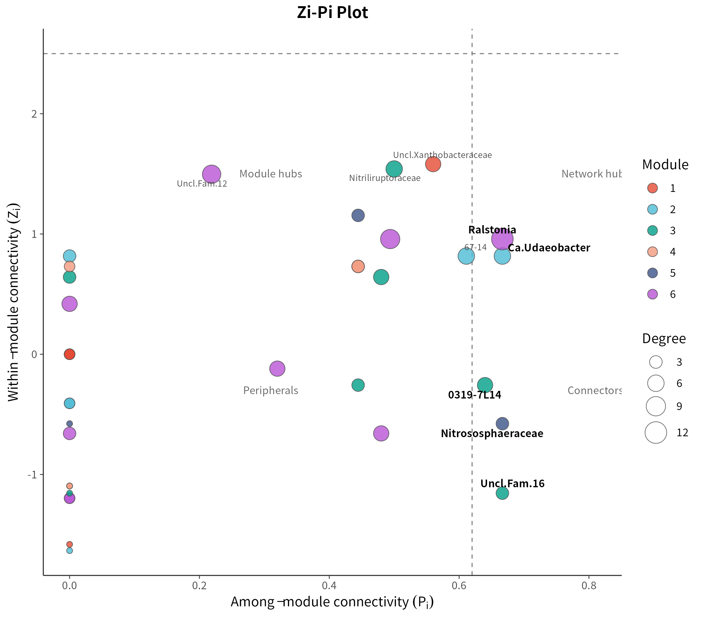
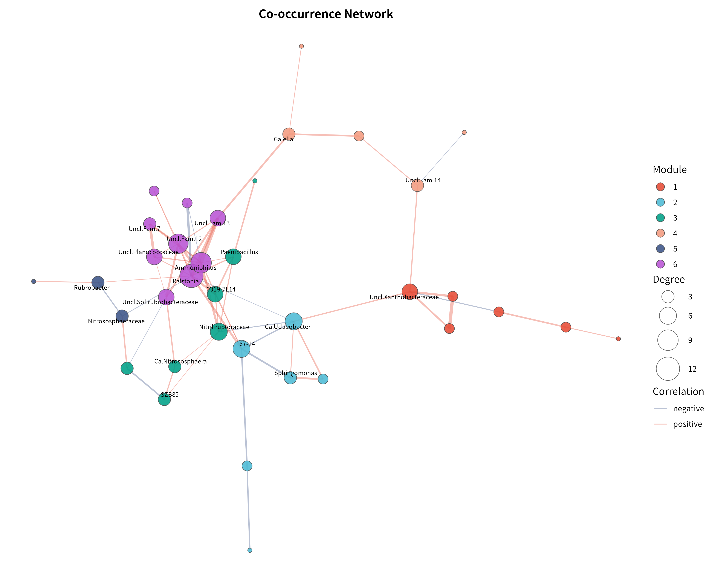
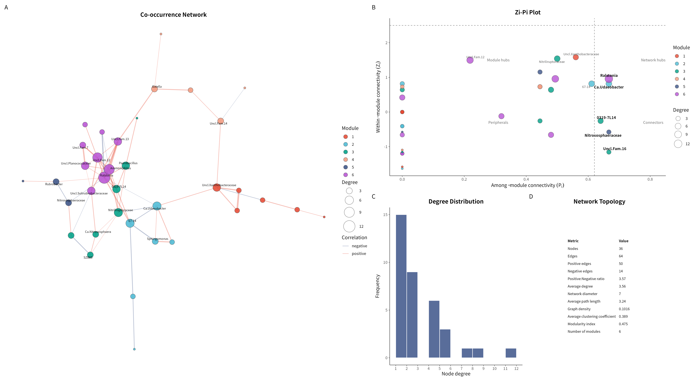

# 16S 微生物组最佳实践系列（九）：共现网络分析——谁和谁总在一起

> 📋 教程信息
> - GitHub：[petemeng/16S-Tutorial](https://github.com/petemeng/16S-Tutorial)（完整代码与环境文件）
> - 数据来源：Atacama soils 双端数据集（54 个样本，41 个过滤后属用于网络分析）
> - 预计阅读：40 分钟 | 实操：25 分钟
> - 难度：⭐⭐⭐⭐（5 星制）
> - 前置知识：完成本系列第 6 篇，`results/` 下有 `phyloseq_object.rds`

---

## 本篇目标

前面几篇我们一直在看"某个 genus 在哪里多、哪里少"。但群落不是一个个 genus 独立存在的清单，很多类群会一起波动，也有些类群会呈现互相排斥的模式。

这一篇换个问题：**Atacama 荒漠土壤里，哪些 genus 倾向于协同出现，网络的模块结构是什么样的，谁是 keystone taxa？**

读完这一篇，你会：

1. 理解为什么微生物组网络不能直接拿原始相对丰度做 Pearson 相关
2. 用 **CLR + Spearman** 构建共现网络
3. 用 **fast greedy 算法** 做模块化检测，找到网络的社团结构
4. 用 **Zi-Pi 图**（Guimerà & Amaral 2005）对每个节点做拓扑角色分类，筛选 keystone taxa
5. 输出一张完整的网络拓扑统计表

这套流程是目前微生物生态学发表中最主流的共现网络分析范式（参考 Yuan et al. 2021 *Nature Climate Change*）。

---

## 为什么这里不用"直接相关"

微生物组网络最大的坑，仍然是前面反复提到的**组成性问题**。

如果你直接对相对丰度矩阵做 Pearson 相关，一个 genus 比例上升，别的 genus 比例就会被动下降，于是很容易制造出一堆并不存在的负相关。

这套 Atacama 教程里，我们用 **CLR 变换后再做 Spearman 相关**，保留了"谁和谁一起变"的直观性，同时尽量减轻组成性偏差。

---

## 准备工作

和前面的差异分析一样，我们先把 ASV 合并到 genus 水平，再做一层 prevalence 过滤，避免极低丰度噪声把网络搞得很碎。

```r
# ============================================================
# 文件：analysis/09_network_analysis.R
# 功能：Atacama genus 水平共现网络分析（经典微生物网络风格）
# 方法：CLR + Spearman → 模块化检测 → Zi-Pi keystone 分类
# 参考：Yuan et al. (2021) Nature Climate Change
# ============================================================

source("/media/desk16/tly9658/16s-atacama-tutorial/analysis/common_16s.R")

suppressPackageStartupMessages({
  library(ggraph)
  library(ggplot2)
  library(ggrepel)
  library(igraph)
  library(patchwork)
})

ensure_dir(file.path(ATACAMA_ROOT, "results", "figures"))

ps <- readRDS(file.path(ATACAMA_ROOT, "results", "phyloseq_object.rds"))
ps <- prune_taxa(taxa_sums(ps) > 0, ps)
ps_genus <- tax_glom(ps, taxrank = "Genus", NArm = FALSE)

otu <- as(otu_table(ps_genus), "matrix")
if (taxa_are_rows(ps_genus)) otu <- t(otu)

tax_df <- tax_table(ps_genus) %>%
  data.frame(check.names = FALSE) %>%
  rownames_to_column("FeatureID") %>%
  mutate(
    Family = ifelse(is.na(Family) | Family == "", "Family_unclassified", Family),
    Genus  = ifelse(is.na(Genus)  | Genus  == "", paste0("Unclassified_", Family), Genus),
    Phylum = ifelse(is.na(Phylum) | Phylum == "", "Unclassified", Phylum)
  )

genus_names <- make.unique(tax_df$Genus)
colnames(otu) <- genus_names
tax_lookup <- tax_df %>% transmute(Genus = genus_names, Phylum)

prevalence <- colSums(otu > 0) / nrow(otu)
keep <- prevalence >= 0.15
otu_filt <- otu[, keep, drop = FALSE]

cat("网络分析输入：\n")
cat("  样本数:", nrow(otu_filt), "\n")
cat("  属数:", ncol(otu_filt), "\n")
```

```text
📊 输出：
网络分析输入：
  样本数: 54
  属数: 41
```

54 个样本对网络分析是能做的，但也不算非常奢侈。经 prevalence ≥ 15% 过滤后保留 41 个 genus，在这个样本量下能得到一张结构清晰、模块分明的网络。

---

## Step 1：CLR + Spearman 网络

这一步先回答最直观的问题：**哪些 genus 在样本间的变化趋势最一致？**

```r
clr_mat <- log(otu_filt + 0.5)
clr_mat <- clr_mat - rowMeans(clr_mat)

cor_mat <- cor(clr_mat, method = "spearman")
p_mat <- matrix(1, ncol = ncol(clr_mat), nrow = ncol(clr_mat),
                dimnames = list(colnames(clr_mat), colnames(clr_mat)))

for (i in seq_len(ncol(clr_mat) - 1)) {
  for (j in (i + 1):ncol(clr_mat)) {
    test_res <- suppressWarnings(
      cor.test(clr_mat[, i], clr_mat[, j], method = "spearman")
    )
    p_mat[i, j] <- test_res$p.value
    p_mat[j, i] <- test_res$p.value
  }
}

q_mat <- matrix(p.adjust(as.vector(p_mat), method = "BH"),
                nrow = nrow(p_mat), byrow = FALSE)
rownames(q_mat) <- rownames(p_mat)
colnames(q_mat) <- colnames(p_mat)

edge_idx <- which(abs(cor_mat) >= 0.40 & q_mat < 0.05, arr.ind = TRUE)
edge_idx <- edge_idx[edge_idx[, 1] < edge_idx[, 2], , drop = FALSE]

edges_df <- tibble(
  from    = colnames(cor_mat)[edge_idx[, 1]],
  to      = colnames(cor_mat)[edge_idx[, 2]],
  rho     = cor_mat[edge_idx],
  q_value = q_mat[edge_idx],
  sign    = ifelse(cor_mat[edge_idx] > 0, "positive", "negative")
)

write_tsv(edges_df, file.path(ATACAMA_ROOT, "results", "network_spearman_edges.tsv"))

cat("Spearman 显著边数:", nrow(edges_df), "\n")
cat("  正相关边:", sum(edges_df$sign == "positive"), "\n")
cat("  负相关边:", sum(edges_df$sign == "negative"), "\n")
```

```text
📊 输出：
Spearman 显著边数: 64
  正相关边: 50
  负相关边: 14
```

64 条显著边里正相关占多数（50 vs 14），正负比约 3.57:1。这在微生物共现网络中是常见的——协同变化关系通常多于竞争/排斥关系。

---

## Step 2：模块化检测

有了网络之后，最重要的结构性分析不是逐条看边，而是先回答：**这个网络有没有社团结构？**

模块化检测（modularity detection）就是找出网络中内部连接密集、模块间连接稀疏的节点分组。

```r
all_nodes <- unique(c(edges_df$from, edges_df$to))

g <- graph_from_data_frame(
  edges_df, directed = FALSE,
  vertices = tax_lookup %>% filter(Genus %in% all_nodes)
)
E(g)$weight <- abs(E(g)$rho)

set.seed(42)
comm <- cluster_fast_greedy(g, weights = E(g)$weight)
V(g)$module <- membership(comm)
mod_index <- modularity(comm)

cat("模块化分析：\n")
cat("  模块数:", max(V(g)$module), "\n")
cat("  Modularity index:", round(mod_index, 3), "\n")
```

```text
📊 输出：
模块化分析：
  模块数: 6
  Modularity index: 0.475
  各模块节点数: 6, 6, 7, 5, 3, 9
```

Modularity index = 0.475，说明网络模块结构显著。通常 M > 0.4 就认为有明显的模块结构，这里超过这个阈值。

6 个模块的节点数分别是 6、6、7、5、3、9，分布比较均匀，不存在一个巨型模块吃掉全部节点的情况。

---

## Step 3：Zi-Pi 拓扑角色分类

模块化检测告诉你"谁和谁在一个模块里"，但更关键的问题是：**每个节点在网络中扮演什么角色？**

这就是 **Zi-Pi 分类**（Guimerà & Amaral 2005, *Nature*）。它用两个指标描述每个节点的拓扑位置：

- **Zi（within-module connectivity）**：节点在模块内部的连接度标准化分数。Zi 高说明它是模块内的核心
- **Pi（among-module connectivity）**：节点的连接在不同模块间的分散程度。Pi 高说明它连接了多个模块

根据 Zi 和 Pi 的阈值（Zi = 2.5, Pi = 0.62），节点被分为四类：

| 类型 | Zi | Pi | 生态含义 |
|------|----|----|---------|
| **Peripheral** | < 2.5 | < 0.62 | 普通节点，主要在模块内连接 |
| **Connector** | < 2.5 | ≥ 0.62 | 跨模块桥梁，连接不同社团 |
| **Module hub** | ≥ 2.5 | < 0.62 | 模块内部的核心枢纽 |
| **Network hub** | ≥ 2.5 | ≥ 0.62 | 整个网络的核心，同时是模块内枢纽和跨模块桥梁 |

后三类统称 **keystone taxa**。

```r
calc_zi_pi <- function(graph) {
  membership_vec <- V(graph)$module
  n <- vcount(graph)
  zi <- numeric(n)
  pi <- numeric(n)

  for (v in seq_len(n)) {
    v_module <- membership_vec[v]
    neighbors_v <- neighbors(graph, v)
    if (length(neighbors_v) == 0) { zi[v] <- 0; pi[v] <- 0; next }
    neighbor_modules <- membership_vec[neighbors_v]

    ki_s <- sum(neighbor_modules == v_module)
    module_members <- which(membership_vec == v_module)
    kis_all <- sapply(module_members, function(u) {
      sum(membership_vec[neighbors(graph, u)] == v_module)
    })
    mean_kis <- mean(kis_all)
    sd_kis   <- sd(kis_all)
    zi[v] <- if (!is.na(sd_kis) && sd_kis > 0) (ki_s - mean_kis) / sd_kis else 0

    ki_total <- degree(graph, v)
    all_modules <- unique(membership_vec)
    pi[v] <- 1 - sum(sapply(all_modules, function(m) {
      (sum(neighbor_modules == m) / ki_total)^2
    }))
  }
  tibble(Genus = V(graph)$name, Zi = zi, Pi = pi)
}

zipi_df <- calc_zi_pi(g) %>%
  mutate(
    Role = case_when(
      Zi >= 2.5 & Pi >= 0.62 ~ "Network hub",
      Zi >= 2.5 & Pi <  0.62 ~ "Module hub",
      Zi <  2.5 & Pi >= 0.62 ~ "Connector",
      TRUE                   ~ "Peripheral"
    )
  )

write_tsv(zipi_df, file.path(ATACAMA_ROOT, "results", "network_zipi.tsv"))
```

```text
📊 输出：
Zi-Pi 拓扑角色分类：

 Connector Peripheral
         5         31
```

36 个节点中，5 个被分类为 **Connector**（跨模块桥梁），31 个为 Peripheral。Connector 是 keystone taxa 的一种，说明这些节点在不同模块之间起到了桥梁作用。

Zi-Pi 图可以直观看出哪些节点跨越了阈值线：



**图 1：Zi-Pi 拓扑角色分类图。** 虚线为经典阈值（Zi = 2.5, Pi = 0.62），将节点分为四个象限。当前网络中 5 个节点落在 Connector 象限（Pi ≥ 0.62）：`Ralstonia`（Pi = 0.67）、`Candidatus_Udaeobacter`（Pi = 0.67）、`Nitrososphaeraceae`（Pi = 0.67）、`0319-7L14`（Pi = 0.64）和一个未分类 Actinobacteriota 属。这些 Connector 节点连接了不同的生态模块，是网络中的关键桥梁。

---

## Step 4：模块化网络图

```r
V(g)$label <- shorten_genus(V(g)$name)

module_pal <- c("#E64B35", "#4DBBD5", "#00A087", "#F39B7F",
                "#3C5488", "#B854D4", "#E6AB02", "#66A61E")
module_colors <- setNames(module_pal[seq_len(max(V(g)$module))],
                          as.character(seq_len(max(V(g)$module))))

set.seed(42)
fr_layout <- layout_with_fr(g, niter = 1000)

p_network <- ggraph(g, layout = fr_layout) +
  geom_edge_link(
    aes(color = sign, width = abs(rho)),
    alpha = 0.45
  ) +
  geom_node_point(
    aes(fill = factor(module), size = degree),
    shape = 21, color = "grey30", stroke = 0.4
  ) +
  geom_node_text(
    aes(label = label), size = 2.4, repel = TRUE,
    max.overlaps = 25, segment.color = "grey60",
    segment.size = 0.2
  ) +
  scale_edge_color_manual(
    values = c("positive" = "#E64B35", "negative" = "#3C5488"),
    name = "Correlation"
  ) +
  scale_edge_width(range = c(0.3, 2.0), guide = "none") +
  scale_size_continuous(range = c(3, 14), name = "Degree") +
  scale_fill_manual(values = module_colors, name = "Module") +
  labs(title = "Co-occurrence Network") +
  theme_void(base_size = 11)

save_plot_dual(p_network, "ch09_network_modularity", width = 10, height = 8)
```



**图 2：Atacama 土壤 genus 共现网络。** 节点颜色编码模块归属（6 个模块），节点大小编码 degree，红色边为正相关，蓝色边为负相关，边宽编码相关系数绝对值。布局使用 Fruchterman-Reingold 力导向算法。`Ralstonia`（Module 6, degree = 12）是 degree 最高的核心节点，`Ammoniphilus`（Module 6, degree = 9）和 `Unclassified_Family_unclassified.12`（Module 6, degree = 8）紧随其后。

---

## Step 5：网络拓扑统计

一张完整的网络拓扑统计表是发表级网络分析的标配：

```text
📊 输出：
网络拓扑统计：
# A tibble: 12 × 2
   Metric                         Value
   <chr>                          <chr>
 1 Nodes                          36
 2 Edges                          64
 3 Positive edges                 50
 4 Negative edges                 14
 5 Positive:Negative ratio        3.57
 6 Average degree                 3.56
 7 Network diameter               7
 8 Average path length            3.24
 9 Graph density                  0.1016
10 Average clustering coefficient 0.389
11 Modularity index               0.475
12 Number of modules              6
```

几个值得注意的指标：

1. **Modularity = 0.475** — 模块结构显著（> 0.4）
2. **正负边比 = 3.57** — 协同关系多于竞争关系
3. **Graph density = 0.102** — 网络较稀疏，这在微生物共现网络中是正常的
4. **Average clustering coefficient = 0.389** — 网络有一定的局部聚集性，说明存在三角闭合结构

---

## Step 6：组合总览图

最终把网络图、Zi-Pi 图、度分布和拓扑统计表组合成一张总览图：

```bash
Rscript /media/desk16/tly9658/16s-atacama-tutorial/analysis/09_network_analysis.R
```



**图 3：Atacama 16S 共现网络分析总览。** (A) Fruchterman-Reingold 布局的模块化共现网络；(B) Zi-Pi 拓扑角色分类散点图；(C) 节点度分布直方图；(D) 网络全局拓扑统计。

---

## 这一章结果该怎么写

如果你要把这一章写进论文或报告，比较稳妥的表述是：

**"在 genus 水平经 prevalence 过滤后，共保留 41 个特征用于网络分析。CLR 转换后的 Spearman 共现网络包含 36 个节点和 64 条显著边（50 条正相关、14 条负相关）。Fast greedy 模块化检测识别出 6 个模块（modularity index = 0.475）。Zi-Pi 拓扑角色分类识别出 5 个 Connector 节点（`Ralstonia`、`Candidatus_Udaeobacter`、`Nitrososphaeraceae`、`0319-7L14` 等），提示它们在不同生态模块之间起到桥梁作用。`Ralstonia`（degree = 12, betweenness = 214）在 degree 和 betweenness 上均排名第一，是 Atacama 土壤微生物共变结构中的核心节点。"**

这样写的好处是：

1. 不会把"共现"说成"互作已证实"
2. 交代了模块化分析和 Zi-Pi 分类的结果
3. 报告了实际检出的 keystone taxa（Connector）
4. 给后面随机森林和整合分析留下接口

---

## 本篇小结

这一篇我们用经典的微生物共现网络分析流程处理了 Atacama 数据：

**网络构建**：CLR + Spearman，64 条显著边（50 正/14 负）。

**模块化检测**：fast greedy 算法识别出 6 个模块，modularity = 0.475，模块结构显著。

**Zi-Pi 分类**：识别出 5 个 Connector 节点（跨模块桥梁），其中 `Ralstonia`（degree = 12, betweenness = 214）、`Candidatus_Udaeobacter`（degree = 6, betweenness = 246）和 `Nitrososphaeraceae`（Pi = 0.67）是最关键的跨模块连接者。

**核心信息**：这套 Atacama 数据的共现网络稀疏但模块结构清晰，`Ralstonia` 在 degree、betweenness 和跨模块连接度上都是最突出的节点。

---

## 下一篇预告

网络分析解决的是"谁和谁有关系"。但如果你真正想做 biomarker，审稿人更关心的是另一件事：**哪些 genus 最能区分 Baquedano 和 Yungay？**

下一篇我们进入随机森林，用交叉验证、特征重要性和 SHAP 值，看看哪些 genus 最能代表这两条 transect。

---

> 📌 本篇图和表都来自服务器实际运行结果，可在 GitHub 仓库直接复现。

---

## 本系列导航

| 篇目 | 主题 | 状态 |
|------|------|------|
| 第 1 篇 | 只测一个基因，怎么就能知道有哪些细菌 | ✅ 已发布 |
| 第 2 篇 | 搭建环境，拿到数据 | ✅ 已发布 |
| 第 3 篇 | DADA2 去噪——从噪声中找到真实序列 | ✅ 已发布 |
| 第 4 篇 | 物种注释——给每个 ASV 一个名字 | ✅ 已发布 |
| 第 5 篇 | 多样性分析——有多"丰富"，彼此有多"不同" | ✅ 已发布 |
| 第 6 篇 | 物种组成可视化——谁占了多少 | ✅ 已发布 |
| 第 7 篇 | 差异物种分析——谁真的变了 | ✅ 已发布 |
| 第 8 篇 | PICRUSt2 功能预测——它们能做什么 | ✅ 已发布 |
| **第 9 篇** | **共现网络分析——谁和谁总在一起** | **📍 本篇** |
| 第 10 篇 | 随机森林 biomarker 筛选 | ✅ 已发布 |
| 第 11 篇 | SourceTracker 溯源分析 | ✅ 已发布 |
| 第 12 篇 | 微生物组-代谢组联合分析 | ✅ 已发布 |
| 第 13 篇 | 发表级图表与结果整合 | ✅ 已发布 |
