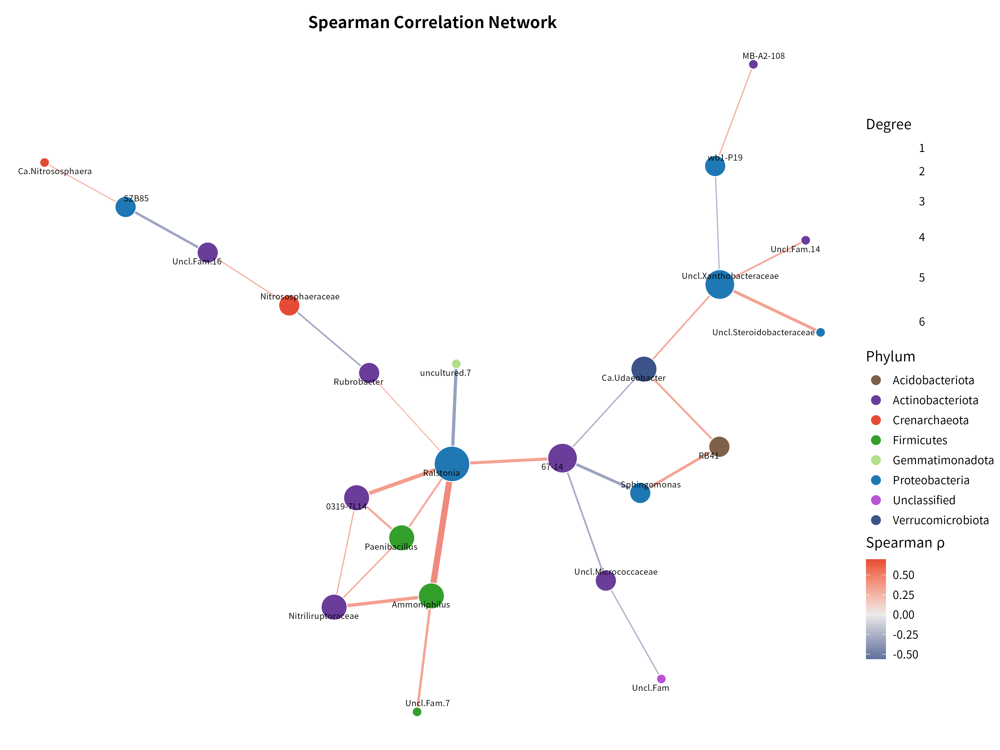
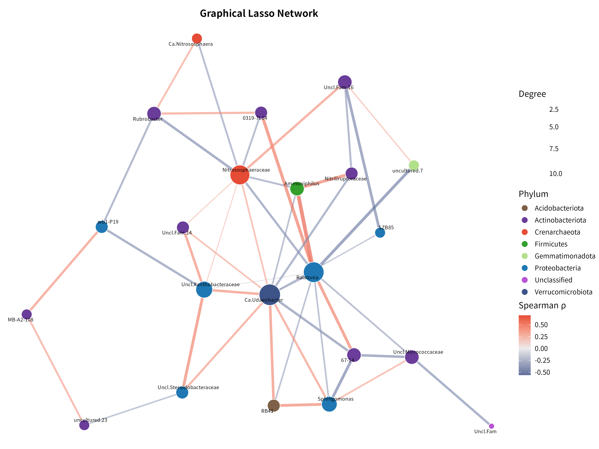

# 16S 微生物组最佳实践系列（九）：共现网络分析——谁和谁总在一起

> 📋 教程信息
> - GitHub：[petemeng/16S-Tutorial](https://github.com/petemeng/16S-Tutorial)（完整代码与环境文件）
> - 数据来源：Atacama soils 双端数据集（54 个样本，33 个过滤后属用于网络分析）
> - 预计阅读：40 分钟 | 实操：25 分钟
> - 难度：⭐⭐⭐⭐（5 星制）
> - 前置知识：完成本系列第 6 篇，`results/` 下有 `phyloseq_object.rds`

---

## 本篇目标

前面几篇我们一直在看"某个 genus 在哪里多、哪里少"。但群落不是一个个 genus 独立存在的清单，很多类群会一起波动，也有些类群会呈现互相排斥的模式。

这一篇换个问题：**Atacama 荒漠土壤里，哪些 genus 倾向于协同出现，哪些是网络中的 hub？**

读完这一篇，你会：

1. 理解为什么微生物组网络不能直接拿原始相对丰度做 Pearson 相关
2. 用 **CLR + Spearman** 先得到边际相关网络
3. 用 **graphical lasso** 进一步提取更稀疏的条件依赖网络
4. 找出 degree 和 betweenness 最高的 hub genus
5. 知道网络结果更适合提出生态假说，而不是直接宣称"互作已被证明"

---

## 为什么这里不用"直接相关"

微生物组网络最大的坑，仍然是前面反复提到的**组成性问题**。

如果你直接对相对丰度矩阵做 Pearson 相关，一个 genus 比例上升，别的 genus 比例就会被动下降，于是很容易制造出一堆并不存在的负相关。

这套 Atacama 教程里，我们用两步走来尽量减轻这个问题：

**第一步，用 CLR 变换后再做 Spearman。**  
它保留了"谁和谁一起变"的直观性，适合先看边际相关网络。

**第二步，用 `huge` 包的 graphical lasso。**  
它不是简单地看两两相关，而是在控制其他 genus 之后，保留更可能属于"直接条件依赖"的边。

所以这篇里你会看到两张网络图：

1. **Spearman 网络**：边更少，方便先看显著共变关系
2. **graphical lasso 网络**：边更多但更稀疏，适合看条件依赖结构

---

## 准备工作

和前面的差异分析一样，我们先把 ASV 合并到 genus 水平，再做一层 prevalence 和平均丰度过滤，避免极低丰度噪声把网络搞得很碎。

```r
# ============================================================
# 文件：analysis/09_network_analysis.R
# 功能：Atacama genus 水平共现网络分析
# 方法：CLR + Spearman；graphical lasso
# ============================================================

source("/media/desk16/tly9658/16s-atacama-tutorial/analysis/common_16s.R")

suppressPackageStartupMessages({
  library(ggraph)
  library(ggplot2)
  library(ggrepel)
  library(graphlayouts)
  library(huge)
  library(igraph)
  library(patchwork)
  library(tidygraph)
})

ensure_dir(file.path(ATACAMA_ROOT, "results", "figures"))

ps <- readRDS(file.path(ATACAMA_ROOT, "results", "phyloseq_object.rds"))
ps <- prune_taxa(taxa_sums(ps) > 0, ps)
ps_genus <- tax_glom(ps, taxrank = "Genus", NArm = FALSE)

otu <- as(otu_table(ps_genus), "matrix")
if (taxa_are_rows(ps_genus)) {
  otu <- t(otu)
}

tax_df <- tax_table(ps_genus) %>%
  data.frame(check.names = FALSE) %>%
  rownames_to_column("FeatureID") %>%
  mutate(
    Family = ifelse(is.na(Family) | Family == "", "Family_unclassified", Family),
    Genus = ifelse(is.na(Genus) | Genus == "", paste0("Unclassified_", Family), Genus),
    Phylum = ifelse(is.na(Phylum) | Phylum == "", "Unclassified", Phylum)
  )

genus_names <- make.unique(tax_df$Genus)
colnames(otu) <- genus_names

prevalence <- colSums(otu > 0) / nrow(otu)
mean_abundance <- colMeans(otu / rowSums(otu))
keep <- prevalence >= 0.2 & mean_abundance >= 5e-4
otu_filt <- otu[, keep, drop = FALSE]

cat("网络分析输入：\n")
cat("  样本数:", nrow(otu_filt), "\n")
cat("  属数:", ncol(otu_filt), "\n")
```

```text
📊 输出：
网络分析输入：
  样本数: 54
  属数: 33
```

54 个样本对网络分析是能做的，但也不算非常奢侈。所以这里一开始就把 genus 数压到 33 个，重点是先拿到稳一点的结构，而不是追求"边越多越好看"。

---

## Step 1：CLR + Spearman 网络

这一步先回答最直观的问题：**哪些 genus 在 Across samples 的变化趋势最一致？**

```r
# ============================================================
# Step 1: CLR + Spearman
# ============================================================

clr_mat <- log(otu_filt + 0.5)
clr_mat <- clr_mat - rowMeans(clr_mat)

cor_mat <- cor(clr_mat, method = "spearman")
p_mat <- matrix(
  1,
  ncol = ncol(clr_mat),
  nrow = ncol(clr_mat),
  dimnames = list(colnames(clr_mat), colnames(clr_mat))
)

for (i in seq_len(ncol(clr_mat) - 1)) {
  for (j in (i + 1):ncol(clr_mat)) {
    test_res <- suppressWarnings(cor.test(
      clr_mat[, i], clr_mat[, j], method = "spearman"
    ))
    p_mat[i, j] <- test_res$p.value
    p_mat[j, i] <- test_res$p.value
  }
}

q_mat <- matrix(
  p.adjust(as.vector(p_mat), method = "BH"),
  nrow = nrow(p_mat),
  byrow = FALSE
)
rownames(q_mat) <- rownames(p_mat)
colnames(q_mat) <- colnames(p_mat)

edge_idx <- which(abs(cor_mat) >= 0.45 & q_mat < 0.05, arr.ind = TRUE)
edge_idx <- edge_idx[edge_idx[, 1] < edge_idx[, 2], , drop = FALSE]

spearman_edges <- tibble(
  from = colnames(cor_mat)[edge_idx[, 1]],
  to = colnames(cor_mat)[edge_idx[, 2]],
  rho = cor_mat[edge_idx],
  q_value = q_mat[edge_idx]
)

write_tsv(spearman_edges, file.path(ATACAMA_ROOT, "results", "network_spearman_edges.tsv"))

cat("Spearman 显著边数:", nrow(spearman_edges), "\n")
```

```text
📊 输出：
Spearman 显著边数: 26
```

26 条显著边，说明这批荒漠土壤样本里不是"所有 genus 都彼此弱相关"，而是能筛出一批结构化共变关系。

从 `results/network_spearman_edges.tsv` 里直接看前几条边，也能感受到这个网络不是纯正相关：

```text
📊 输出：
from                               to                                 rho      q_value
Candidatus_Nitrososphaera          SZB85                              0.4608   0.0114
Ralstonia                          uncultured.7                      -0.5595   0.0021
Candidatus_Udaeobacter             Unclassified_Xanthobacteraceae     0.4904   0.0073
wb1-P19                            Unclassified_Xanthobacteraceae    -0.4606   0.0114
Unclassified_Steroidobacteraceae   Unclassified_Xanthobacteraceae     0.5493   0.0021
```

这里既有正相关，也有负相关。已经能看到 **`Ralstonia`** 和 **`Candidatus_Udaeobacter`** 等关键节点。

---

## Step 2：计算 hub genus

有了边之后，下一步通常不是直接解释每一条关系，而是先问：**谁在网络里最"忙"？**

```r
# ============================================================
# Step 2: 计算节点拓扑指标
# ============================================================

tax_lookup <- tax_df %>%
  transmute(Genus = genus_names, Phylum)

g_spearman <- graph_from_data_frame(
  spearman_edges,
  directed = FALSE,
  vertices = tax_lookup %>%
    filter(Genus %in% unique(c(spearman_edges$from, spearman_edges$to)))
)

V(g_spearman)$degree <- degree(g_spearman)

node_metrics <- tibble(
  Genus = V(g_spearman)$name,
  degree = V(g_spearman)$degree,
  betweenness = betweenness(g_spearman),
  closeness = closeness(g_spearman)
) %>%
  left_join(tax_lookup, by = "Genus") %>%
  arrange(desc(degree), desc(betweenness))

write_tsv(node_metrics, file.path(ATACAMA_ROOT, "results", "network_node_metrics.tsv"))

cat("Top 10 hub genera（Spearman 网络）：\n")
print(head(node_metrics, 10))
```

```text
📊 输出：
Top 10 hub genera（Spearman 网络）：
# A tibble: 10 × 5
   Genus                               degree betweenness closeness Phylum
 1 Ralstonia                                6       158      0.0179 Proteobacteria
 2 67-14                                    4       139      0.0175 Actinobacteriota
 3 Unclassified_Xanthobacteraceae           4        77      0.0127 Proteobacteria
 4 Candidatus_Udaeobacter                   3        92.5    0.0152 Verrucomicrobiota
 5 Ammoniphilus                             3        27      0.0137 Firmicutes
 6 Paenibacillus                            3         6      0.0135 Firmicutes
 7 0319-7L14                                3         6      0.0135 Actinobacteriota
 8 Nitriliruptoraceae                       3         2      0.0111 Actinobacteriota
 9 Rubrobacter                              2        72      0.0145 Actinobacteriota
10 Nitrososphaeraceae                       2        57      0.0119 Crenarchaeota
```

这一步最值得记住的不是第 8 名还是第 9 名，而是前面那几个重复出现的 hub：

1. **`Ralstonia`** 是 degree 最高的核心节点（degree = 6），同时 betweenness 也最高，说明它不仅连接数多，还位于网络的"交通枢纽"位置
2. **`67-14`** 和 **`Unclassified_Xanthobacteraceae`** 紧随其后（degree = 4），前者 betweenness 也极高
3. **`Candidatus_Udaeobacter`** 虽然 degree 只有 3，但 betweenness 达到 92.5，说明它在子网络之间起到了桥梁作用
4. **`0319-7L14`** 不只在差异分析和随机森林里出现，在网络里也有一定连接度

这就是为什么网络分析很适合和第 7、10 篇联动看。一个 genus 如果同时是差异属、分类特征、hub，证据链会明显更完整。

---

## Step 3：画 Spearman 网络图

```r
# 缩短过长的属名用于图表显示
shorten_genus <- function(x) {
  x <- gsub("Unclassified_Family_unclassified", "Uncl.Fam", x)
  x <- gsub("Unclassified_", "Uncl.", x)
  x <- gsub("Candidatus_", "Ca.", x)
  x
}

V(g_spearman)$label <- shorten_genus(V(g_spearman)$name)

set.seed(42)
p_spearman <- ggraph(g_spearman, layout = "stress") +
  geom_edge_link(
    aes(color = rho, width = abs(rho)),
    alpha = 0.65
  ) +
  geom_node_point(
    aes(fill = Phylum, size = degree),
    shape = 21, color = "white", stroke = 0.6
  ) +
  geom_node_text(
    aes(label = label),
    size = 2.6, repel = TRUE,
    max.overlaps = 30,
    segment.color = "grey55",
    segment.size = 0.25,
    point.padding = unit(0.25, "lines")
  ) +
  scale_edge_color_gradient2(
    low = "#3C5488", mid = "grey92", high = "#E64B35",
    midpoint = 0, name = expression(Spearman~rho)
  ) +
  scale_edge_width(range = c(0.4, 2.5), guide = "none") +
  scale_size_continuous(range = c(3.5, 14), name = "Degree") +
  scale_fill_manual(values = phylum_colors, name = "Phylum") +
  guides(fill = guide_legend(override.aes = list(size = 4))) +
  labs(title = "Spearman Correlation Network") +
  theme_void(base_size = 12) +
  theme(
    legend.position = "right",
    plot.title = element_text(hjust = 0.5, face = "bold", size = 14),
    plot.background = element_rect(fill = "white", color = NA)
  )

save_plot_dual(p_spearman, "ch09_spearman_network", width = 12, height = 9)
```



**图 1：CLR + Spearman 共现网络。** 红色边表示正相关，蓝色边表示负相关；边宽度编码相关系数绝对值，节点大小编码 degree，颜色编码门水平分类。所有节点均标注属名（ggrepel 自动避免重叠），布局使用 stress 算法。`Ralstonia`（Proteobacteria）是 degree 最高的 hub，`67-14`（Actinobacteriota）和 `Candidatus_Udaeobacter`（Verrucomicrobiota）也处于网络核心。

---

## Step 4：graphical lasso 条件依赖网络

Spearman 网络更像"谁和谁一起变"。但生态上更想知道的常常是：**在控制其他 genus 以后，这条边还在不在？**

这就是 graphical lasso 的用途。

```r
# ============================================================
# Step 4: graphical lasso
# ============================================================

huge_fit <- huge(
  clr_mat,
  method = "glasso",
  nlambda = 20,
  lambda.min.ratio = 0.1,
  verbose = FALSE
)

target_idx <- which.min(abs(huge_fit$df - 40))
adj <- as.matrix(huge_fit$path[[target_idx]])
diag(adj) <- 0

glasso_idx <- which(adj != 0, arr.ind = TRUE)
glasso_idx <- glasso_idx[glasso_idx[, 1] < glasso_idx[, 2], , drop = FALSE]

# 直接从完整相关矩阵查找 rho，确保所有边都有方向信息
glasso_edges <- tibble(
  from = colnames(clr_mat)[glasso_idx[, 1]],
  to = colnames(clr_mat)[glasso_idx[, 2]]
) %>%
  rowwise() %>%
  mutate(rho = cor_mat[from, to]) %>%
  ungroup()

write_tsv(glasso_edges, file.path(ATACAMA_ROOT, "results", "network_glasso_edges.tsv"))

cat("Graphical lasso 选择的路径索引:", target_idx, "\n")
cat("Graphical lasso 边数:", nrow(glasso_edges), "\n")
```

```text
📊 输出：
Graphical lasso 选择的路径索引: 6
Graphical lasso 边数: 45
```

这里得到 45 条边，比 Spearman 的 26 条更多，但别把"边数更多"理解成"更宽松"。这两张网的含义不同：

1. **Spearman** 需要单边显著，强调的是边际相关
2. **graphical lasso** 强调的是整体稀疏结构，允许一些不在 Spearman 显著表里的边保留下来

```r
g_glasso <- graph_from_data_frame(
  glasso_edges,
  directed = FALSE,
  vertices = tax_lookup %>%
    filter(Genus %in% unique(c(glasso_edges$from, glasso_edges$to)))
)

V(g_glasso)$degree <- degree(g_glasso)
V(g_glasso)$label <- shorten_genus(V(g_glasso)$name)

set.seed(42)
p_glasso <- ggraph(g_glasso, layout = "stress") +
  geom_edge_link(
    aes(color = rho, width = abs(rho)),
    alpha = 0.6
  ) +
  geom_node_point(
    aes(fill = Phylum, size = degree),
    shape = 21, color = "white", stroke = 0.6
  ) +
  geom_node_text(
    aes(label = label),
    size = 2.6, repel = TRUE,
    max.overlaps = 30,
    segment.color = "grey55",
    segment.size = 0.25,
    point.padding = unit(0.25, "lines")
  ) +
  scale_edge_color_gradient2(
    low = "#3C5488", mid = "grey92", high = "#E64B35",
    midpoint = 0, name = expression(Spearman~rho)
  ) +
  scale_edge_width(range = c(0.4, 2.5), guide = "none") +
  scale_size_continuous(range = c(3.5, 14), name = "Degree") +
  scale_fill_manual(values = phylum_colors, name = "Phylum") +
  guides(fill = guide_legend(override.aes = list(size = 4))) +
  labs(title = "Graphical Lasso Network") +
  theme_void(base_size = 12) +
  theme(
    legend.position = "right",
    plot.title = element_text(hjust = 0.5, face = "bold", size = 14),
    plot.background = element_rect(fill = "white", color = NA)
  )

save_plot_dual(p_glasso, "ch09_glasso_network", width = 12, height = 9)
```



**图 2：graphical lasso 条件依赖网络。** 边颜色同样编码 Spearman 相关方向（红色正相关、蓝色负相关），边宽度编码相关系数绝对值。与图 1 相比，这张网络保留了更多条件依赖边（45 vs 26），包括一些不在 Spearman 显著列表中但具有条件依赖关系的连接。

把两张图放在一起看，最稳的解读通常是：

**如果某个 genus 同时出现在 Spearman 核心区域和 glasso 骨架里，它更值得后续重点讨论。**

---

## 这一章结果该怎么写

如果你要把这一章写进论文或报告，比较稳妥的表述是：

**"在 genus 水平经 prevalence/丰度过滤后，共保留 33 个特征用于网络分析。CLR 转换后的 Spearman 网络识别出 26 条显著关联边，其中 `Ralstonia`、`67-14` 和 `Unclassified_Xanthobacteraceae` 具有最高的中心性。进一步使用 graphical lasso 构建条件依赖网络，共得到 45 条边，提示上述类群位于 Atacama 土壤共变结构的核心位置。"**

这样写的好处是：

1. 不会把"共现"说成"互作已证实"
2. 同时交代了过滤策略和方法学前提
3. 给后面随机森林和整合分析留下接口

---

## 本篇小结

这一篇我们把 Atacama 的 genus 水平数据做成了两张网络：

**Spearman 网络** 给出 26 条显著边，适合先看"谁和谁经常一起变"。

**graphical lasso 网络** 给出 45 条条件依赖边，适合看更稀疏的网络骨架。

最醒目的 hub 是 **`Ralstonia`**（degree = 6，betweenness = 158），其次是 **`67-14`** 和 **`Unclassified_Xanthobacteraceae`**。**`0319-7L14`** 也出现在网络中，如果后面它还能在随机森林等分析里出现，就会成为值得重点追踪的候选生态核心类群。

---

## 下一篇预告

网络分析解决的是"谁和谁有关系"。但如果你真正想做 biomarker，审稿人更关心的是另一件事：**哪些 genus 最能区分 Baquedano 和 Yungay？**

下一篇我们进入随机森林，用交叉验证、特征重要性和 SHAP 值，看看哪些 genus 最能代表这两条 transect。

---

> 📌 本篇图和表都来自服务器实际运行结果，可在 GitHub 仓库直接复现。

---

## 本系列导航

| 篇目 | 主题 | 状态 |
|------|------|------|
| 第 1 篇 | 只测一个基因，怎么就能知道有哪些细菌 | ✅ 已发布 |
| 第 2 篇 | 搭建环境，拿到数据 | ✅ 已发布 |
| 第 3 篇 | DADA2 去噪——从噪声中找到真实序列 | ✅ 已发布 |
| 第 4 篇 | 物种注释——给每个 ASV 一个名字 | ✅ 已发布 |
| 第 5 篇 | 多样性分析——有多"丰富"，彼此有多"不同" | ✅ 已发布 |
| 第 6 篇 | 物种组成可视化——谁占了多少 | ✅ 已发布 |
| 第 7 篇 | 差异物种分析——谁真的变了 | ✅ 已发布 |
| 第 8 篇 | PICRUSt2 功能预测——它们能做什么 | ✅ 已发布 |
| **第 9 篇** | **共现网络分析——谁和谁总在一起** | **📍 本篇** |
| 第 10 篇 | 随机森林 biomarker 筛选 | ✅ 已发布 |
| 第 11 篇 | SourceTracker 溯源分析 | ✅ 已发布 |
| 第 12 篇 | 微生物组-代谢组联合分析 | ✅ 已发布 |
| 第 13 篇 | 发表级图表与结果整合 | ✅ 已发布 |
