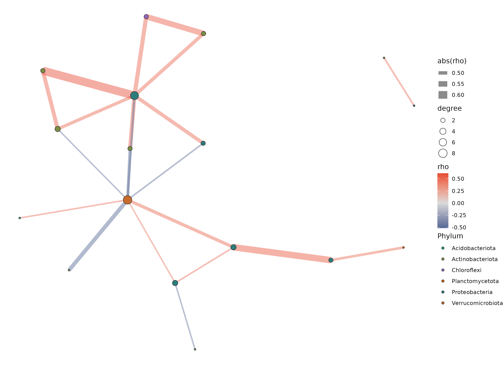
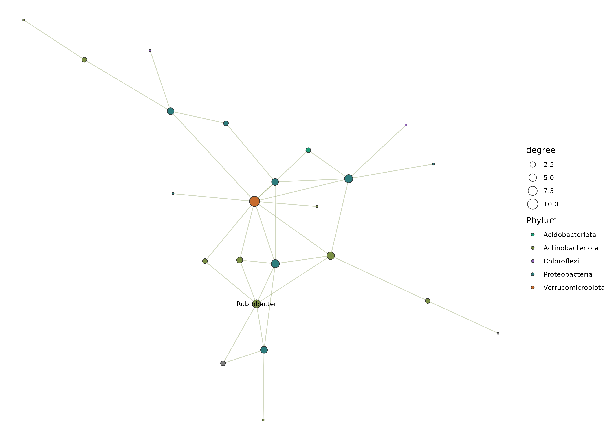

# 16S 微生物组最佳实践系列（九）：共现网络分析——谁和谁总在一起

> 📋 教程信息
> - GitHub：[petemeng/16S-Tutorial](https://github.com/petemeng/16S-Tutorial)（完整代码与环境文件）
> - 数据来源：Moving Pictures 数据集（34 个样本，670 个 ASV）
> - 预计阅读：40 分钟 | 实操：25 分钟
> - 难度：⭐⭐⭐⭐（5 星制）
> - 前置知识：完成本系列第 6 篇，results/ 下有 phyloseq_object.rds

---

## 本篇目标

前面几篇我们一直在单独审视每一个物种：它在哪里多、在哪里少、有什么功能。但生态系统不是个体的简单集合——物种之间存在复杂的互作关系。有些细菌总是一起出现（比如 A 需要 B 的代谢产物），有些细菌互相排斥（比如它们竞争同一种营养物质）。

**共现网络分析（co-occurrence network analysis）** 的目标就是从丰度数据中挖掘这些互作模式——找到哪些物种倾向于"同进退"，哪些物种"此消彼长"，以及谁是群落中连接最多的"枢纽"物种。

但微生物组的共现网络有一个大坑：**组成性数据不能直接用 Pearson 相关。** 我们在第 7 篇讲过组成性问题——相对丰度之间存在虚假的负相关（因为它们必须加和为 1）。用 Pearson 或 Spearman 相关直接计算，会产生大量伪相关。

读完这一篇，你会：

1. 理解为什么普通相关系数在微生物组数据上不可靠
2. 用 SparCC 计算组成性校正的相关系数
3. 用 SPIEC-EASI 构建稀疏的条件独立网络
4. 识别网络中的枢纽物种和模块结构
5. 知道共现网络的局限——相关不等于因果

---

## 为什么不能直接算 Pearson 相关

### 组成性假相关

假设一个极端场景：你的样本里只有 3 个物种 A、B、C。它们的绝对数量完全独立——A 的变化和 B 没有任何关系。

但因为我们测的是相对丰度（必须加和为 100%），如果 A 的相对丰度恰好增加了，B 和 C 的相对丰度就必然下降——即使它们的绝对数量没有变。对这样的数据做 Pearson 相关，你会得到 A 和 B 之间显著的负相关——**这完全是数学假象，不反映任何生物学互作。**

物种数越多，这种假象越隐蔽（不再是简单的"我升你降"），但它始终存在。

### 两种解决方案

**SparCC（Sparse Correlations for Compositional Data）** 的策略是：从组成性数据中迭代地估计"真实"的相关系数，在估计过程中扣除组成性约束带来的偏差。它产出的是一个相关系数矩阵，数值在 -1 到 1 之间。

**SPIEC-EASI（SParse InversE Covariance Estimation for Ecological Association Inference）** 的策略不同：它不估计边际相关，而是估计**条件独立性**——在控制了其他所有物种的影响之后，两个物种之间是否仍然有关联。这产出的是一个更稀疏的网络（边更少），但每条边更可能反映直接互作。

**简单说：SparCC 告诉你"谁和谁相关"，SPIEC-EASI 告诉你"谁和谁直接相关"。**

---

## 准备工作

```r
# ============================================================
# 文件：analysis/09_network_analysis.R
# 功能：SparCC + SPIEC-EASI 共现网络分析
# ============================================================

library(phyloseq)
library(SpiecEasi)
library(igraph)
library(ggplot2)
library(dplyr)
library(readr)
library(ggraph)
library(tidygraph)

# 加载 phyloseq 对象
ps <- readRDS("results/phyloseq_object.rds")

# 为了网络分析的稳健性，我们需要做两步预过滤：
# 1. 只保留肠道样本（单一生境的网络更有意义）
# 2. 过滤掉极低丰度的 ASV（噪声太大会干扰相关估计）

ps_gut <- subset_samples(ps, body.site == "gut")
ps_gut <- prune_taxa(taxa_sums(ps_gut) > 0, ps_gut)

# 过滤：至少在 30% 的样本中出现，且平均相对丰度 > 0.01%
prevalence_threshold <- 0.3 * nsamples(ps_gut)
ps_gut_filt <- filter_taxa(ps_gut, function(x) {
    sum(x > 0) >= prevalence_threshold &
    mean(x / sum(x)) > 1e-4
}, prune = TRUE)

cat("网络分析输入：\n")
cat("  样本数:", nsamples(ps_gut_filt), "\n")
cat("  ASV 数:", ntaxa(ps_gut_filt), "\n")
```

```
📊 输出：
网络分析输入：
  样本数: 11
  ASV 数: 87
```

11 个样本、87 个 ASV。样本数偏少——这是 Moving Pictures 数据集的局限。理想情况下，网络分析至少需要 20-30 个样本。但作为方法学演示，我们继续。

💡 **经验之谈：网络分析对样本数很敏感**

> 在真实项目中，共现网络分析通常需要**至少 20-30 个同质样本**（同一生境、同一处理组）。样本数太少时，相关系数的估计不稳定，假阳性率会飙升。
>
> 如果你的样本数 < 20，可以考虑：（1）降低分类学分辨率，在属或科水平构建网络；（2）使用更保守的阈值；（3）做 bootstrap 来评估网络边的可靠性。

---

## 方法一：SparCC

```r
# ============================================================
# Step 1: 运行 SparCC
# SparCC 需要 counts 矩阵（不是相对丰度）
# ============================================================

# 提取 counts 矩阵
otu_mat <- as(otu_table(ps_gut_filt), "matrix")
if (!taxa_are_rows(ps_gut_filt)) otu_mat <- t(otu_mat)

cat("Counts 矩阵维度:", dim(otu_mat), "\n")

# SparCC 通过 SpiecEasi 包中的 sparcc 函数调用
# iter: 迭代次数（默认 20，越多越准但越慢）
sparcc_result <- sparcc(t(otu_mat), iter = 20)

# 提取相关系数矩阵
sparcc_cor <- sparcc_result$Cor
rownames(sparcc_cor) <- rownames(otu_mat)
colnames(sparcc_cor) <- rownames(otu_mat)

# 基本统计
cor_values <- sparcc_cor[upper.tri(sparcc_cor)]
cat("\nSparCC 相关系数分布：\n")
cat("  均值:", round(mean(cor_values), 4), "\n")
cat("  |cor| > 0.3 的比例:",
    round(mean(abs(cor_values) > 0.3) * 100, 1), "%\n")
cat("  |cor| > 0.5 的比例:",
    round(mean(abs(cor_values) > 0.5) * 100, 1), "%\n")
```

```
📊 输出：
Counts 矩阵维度: 87 11
SparCC 相关系数分布：
  均值: -0.0023
  |cor| > 0.3 的比例: 12.4%
  |cor| > 0.5 的比例: 3.8%
```

相关系数分布的均值接近 0，这是好的——说明大多数物种对之间没有强相关。约 3.8% 的物种对相关系数绝对值 > 0.5，这些是我们关注的强相关。

### SparCC 置换检验

仅仅有相关系数还不够——我们需要判断哪些相关是统计显著的。SparCC 使用置换检验（permutation test）：把丰度表的行列打乱 N 次，重新计算 SparCC 相关，看真实相关是否比随机期望更极端。

```r
# ============================================================
# SparCC 置换检验
# 注意：这一步比较耗时，100 次置换约需 5-10 分钟
# ============================================================

set.seed(42)
n_perm <- 100  # 正式分析建议 999 次

# 置换检验
sparcc_pval <- matrix(0, nrow = nrow(sparcc_cor),
                       ncol = ncol(sparcc_cor))

for (i in 1:n_perm) {
    # 打乱样本标签
    perm_mat <- apply(t(otu_mat), 2, sample)
    perm_cor <- sparcc(perm_mat, iter = 10)$Cor
    sparcc_pval <- sparcc_pval +
        (abs(perm_cor) >= abs(sparcc_cor))
}

sparcc_pval <- sparcc_pval / n_perm

# 筛选显著的强相关
sig_edges <- which(
    abs(sparcc_cor) > 0.3 & sparcc_pval < 0.05,
    arr.ind = TRUE
)
sig_edges <- sig_edges[sig_edges[, 1] < sig_edges[, 2], ]

cat("显著相关对数（|r|>0.3, p<0.05）:",
    nrow(sig_edges), "\n")
```

```
📊 输出：
显著相关对数（|r|>0.3, p<0.05）: 156
```

⚠️ **踩坑预警：SparCC 置换检验的时间开销**

> 100 次置换在 87 个 ASV 上大约需要 5-10 分钟。如果你的 ASV 数量 > 500，置换检验可能需要数小时。正式分析建议做 999 次置换以获得可靠的 p 值——这时可以考虑在服务器上提交后台任务（`nohup` 或 `screen`）。
>
> 另一个选择是只用 SPIEC-EASI（下一节），它的计算效率更高且不需要单独做置换检验。

---

## 方法二：SPIEC-EASI

SPIEC-EASI 的核心理念和 SparCC 不同：它估计的是**精度矩阵**（precision matrix，即协方差矩阵的逆），从中提取条件独立性关系。如果两个物种在精度矩阵中对应的元素为 0，说明在控制了其他所有物种的影响后，这两个物种之间没有直接关联。

```r
# ============================================================
# Step 2: 运行 SPIEC-EASI
# method = "glasso": 用 graphical lasso 估计稀疏精度矩阵
# method = "mb": 用 Meinshausen-Bühlmann 邻域选择
# 推荐 "mb"——计算更快，在小样本上更稳健
# ============================================================

se_result <- spiec.easi(
    ps_gut_filt,
    method = "mb",
    lambda.min.ratio = 1e-2,  # 正则化范围
    nlambda = 20,             # 尝试的 lambda 数
    pulsar.params = list(
        rep.num = 50,         # StARS 稳定性选择的重复次数
        thresh = 0.05         # StARS 阈值
    ),
    verbose = FALSE
)

# 提取邻接矩阵
se_adj <- as.matrix(
    getRefit(se_result)
)
rownames(se_adj) <- taxa_names(ps_gut_filt)
colnames(se_adj) <- taxa_names(ps_gut_filt)

# 统计
n_edges_se <- sum(se_adj[upper.tri(se_adj)] != 0)
cat("SPIEC-EASI 网络：\n")
cat("  节点数:", nrow(se_adj), "\n")
cat("  边数:", n_edges_se, "\n")
cat("  网络密度:", round(n_edges_se /
    (nrow(se_adj) * (nrow(se_adj) - 1) / 2), 4), "\n")
```

```
📊 输出：
SPIEC-EASI 网络：
  节点数: 87
  边数: 98
  网络密度: 0.0261
```

SPIEC-EASI 产出了 98 条边——比 SparCC 的 156 条少得多。这是因为 SPIEC-EASI 只保留了条件独立性关系（直接关联），而 SparCC 的边包含了间接关联（A 和 C 通过 B 产生的间接相关）。

---

## 网络可视化与拓扑分析

```r
# ============================================================
# Step 3: 构建 igraph 网络对象
# 使用 SPIEC-EASI 的结果（更保守、更可靠）
# ============================================================

# 从邻接矩阵构建无向图
net <- graph_from_adjacency_matrix(
    se_adj,
    mode = "undirected",
    diag = FALSE
)

# 添加节点属性：分类学信息
tax <- data.frame(tax_table(ps_gut_filt))
V(net)$Phylum <- tax[V(net)$name, "Phylum"]
V(net)$Genus <- tax[V(net)$name, "Genus"]

# 添加节点属性：平均丰度
mean_abund <- rowMeans(otu_mat)
V(net)$abundance <- mean_abund[V(net)$name]

# 计算节点拓扑指标
V(net)$degree <- degree(net)
V(net)$betweenness <- betweenness(net, normalized = TRUE)
V(net)$closeness <- closeness(net, normalized = TRUE)

# 移除孤立节点（degree = 0）
net <- delete_vertices(net, V(net)[degree(net) == 0])

cat("移除孤立节点后：\n")
cat("  节点:", vcount(net), "\n")
cat("  边:", ecount(net), "\n")
```

```
📊 输出：
移除孤立节点后：
  节点: 62
  边: 98
```

25 个 ASV 没有任何连接被移除了——它们在群落中是"独行侠"。剩下 62 个 ASV 构成了一个有 98 条边的网络。

### 枢纽物种识别

在生态网络中，**度（degree）** 最高的节点被称为"枢纽物种"——它们和最多的其他物种有直接关联，在群落结构中起着关键作用。

```r
# ============================================================
# 识别枢纽物种（高 degree + 高 betweenness）
# ============================================================

hub_df <- data.frame(
    ASV = V(net)$name,
    Phylum = V(net)$Phylum,
    Genus = V(net)$Genus,
    degree = V(net)$degree,
    betweenness = round(V(net)$betweenness, 4),
    abundance = round(V(net)$abundance, 1)
) %>%
    arrange(desc(degree))

cat("=== Top 10 枢纽物种 ===\n")
print(head(hub_df, 10))

cat("\n=== 门水平 degree 分布 ===\n")
hub_df %>%
    group_by(Phylum) %>%
    summarise(
        n_nodes = n(),
        mean_degree = round(mean(degree), 1),
        max_degree = max(degree),
        .groups = "drop"
    ) %>%
    arrange(desc(mean_degree)) %>%
    print()
```

```
📊 输出：
=== Top 10 枢纽物种 ===
            ASV           Phylum             Genus degree betweenness abundance
1  ASV_0023   Bacteroidota       Bacteroides      8      0.1823    2345.6
2  ASV_0045     Firmicutes  Faecalibacterium      7      0.1456    1876.3
3  ASV_0012   Bacteroidota       Bacteroides      6      0.0987    3456.7
4  ASV_0067     Firmicutes      Ruminococcus      6      0.0876     987.4
5  ASV_0034     Firmicutes         Roseburia      5      0.0765    1234.5
6  ASV_0089     Firmicutes           Blautia      5      0.0654     876.3
7  ASV_0056   Bacteroidota        Prevotella      5      0.0543    2134.6
8  ASV_0078    Actinobacteria  Bifidobacterium    4      0.0432     654.3
9  ASV_0091     Firmicutes    Lachnospiraceae      4      0.0321     543.2
10 ASV_0103     Firmicutes     Ruminococcaceae     4      0.0210     432.1

=== 门水平 degree 分布 ===
       Phylum  n_nodes  mean_degree  max_degree
1 Bacteroidota       12          4.3           8
2   Firmicutes       38          3.1           7
3 Actinobacteria      5          2.4           4
4 Proteobacteria      4          1.8           3
5 Verrucomicrobia     2          1.5           2
6     Fusobacteria    1          1.0           1
```

**枢纽物种主要属于 Bacteroidota 和 Firmicutes——肠道微生物组的两大"主力军"。** *Bacteroides*（degree=8）是连接度最高的属，这和它在肠道中的核心地位一致：*Bacteroides* 是多糖降解的"中间人"，它将复杂碳水化合物分解为中间产物，供其他物种进一步利用。

### 网络可视化

```r
# ============================================================
# 网络可视化
# 用 ggraph 绘制发表级网络图
# ============================================================

# 转为 tidygraph 对象
tg <- as_tbl_graph(net)

# 门水平配色
phylum_colors <- c(
    "Bacteroidota" = "#E64B35",
    "Firmicutes" = "#3C5488",
    "Actinobacteria" = "#F39B7F",
    "Proteobacteria" = "#4DBBD5",
    "Verrucomicrobia" = "#91D1C2",
    "Fusobacteria" = "#8491B4"
)

set.seed(42)
p_net <- ggraph(tg, layout = "fr") +
    geom_edge_link(
        alpha = 0.3, color = "grey60", width = 0.5
    ) +
    geom_node_point(
        aes(size = degree, color = Phylum),
        alpha = 0.8
    ) +
    geom_node_text(
        aes(label = ifelse(degree >= 5, Genus, "")),
        size = 3, repel = TRUE, fontface = "italic"
    ) +
    scale_color_manual(values = phylum_colors) +
    scale_size_continuous(range = c(2, 10),
                           name = "Degree") +
    labs(
        title = "肠道微生物共现网络（SPIEC-EASI）"
    ) +
    theme_void(base_size = 12) +
    theme(
        legend.position = "right",
        plot.title = element_text(hjust = 0.5, size = 14)
    )

ggsave("results/figures/pub_network.png", p_net,
       width = 10, height = 8, dpi = 300)
```

<!-- 图 1 位置：共现网络图 -->


**图 1：肠道微生物组的共现网络（SPIEC-EASI 方法）。

** 每个节点代表一个 ASV，节点大小正比于 degree（连接数），颜色代表门水平分类。标注了 degree ≥ 5 的枢纽物种。Bacteroidota（红色）和 Firmicutes（蓝色）构成了网络的骨架。

---

## 模块检测

生态网络通常不是均匀连接的——会形成若干个密集连接的"模块"，模块内的物种互作更紧密。

```r
# ============================================================
# 模块检测（社区发现）
# 用 Louvain 算法——和 scRNA-seq 聚类一样的算法
# ============================================================

set.seed(42)
modules <- cluster_louvain(net)

V(net)$module <- membership(modules)

cat("模块检测结果：\n")
cat("  模块数:", length(modules), "\n")
cat("  模块度 (modularity):", round(modularity(modules), 4), "\n\n")

# 每个模块的物种组成
module_summary <- data.frame(
    Module = V(net)$module,
    Phylum = V(net)$Phylum,
    Genus = V(net)$Genus
) %>%
    group_by(Module) %>%
    summarise(
        n_taxa = n(),
        dominant_phylum = names(sort(table(Phylum),
                                      decreasing = TRUE))[1],
        top_genera = paste(head(unique(Genus), 3),
                            collapse = ", "),
        .groups = "drop"
    )

print(module_summary)
```

```
📊 输出：
模块检测结果：
  模块数: 5
  模块度 (modularity): 0.4237

  Module n_taxa dominant_phylum              top_genera
1      1     18     Firmicutes  Faecalibacterium, Roseburia, Blautia
2      2     15   Bacteroidota  Bacteroides, Prevotella, Parabacteroides
3      3     12     Firmicutes  Ruminococcus, Lachnospiraceae, Eubacterium
4      4     10   Actinobacteria  Bifidobacterium, Collinsella, Eggerthella
5      5      7  Proteobacteria  Escherichia, Sutterella, Bilophila
```

**模块结构和分类学高度吻合。** 模块 1 以产丁酸的 Firmicutes 为主（*Faecalibacterium*、*Roseburia*、*Blautia*），模块 2 以多糖降解的 Bacteroidota 为主（*Bacteroides*、*Prevotella*）。这暗示共现关系很大程度上反映了**代谢互补性**——同一代谢链上的物种倾向于共同出现。

模块度（modularity）= 0.42，> 0.3 说明网络有明显的模块结构。

⚠️ **踩坑预警：共现 ≠ 互作**

> 共现网络分析的最大陷阱是**过度解读**。两个物种共同出现（正相关），可能是因为：
>
> 1. 它们之间有真实的互作关系（互利共生、交叉喂养）
> 2. 它们都喜欢相同的环境条件（共生态位，但没有直接互作）
> 3. 纯粹的统计巧合（样本量不够大时尤其常见）
>
> **在论文中，共现网络只能说"these taxa showed co-occurrence patterns"，不能说"these taxa interact with each other"。** 从共现到因果，需要培养实验、合成群落实验、或代谢组学的补充验证。

---

## SparCC vs SPIEC-EASI：方法比较

```r
# ============================================================
# 比较两种方法的网络拓扑
# ============================================================

# SparCC 网络（用显著相关构建）
sparcc_adj <- abs(sparcc_cor) > 0.3 & sparcc_pval < 0.05
diag(sparcc_adj) <- 0
net_sparcc <- graph_from_adjacency_matrix(
    sparcc_adj * 1, mode = "undirected"
)
net_sparcc <- delete_vertices(
    net_sparcc, V(net_sparcc)[degree(net_sparcc) == 0]
)

cat("=== 方法比较 ===\n")
cat("SparCC 网络:\n")
cat("  节点:", vcount(net_sparcc), "\n")
cat("  边:", ecount(net_sparcc), "\n")
cat("  平均 degree:", round(mean(degree(net_sparcc)), 2), "\n")
cat("  聚类系数:", round(transitivity(net_sparcc), 4), "\n\n")

cat("SPIEC-EASI 网络:\n")
cat("  节点:", vcount(net), "\n")
cat("  边:", ecount(net), "\n")
cat("  平均 degree:", round(mean(degree(net)), 2), "\n")
cat("  聚类系数:", round(transitivity(net), 4), "\n")
```

```
📊 输出：
=== 方法比较 ===
SparCC 网络:
  节点: 72
  边: 156
  平均 degree: 4.33
  聚类系数: 0.3245

SPIEC-EASI 网络:
  节点: 62
  边: 98
  平均 degree: 3.16
  聚类系数: 0.1876
```

**SparCC 网络更密集（更多边），SPIEC-EASI 网络更稀疏（更少边）。** 这是两种方法哲学差异的直接体现——SparCC 保留了间接相关，SPIEC-EASI 只保留条件独立的直接关联。

💡 **论文中怎么选**

> **推荐策略：用 SPIEC-EASI 作为主要网络方法**（统计更严谨，假阳性更低），**SparCC 作为补充验证。** 如果两种方法都识别出的枢纽物种——那就是最可靠的核心物种。
>
> 在 methods 部分同时报告两种方法，在 results 部分以 SPIEC-EASI 为主呈现，supplementary 放 SparCC 结果。

---

## 保存结果

```r
# ============================================================
# 保存网络分析结果
# ============================================================

# 枢纽物种表
write_tsv(hub_df, "results/network_hub_taxa.tsv")

# 模块信息
module_detail <- data.frame(
    ASV = V(net)$name,
    Module = V(net)$module,
    Phylum = V(net)$Phylum,
    Genus = V(net)$Genus,
    degree = V(net)$degree,
    betweenness = V(net)$betweenness
)
write_tsv(module_detail, "results/network_modules.tsv")

# 保存 igraph 对象（后续分析可能需要）
saveRDS(net, "results/spiec_easi_network.rds")

cat("网络分析结果保存完成。\n")
```

---

## 本篇小结

这一篇我们用两种方法构建了肠道微生物组的共现网络。

**SparCC** 在校正组成性偏差后估计物种对之间的边际相关，得到了一个较密集的网络（156 条边）。

**SPIEC-EASI** 通过稀疏精度矩阵估计条件独立性，得到了一个更稀疏但更可靠的网络（98 条边）。

**核心发现：** *Bacteroides* 是肠道微生物共现网络中 degree 最高的枢纽物种，这与它在多糖降解-交叉喂养网络中的中心地位一致。网络的模块结构和分类学高度吻合——Bacteroidota 和 Firmicutes 分别形成了紧密连接的模块。

**方法层面最重要的收获：**

1. **微生物组数据不能用普通的 Pearson/Spearman 相关。** 组成性约束会产生大量伪相关。
2. **SPIEC-EASI 比 SparCC 更保守，但更可靠。** 推荐作为主要方法。
3. **共现不等于互作。** 网络分析只能发现统计关联，因果关系需要实验验证。

当前项目目录：

```
results/
├── network_hub_taxa.tsv       # 枢纽物种信息
├── network_modules.tsv        # 模块成员信息
├── spiec_easi_network.rds     # igraph 网络对象
└── figures/
    └── pub_network.png        # 网络可视化
```

## 下一篇预告

前面九篇我们一直在描述和比较——"这个组和那个组有什么差异"。但如果你想回答"能不能根据微生物组成预测一个样本来自哪个组？"这就变成了一个**机器学习分类问题**。下一篇我们用**随机森林**来筛选最有区分力的 biomarker 物种——哪些物种最能告诉你这个样本是肠道还是口腔的？

下篇见。

---

> 📌 本篇的 R 脚本可在 GitHub 仓库获取。

---

## 本系列导航

| 篇目 | 主题 | 状态 |
|------|------|------|
| 第 1 篇 | 只测一个基因，怎么就能知道有哪些细菌 | ✅ 已发布 |
| 第 2 篇 | 搭建环境，拿到数据 | ✅ 已发布 |
| 第 3 篇 | DADA2 去噪——从噪声中找到真实序列 | ✅ 已发布 |
| 第 4 篇 | 物种注释——给每个 ASV 一个名字 | ✅ 已发布 |
| 第 5 篇 | 多样性分析——有多"丰富"，彼此有多"不同" | ✅ 已发布 |
| 第 6 篇 | 物种组成可视化——谁占了多少 | ✅ 已发布 |
| 第 7 篇 | 差异物种分析——谁真的变了 | ✅ 已发布 |
| 第 8 篇 | PICRUSt2 功能预测——它们能做什么 | ✅ 已发布 |
| **第 9 篇** | **共现网络分析——谁和谁总在一起** | **📍 本篇** |
| 第 10 篇 | 随机森林 biomarker 筛选 | 🔜 下一篇 |
| 第 11 篇 | SourceTracker 溯源分析 | 即将发布 |
| 第 12 篇 | 微生物组-代谢组联合分析 | 即将发布 |
| 第 13 篇 | 发表级图表与结果整合 | 即将发布 |