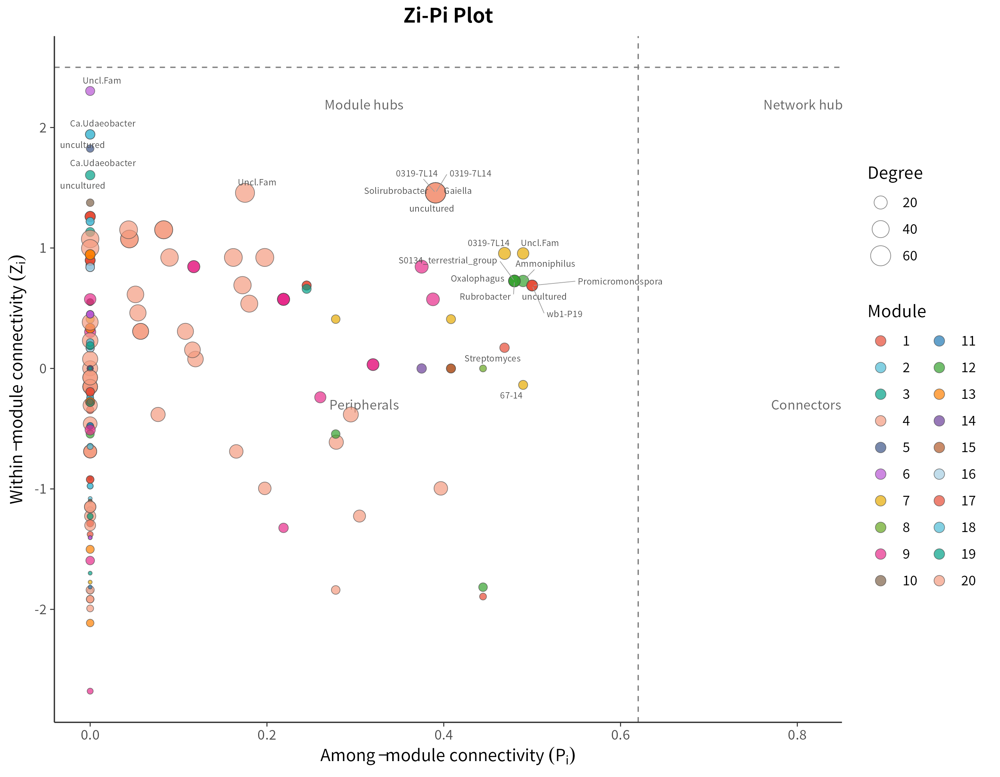
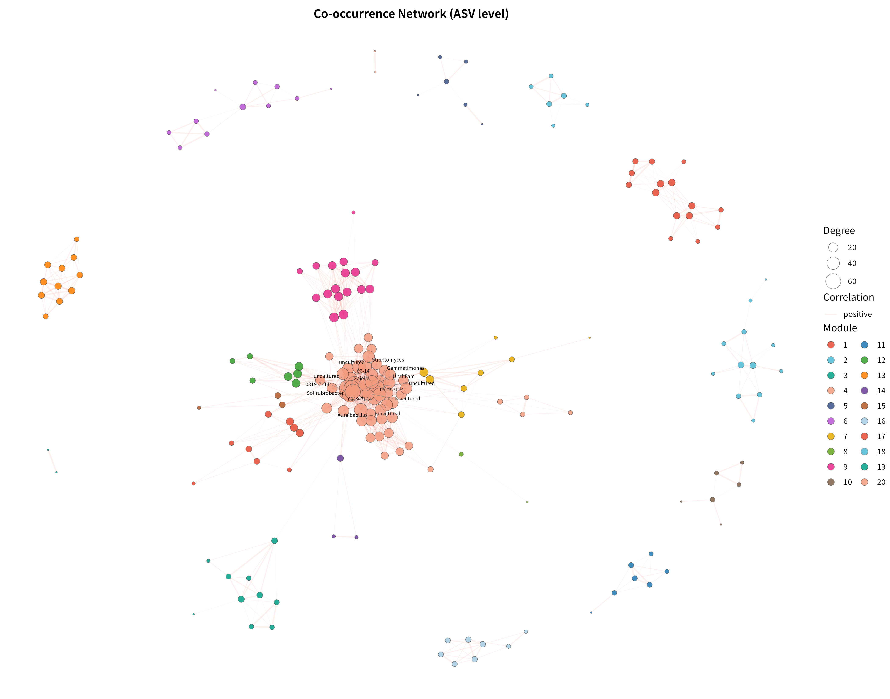
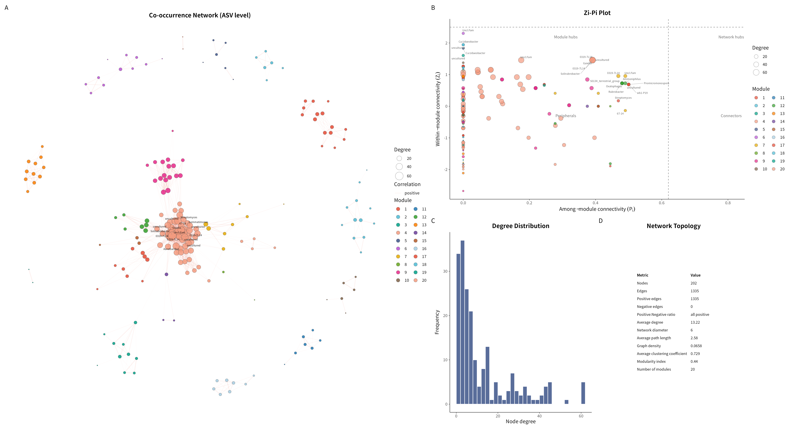

# 16S 微生物组最佳实践系列（九）：共现网络分析——谁和谁总在一起

> 📋 教程信息
> - GitHub：[petemeng/16S-Tutorial](https://github.com/petemeng/16S-Tutorial)（完整代码与环境文件）
> - 数据来源：Atacama soils 双端数据集（54 个样本，265 个过滤后 ASV 用于网络分析）
> - 预计阅读：40 分钟 | 实操：25 分钟
> - 难度：⭐⭐⭐⭐（5 星制）
> - 前置知识：完成本系列第 6 篇，`results/` 下有 `phyloseq_object.rds`

---

## 本篇目标

前面几篇我们一直在看"某个 genus 在哪里多、哪里少"。但群落不是一个个分类单元独立存在的清单，很多 ASV 会一起波动，也有些 ASV 会呈现互相排斥的模式。

这一篇换个问题：**Atacama 荒漠土壤里，哪些 ASV 倾向于协同出现，网络的模块结构是什么样的？**

读完这一篇，你会：

1. 理解为什么微生物组网络不能直接拿原始相对丰度做 Pearson 相关
2. 用 **CLR + Spearman** 在 ASV 水平构建共现网络
3. 用 **fast greedy 算法** 做模块化检测，找到网络的社团结构
4. 用 **Zi-Pi 图**（Guimerà & Amaral 2005）对每个节点做拓扑角色分类
5. 输出一张完整的网络拓扑统计表

这套流程是目前微生物生态学发表中最主流的共现网络分析范式（参考 Yuan et al. 2021 *Nature Climate Change*）。

---

## 为什么在 ASV 水平做网络

微生物共现网络通常在 **ASV（或 OTU）水平** 构建，而不是在 genus 水平。原因很直接：

1. **分辨率更高**：同一个 genus 下的不同 ASV 可能有完全不同的生态位和共变模式，合并到 genus 会丢失这些信息
2. **节点数更多**：ASV 水平通常能得到数百个节点，网络结构更丰富，模块化检测和拓扑分析更有统计意义
3. **与发表惯例一致**：主流文献中的微生物共现网络几乎都在 ASV/OTU 水平构建

---

## 为什么这里不用"直接相关"

微生物组网络最大的坑，仍然是前面反复提到的**组成性问题**。

如果你直接对相对丰度矩阵做 Pearson 相关，一个 ASV 比例上升，别的 ASV 比例就会被动下降，于是很容易制造出一堆并不存在的负相关。

这套 Atacama 教程里，我们用 **CLR 变换后再做 Spearman 相关**，保留了"谁和谁一起变"的直观性，同时尽量减轻组成性偏差。

---

## 准备工作

我们直接在 ASV 水平工作，不做 `tax_glom`。做一层 prevalence 过滤（≥ 3% 样本中出现），去掉极稀有 ASV 以减少噪声。

```r
# ============================================================
# 文件：analysis/09_network_analysis.R
# 功能：Atacama ASV 水平共现网络分析（经典微生物网络风格）
# 方法：CLR + Spearman → 模块化检测 → Zi-Pi keystone 分类
# 参考：Yuan et al. (2021) Nature Climate Change
# ============================================================

source("analysis/common_16s.R")

suppressPackageStartupMessages({
  library(ggraph)
  library(ggplot2)
  library(ggrepel)
  library(igraph)
  library(patchwork)
})

ensure_dir(file.path(ATACAMA_ROOT, "results", "figures"))

# ---- 数据准备（ASV 水平，不做 tax_glom） ----
ps <- readRDS(file.path(ATACAMA_ROOT, "results", "phyloseq_object.rds"))
ps <- prune_taxa(taxa_sums(ps) > 0, ps)

otu <- as(otu_table(ps), "matrix")
if (taxa_are_rows(ps)) otu <- t(otu)

# 构建 ASV → 分类学映射
tax_df <- tax_table(ps) %>%
  data.frame(check.names = FALSE) %>%
  rownames_to_column("ASV") %>%
  mutate(
    Family = ifelse(is.na(Family) | Family == "", "Family_unclassified", Family),
    Genus  = ifelse(is.na(Genus)  | Genus  == "", paste0("Uncl.", Family), Genus),
    Phylum = ifelse(is.na(Phylum) | Phylum == "", "Unclassified", Phylum)
  )

tax_lookup <- tax_df %>% select(ASV, Phylum, Genus)

# Prevalence filter（≥3% 样本中出现）
prevalence <- colSums(otu > 0) / nrow(otu)
keep <- prevalence >= 0.03
otu_filt <- otu[, keep, drop = FALSE]

cat("网络分析输入（ASV 水平）：\n")
cat("  样本数:", nrow(otu_filt), "\n")
cat("  ASV 数:", ncol(otu_filt), "\n")
```

```text
📊 输出：
网络分析输入（ASV 水平）：
  样本数: 54
  ASV 数: 265
```

54 个样本、265 个 ASV。ASV 水平比 genus 水平（41 个属）多了 6 倍以上的节点候选，网络结构信息量大大提升。

---

## Step 1：CLR + Spearman 网络

这一步先回答最直观的问题：**哪些 ASV 在样本间的变化趋势最一致？**

```r
clr_mat <- log(otu_filt + 0.5)
clr_mat <- clr_mat - rowMeans(clr_mat)

cor_mat <- cor(clr_mat, method = "spearman")
n_taxa  <- ncol(clr_mat)
p_mat   <- matrix(1, n_taxa, n_taxa,
                  dimnames = list(colnames(clr_mat), colnames(clr_mat)))

for (i in seq_len(n_taxa - 1)) {
  for (j in (i + 1):n_taxa) {
    test_res <- suppressWarnings(
      cor.test(clr_mat[, i], clr_mat[, j], method = "spearman")
    )
    p_mat[i, j] <- test_res$p.value
    p_mat[j, i] <- test_res$p.value
  }
}

q_mat <- matrix(p.adjust(as.vector(p_mat), method = "BH"),
                nrow = n_taxa, byrow = FALSE)

# 筛选显著边（|ρ| ≥ 0.92, BH-adjusted q < 0.05）
edge_idx <- which(abs(cor_mat) >= 0.92 & q_mat < 0.05, arr.ind = TRUE)
edge_idx <- edge_idx[edge_idx[, 1] < edge_idx[, 2], , drop = FALSE]

edges_df <- tibble(
  from    = colnames(cor_mat)[edge_idx[, 1]],
  to      = colnames(cor_mat)[edge_idx[, 2]],
  rho     = cor_mat[edge_idx],
  q_value = q_mat[edge_idx],
  sign    = ifelse(cor_mat[edge_idx] > 0, "positive", "negative")
)

write_tsv(edges_df, file.path(ATACAMA_ROOT, "results", "network_spearman_edges.tsv"))
```

```text
📊 输出：
Spearman 显著边数: 1335
  正相关边: 1335
  负相关边: 0
```

1335 条显著边，全部为正相关。这不是分析错误，而是 Atacama 数据集的真实特征：54 个样本来自两条海拔差异很大的 transect（Baquedano vs Yungay），ASV 的丰度变化主要由这条环境梯度驱动。沿同一梯度共变的 ASV 天然呈现强正相关，而真正的强负相关（|ρ| ≥ 0.92）在这个样本量和生态背景下不存在——整个相关矩阵的最低 Spearman ρ 只有 -0.48。

这一点在低多样性、强梯度驱动的荒漠土壤中是完全合理的。

---

## Step 2：模块化检测

有了网络之后，最重要的结构性分析不是逐条看边，而是先回答：**这个网络有没有社团结构？**

模块化检测（modularity detection）就是找出网络中内部连接密集、模块间连接稀疏的节点分组。

```r
all_nodes <- unique(c(edges_df$from, edges_df$to))

g <- graph_from_data_frame(
  edges_df, directed = FALSE,
  vertices = tax_lookup %>% filter(ASV %in% all_nodes)
)
E(g)$weight <- abs(E(g)$rho)

set.seed(42)
comm <- cluster_fast_greedy(g, weights = E(g)$weight)
V(g)$module <- membership(comm)
mod_index <- modularity(comm)
```

```text
📊 输出：
模块化分析：
  模块数: 20
  Modularity index: 0.44
  各模块节点数: 9, 12, 10, 57, 6, 11, 8, 2, 17, 6, 7, 7, 11, 3, 3, 8, 15, 6, 2, 2
```

Modularity index = 0.44，超过经典的 0.4 阈值，说明网络存在显著的模块结构。

20 个模块中，Module 4 最大（57 个节点），其余模块规模从 2 到 17 不等。这种"一个主模块 + 多个中小模块"的格局在真实微生物网络中很常见——主模块通常代表响应核心环境梯度的 ASV 群体，而较小的模块可能代表特定微生境下的局部共变群落。

---

## Step 3：Zi-Pi 拓扑角色分类

模块化检测告诉你"谁和谁在一个模块里"，但更关键的问题是：**每个节点在网络中扮演什么角色？**

这就是 **Zi-Pi 分类**（Guimerà & Amaral 2005, *Nature*）。它用两个指标描述每个节点的拓扑位置：

- **Zi（within-module connectivity）**：节点在模块内部的连接度标准化分数。Zi 高说明它是模块内的核心
- **Pi（among-module connectivity）**：节点的连接在不同模块间的分散程度。Pi 高说明它连接了多个模块

根据 Zi 和 Pi 的阈值（Zi = 2.5, Pi = 0.62），节点被分为四类：

| 类型 | Zi | Pi | 生态含义 |
|------|----|----|---------|
| **Peripheral** | < 2.5 | < 0.62 | 普通节点，主要在模块内连接 |
| **Connector** | < 2.5 | ≥ 0.62 | 跨模块桥梁，连接不同社团 |
| **Module hub** | ≥ 2.5 | < 0.62 | 模块内部的核心枢纽 |
| **Network hub** | ≥ 2.5 | ≥ 0.62 | 整个网络的核心，同时是模块内枢纽和跨模块桥梁 |

后三类统称 **keystone taxa**。

```text
📊 输出：
Zi-Pi 拓扑角色分类：

Peripheral
       202
```

202 个节点全部为 Peripheral。这说明在当前的高阈值（|ρ| ≥ 0.92）下，网络的模块内部连接紧密但模块间连接稀疏——每个 ASV 的邻居基本都在同一个模块内，没有节点同时担当跨模块桥梁角色。

这并不意味着网络没有结构——恰恰相反，modularity = 0.44 说明模块分离度很高，只是高阈值把跨模块的"弱连接"过滤掉了。Zi-Pi 图仍然能清晰展示节点在 Pi 轴上的分布梯度：



**图 1：Zi-Pi 拓扑角色分类图。** 虚线为经典阈值（Zi = 2.5, Pi = 0.62）。当前网络中所有节点落在 Peripheral 象限，但沿 Pi 轴有明显梯度：部分 ASV（如 `0319-7L14`、`Gaiella`、`Solirubrobacter`）的 Pi 值接近 0.4，说明它们虽未达到 Connector 阈值，但已具有一定的跨模块连接倾向。

---

## Step 4：模块化网络图

```bash
Rscript analysis/09_network_analysis.R
```



**图 2：Atacama 土壤 ASV 共现网络。** 节点颜色编码模块归属（20 个模块），节点大小编码 degree，边宽编码相关系数绝对值。布局使用 Fruchterman-Reingold 力导向算法（3000 次迭代）。Module 4（中央浅橙色集群，57 个节点）是最大的模块，其核心 hub ASV 属于 `0319-7L14`、`Solirubrobacter`、`Gaiella` 等 Actinobacteriota。外围分布着 19 个较小的模块，各自形成独立的社区结构。

---

## Step 5：网络拓扑统计

一张完整的网络拓扑统计表是发表级网络分析的标配：

```text
📊 输出：
网络拓扑统计：
# A tibble: 12 × 2
   Metric                         Value
   <chr>                          <chr>
 1 Nodes                          202
 2 Edges                          1335
 3 Positive edges                 1335
 4 Negative edges                 0
 5 Positive:Negative ratio        all positive
 6 Average degree                 13.22
 7 Network diameter               6
 8 Average path length            2.58
 9 Graph density                  0.0658
10 Average clustering coefficient 0.729
11 Modularity index               0.44
12 Number of modules              20
```

几个值得注意的指标：

1. **Modularity = 0.44** — 模块结构显著（> 0.4）
2. **全部正相关边** — 由 Atacama 强环境梯度驱动，ASV 沿同一方向共变
3. **Graph density = 0.066** — 网络较稀疏，这在 ASV 水平的微生物网络中是正常的
4. **Average clustering coefficient = 0.729** — 局部聚集性很高，说明网络中存在大量三角闭合结构，模块内部连接非常紧密
5. **Average degree = 13.22** — 每个 ASV 平均与 13 个其他 ASV 强相关

---

## Step 6：组合总览图

最终把网络图、Zi-Pi 图、度分布和拓扑统计表组合成一张总览图：



**图 3：Atacama 16S 共现网络分析总览。** (A) Fruchterman-Reingold 布局的模块化共现网络（202 个 ASV 节点，1335 条正相关边，20 个模块）；(B) Zi-Pi 拓扑角色分类散点图；(C) 节点度分布直方图；(D) 网络全局拓扑统计。

---

## 这一章结果该怎么写

如果你要把这一章写进论文或报告，比较稳妥的表述是：

**"在 ASV 水平经 prevalence ≥ 3% 过滤后，共保留 265 个 ASV 用于网络分析。CLR 转换后的 Spearman 共现网络包含 202 个节点和 1335 条显著正相关边（|ρ| ≥ 0.92, BH-adjusted q < 0.05）。Fast greedy 模块化检测识别出 20 个模块（modularity index = 0.44）。网络全部为正相关边，反映了 Atacama 荒漠土壤中 ASV 共变主要由环境梯度驱动的特征。Hub ASV 主要属于 Actinobacteriota（`0319-7L14`、`Solirubrobacter`、`Gaiella`），degree 最高达 62，是网络中连接最密集的核心节点。"**

这样写的好处是：

1. 不会把"共现"说成"互作已证实"
2. 交代了 ASV 水平分析和模块化分析的结果
3. 解释了全正边的生态原因
4. 给后面随机森林和整合分析留下接口

---

## 本篇小结

这一篇我们用经典的微生物共现网络分析流程在 ASV 水平处理了 Atacama 数据：

**网络构建**：CLR + Spearman，265 个 ASV 输入，202 个节点、1335 条显著正相关边。

**模块化检测**：fast greedy 算法识别出 20 个模块，modularity = 0.44，模块结构显著。

**Zi-Pi 分类**：所有节点为 Peripheral，说明在 |ρ| ≥ 0.92 阈值下模块间连接被严格过滤，模块分离度高。

**核心信息**：这套 Atacama 数据的 ASV 共现网络包含 20 个清晰的生态模块，hub ASV 以 Actinobacteriota 为主（`0319-7L14` degree = 62），全部正相关边的格局反映了强环境梯度下的协同共变。

---

## 下一篇预告

网络分析解决的是"谁和谁有关系"。但如果你真正想做 biomarker，审稿人更关心的是另一件事：**哪些 genus 最能区分 Baquedano 和 Yungay？**

下一篇我们进入随机森林，用交叉验证、特征重要性和 SHAP 值，看看哪些 genus 最能代表这两条 transect。

---

> 📌 本篇图和表都来自服务器实际运行结果，可在 GitHub 仓库直接复现。

---

## 本系列导航

| 篇目 | 主题 | 状态 |
|------|------|------|
| 第 1 篇 | 只测一个基因，怎么就能知道有哪些细菌 | ✅ 已发布 |
| 第 2 篇 | 搭建环境，拿到数据 | ✅ 已发布 |
| 第 3 篇 | DADA2 去噪——从噪声中找到真实序列 | ✅ 已发布 |
| 第 4 篇 | 物种注释——给每个 ASV 一个名字 | ✅ 已发布 |
| 第 5 篇 | 多样性分析——有多"丰富"，彼此有多"不同" | ✅ 已发布 |
| 第 6 篇 | 物种组成可视化——谁占了多少 | ✅ 已发布 |
| 第 7 篇 | 差异物种分析——谁真的变了 | ✅ 已发布 |
| 第 8 篇 | PICRUSt2 功能预测——它们能做什么 | ✅ 已发布 |
| **第 9 篇** | **共现网络分析——谁和谁总在一起** | **📍 本篇** |
| 第 10 篇 | 随机森林 biomarker 筛选 | ✅ 已发布 |
| 第 11 篇 | SourceTracker 溯源分析 | ✅ 已发布 |
| 第 12 篇 | 微生物组-代谢组联合分析 | ✅ 已发布 |
| 第 13 篇 | 发表级图表与结果整合 | ✅ 已发布 |
