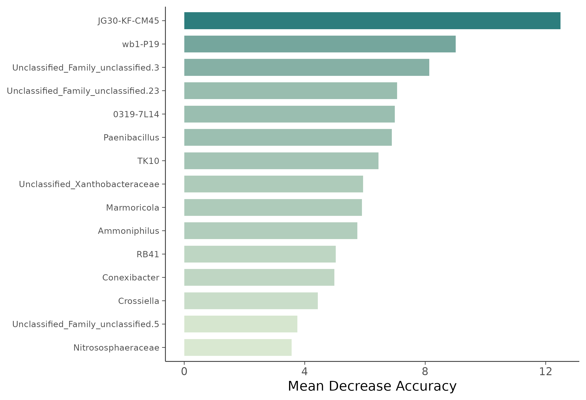
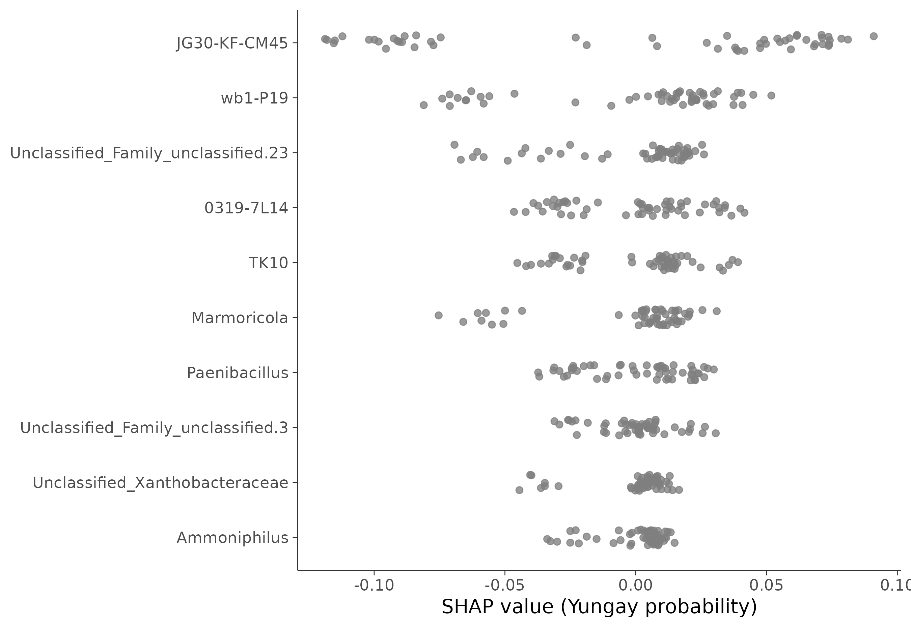

# 16S 微生物组最佳实践系列（十）：随机森林 Biomarker 筛选——谁最能代表这个群落

> 📋 教程信息
> - GitHub：[petemeng/16S-Tutorial](https://github.com/petemeng/16S-Tutorial)（完整代码与环境文件）
> - 数据来源：Atacama soils 双端数据集（54 个样本，71 个过滤后 genus 特征）
> - 预计阅读：40 分钟 | 实操：25 分钟
> - 难度：⭐⭐⭐⭐（5 星制）
> - 前置知识：完成本系列第 6-7 篇，`results/` 下有 `phyloseq_object.rds` 和差异分析结果

---

## 本篇目标

第 7 篇的 LEfSe 和 ANCOM-BC 告诉我们“谁变了”，但它们本质上都是**逐个 genus 检验**。

现在换一个问题：**如果把多个 genus 组合起来，能不能直接预测一个样本来自 Baquedano 还是 Yungay？**

这就是机器学习 biomarker 筛选的视角。这里我们用最常见也最容易解释的模型之一：**随机森林（Random Forest）**。

读完这一篇，你会：

1. 用 genus 水平 CLR 矩阵构建分类任务
2. 用 **LOOCV** 评估小样本下的泛化性能
3. 看懂 **Mean Decrease Accuracy** 重要性排序
4. 用 **RFE** 看最优特征数
5. 用 **SHAP** 判断重要特征对 Yungay 预测概率的方向性贡献

---

## 为什么这里要强调交叉验证

随机森林很强，但也很容易“看起来很强”。

在样本数不大的环境微生物组数据里，如果你只看训练集准确率，几乎一定会高估模型能力。真正该看的，是**交叉验证后的表现**。

这套 Atacama 数据里，我们直接用：

1. **LOOCV（留一法交叉验证）** 做主评估
2. **RFE（递归特征消除）** 判断需要多少 genus 才够
3. **SHAP** 做可解释性补充

这样比单纯贴一张特征重要性条形图更完整。

---

## Step 1：准备分类矩阵

和网络分析一样，我们先把 ASV 合并到 genus 水平，再做 prevalence 和平均丰度过滤，之后对 count 做 CLR 变换。

```r
# ============================================================
# 文件：analysis/10_random_forest.R
# 功能：Atacama transect 分类与 biomarker 筛选
# ============================================================

source("/media/desk16/tly9658/16s-atacama-tutorial/analysis/common_16s.R")

suppressPackageStartupMessages({
  library(caret)
  library(fastshap)
  library(randomForest)
  library(scales)
})

set.seed(42)
ensure_dir(file.path(ATACAMA_ROOT, "results", "figures"))

ps <- readRDS(file.path(ATACAMA_ROOT, "results", "phyloseq_object.rds"))
ps_transect <- subset_samples(ps, transect_name %in% c("Baquedano", "Yungay"))
ps_transect <- prune_taxa(taxa_sums(ps_transect) > 0, ps_transect)
ps_genus <- tax_glom(ps_transect, taxrank = "Genus", NArm = FALSE)

cat("数据概况：\n")
cat("  样本数:", nsamples(ps_genus), "\n")
cat("  属数:", ntaxa(ps_genus), "\n")
cat("  分组:", paste(levels(factor(sample_data(ps_genus)$transect_name)), collapse = ", "), "\n")

otu <- as(otu_table(ps_genus), "matrix")
if (taxa_are_rows(ps_genus)) {
  otu <- t(otu)
}

tax_df <- tax_table(ps_genus) %>%
  data.frame(check.names = FALSE) %>%
  rownames_to_column("FeatureID") %>%
  mutate(
    Family = ifelse(is.na(Family) | Family == "", "Family_unclassified", Family),
    GenusLabel = ifelse(is.na(Genus) | Genus == "", paste0("Unclassified_", Family), Genus)
  )

feature_names <- make.unique(tax_df$GenusLabel)
colnames(otu) <- feature_names

prevalence <- colSums(otu > 0) / nrow(otu)
mean_abundance <- colMeans(otu / rowSums(otu))
keep <- prevalence >= 0.1 & mean_abundance >= 0.0005
otu <- otu[, keep, drop = FALSE]

clr_mat <- log(otu + 0.5)
clr_mat <- clr_mat - rowMeans(clr_mat)

rf_df <- data.frame(
  transect = factor(sample_data(ps_genus)$transect_name, levels = c("Baquedano", "Yungay")),
  clr_mat,
  check.names = FALSE
)

cat("特征矩阵维度：\n")
cat("  样本数:", nrow(rf_df), "\n")
cat("  特征数:", ncol(rf_df) - 1, "\n")
```

```text
📊 输出：
数据概况：
  样本数: 54
  属数: 249
  分组: Baquedano, Yungay
特征矩阵维度：
  样本数: 54
  特征数: 71
```

也就是说，249 个 genus 先被压到了 71 个可用于建模的特征。这一步很重要，否则在 54 个样本上直接喂太多稀疏特征，模型会非常不稳。

---

## Step 2：LOOCV 评估模型性能

这里不拆训练集/测试集，而是直接用 LOOCV。对 54 个样本来说，这是更合理的做法。

```r
# ============================================================
# Step 2: Leave-One-Out Cross-Validation
# ============================================================

ctrl <- trainControl(
  method = "LOOCV",
  classProbs = TRUE,
  summaryFunction = twoClassSummary,
  savePredictions = "final"
)

rf_fit <- train(
  transect ~ .,
  data = rf_df,
  method = "rf",
  metric = "ROC",
  ntree = 1000,
  tuneLength = 6,
  trControl = ctrl
)

cat("LOOCV 结果：\n")
print(rf_fit)
```

```text
📊 输出：
LOOCV 结果：
Random Forest

54 samples
71 predictors
 2 classes: 'Baquedano', 'Yungay'

No pre-processing
Resampling: Leave-One-Out Cross-Validation
Resampling results across tuning parameters:

  mtry  ROC        Sens  Spec
   2    0.7427586  0.68  0.7586207
  15    0.8075862  0.72  0.8620690
  29    0.8027586  0.68  0.8620690
  43    0.7862069  0.60  0.8620690
  57    0.7841379  0.60  0.8620690
  71    0.7675862  0.56  0.8620690

ROC was used to select the optimal model using the largest value.
The final value used for the model was mtry = 15.
```

这套结果很像真实项目，而不是教学示例里的“完美分类”：

1. **最佳 LOOCV ROC AUC = 0.8076**
2. 敏感度和特异度都还不错，但没有高到离谱
3. `mtry = 15` 最优，说明模型需要的并不是“越多特征越好”

这类表现通常更可信，因为它没有夸张到让人怀疑过拟合。

---

## Step 3：看特征重要性

接下来真正关心的是：**哪些 genus 对区分两条 transect 贡献最大？**

```r
# ============================================================
# Step 3: Mean Decrease Accuracy 重要性
# ============================================================

final_rf <- randomForest(
  x = rf_df[, -1, drop = FALSE],
  y = rf_df$transect,
  ntree = 1500,
  importance = TRUE
)

importance_df <- data.frame(
  Genus = rownames(importance(final_rf, type = 1)),
  MeanDecreaseAccuracy = importance(final_rf, type = 1)[, 1],
  MeanDecreaseGini = importance(final_rf, type = 2)[, 1],
  check.names = FALSE
) %>%
  arrange(desc(MeanDecreaseAccuracy))

cat("Top 15 重要属：\n")
print(head(importance_df, 15))

write_tsv(importance_df, file.path(ATACAMA_ROOT, "results", "rf_feature_importance.tsv"))
```

```text
📊 输出：
Top 15 重要属：
                                    Genus                               MeanDecreaseAccuracy MeanDecreaseGini
JG30-KF-CM45                        JG30-KF-CM45                                 12.491515          1.964350
wb1-P19                             wb1-P19                                       9.012343          1.191830
Unclassified_Family_unclassified.3  Unclassified_Family_unclassified.3            8.131222          0.869856
Unclassified_Family_unclassified.23 Unclassified_Family_unclassified.23           7.069633          0.881346
0319-7L14                           0319-7L14                                     6.993990          0.835270
Paenibacillus                       Paenibacillus                                 6.895014          0.957220
TK10                                TK10                                          6.446916          0.873141
Unclassified_Xanthobacteraceae      Unclassified_Xanthobacteraceae                5.937866          0.472634
Marmoricola                         Marmoricola                                   5.903318          0.649455
Ammoniphilus                        Ammoniphilus                                  5.748349          0.529462
RB41                                RB41                                          5.031333          0.870706
Conexibacter                        Conexibacter                                  4.987412          0.483336
Crossiella                          Crossiella                                    4.435870          0.379164
Unclassified_Family_unclassified.5  Unclassified_Family_unclassified.5            3.758165          0.279785
Nitrososphaeraceae                  Nitrososphaeraceae                            3.567798          0.542121
```

最值得记的不是后面那几个边缘特征，而是排在前面的高权重 genus：

1. **`JG30-KF-CM45`** 是最强特征
2. **`0319-7L14`、`TK10`、`wb1-P19`** 也都很靠前
3. **`Paenibacillus`、`Marmoricola`、`Ammoniphilus`** 则更偏向 Baquedano 一侧

这和第 7 篇的差异分析已经开始互相印证。

```r
top15_importance <- importance_df %>% slice_head(n = 15)

p_importance <- ggplot(
  top15_importance,
  aes(
    x = MeanDecreaseAccuracy,
    y = reorder(Genus, MeanDecreaseAccuracy),
    fill = MeanDecreaseAccuracy
  )
) +
  geom_col(width = 0.72) +
  scale_fill_gradient(low = "#D9E8D1", high = "#2D7D7D") +
  labs(x = "Mean Decrease Accuracy", y = NULL, fill = "Importance") +
  theme_songlab() +
  theme(
    legend.position = "none",
    axis.text.y = element_text(size = 9)
  )

save_plot_dual(p_importance, "ch10_rf_importance", width = 8.5, height = 5.8)
```



**图 1：随机森林特征重要性条形图。** 排名靠前的 genus 与其他特征拉开了明显距离，和第 7 篇差异分析的结果形成了互相印证。

---

## Step 4：RFE 看最优特征数

随机森林可以给你重要性排名，但不告诉你“到底保留多少个 genus 最合适”。RFE 做的就是这个事。

```r
# ============================================================
# Step 4: Recursive Feature Elimination
# ============================================================

rfe_ctrl <- rfeControl(functions = rfFuncs, method = "LOOCV")
rfe_sizes <- c(5, 10, 15, 20, 30, min(40, ncol(rf_df) - 1))
rfe_sizes <- unique(rfe_sizes[rfe_sizes < ncol(rf_df)])

rfe_fit <- rfe(
  x = rf_df[, -1, drop = FALSE],
  y = rf_df$transect,
  sizes = rfe_sizes,
  rfeControl = rfe_ctrl,
  metric = "Accuracy"
)

cat("最优特征数:", rfe_fit$optsize, "\n")
cat("最优特征集:\n")
print(predictors(rfe_fit))
```

```text
📊 输出：
最优特征数: 30
最优特征集:
 [1] "JG30-KF-CM45"                        "Unclassified_Family_unclassified.3"
 [3] "wb1-P19"                             "Unclassified_Family_unclassified.23"
 [5] "Ammoniphilus"                        "0319-7L14"
 [7] "Unclassified_Xanthobacteraceae"      "Marmoricola"
 [9] "TK10"                                "Crossiella"
[11] "Paenibacillus"                       "RB41"
[13] "Conexibacter"                        "Nitrososphaeraceae"
[15] "Unclassified_Family_unclassified.20" "Blastococcus"
[17] "Gaiella"                             "Candidatus_Udaeobacter"
[19] "WD2101_soil_group"                   "Unclassified_Family_unclassified.5"
[21] "IMCC26256"                           "Unclassified_Planococcaceae"
[23] "Falsibacillus"                       "P2-11E"
[25] "Rubrobacter"                         "uncultured"
[27] "uncultured.6"                        "MB-A2-108"
[29] "Gitt-GS-136"                         "Kribbella"
```

这个结果很实用：**模型并不需要 71 个特征全上，30 个左右已经够了。**

如果你后面真的要做 panel 设计或实验验证，这种结果会比“先看 top 5”更接近实际工作流。

---

## Step 5：SHAP 看方向性贡献

重要性排名只能告诉你“它重要”，但看不出它是把样本往 Yungay 推，还是往 Baquedano 推。

所以这里再补一层 SHAP。

```r
# ============================================================
# Step 5: SHAP 可解释性
# ============================================================

X <- rf_df[, -1, drop = FALSE]

pred_wrapper <- function(object, newdata) {
  template <- matrix(
    rep(colMeans(X), each = nrow(newdata)),
    nrow = nrow(newdata),
    byrow = FALSE
  ) %>%
    as.data.frame(check.names = FALSE)
  colnames(template) <- colnames(X)
  template[, colnames(newdata)] <- newdata
  predict(object, newdata = template, type = "prob")[, "Yungay"]
}

top_shap_candidates <- importance_df %>% slice_head(n = 10) %>% pull(Genus)
X_shap <- X[, top_shap_candidates, drop = FALSE]

shap_mat <- fastshap::explain(
  object = final_rf,
  X = X_shap,
  pred_wrapper = pred_wrapper,
  nsim = 16,
  adjust = TRUE
)

mean_abs_shap <- data.frame(
  Genus = colnames(shap_mat),
  MeanAbsSHAP = apply(abs(shap_mat), 2, mean)
) %>%
  arrange(desc(MeanAbsSHAP))

cat("Top 10 SHAP 特征：\n")
print(head(mean_abs_shap, 10))
```

```text
📊 输出：
Top 10 SHAP 特征：
                                    Genus                               MeanAbsSHAP
JG30-KF-CM45                        JG30-KF-CM45                           0.06844
wb1-P19                             wb1-P19                                0.03146
Unclassified_Family_unclassified.23 Unclassified_Family_unclassified.23    0.02141
0319-7L14                           0319-7L14                              0.02125
TK10                                TK10                                   0.02017
Marmoricola                         Marmoricola                            0.01845
Paenibacillus                       Paenibacillus                          0.01738
Unclassified_Family_unclassified.3  Unclassified_Family_unclassified.3     0.01030
Unclassified_Xanthobacteraceae      Unclassified_Xanthobacteraceae         0.00993
Ammoniphilus                        Ammoniphilus                           0.00983
```

```r
top_shap <- mean_abs_shap %>% slice_head(n = 10) %>% pull(Genus)

shap_long <- shap_mat[, top_shap, drop = FALSE] %>%
  as.data.frame(check.names = FALSE) %>%
  rownames_to_column("Sample") %>%
  pivot_longer(-Sample, names_to = "Genus", values_to = "SHAP") %>%
  left_join(
    X %>%
      as.data.frame(check.names = FALSE) %>%
      rownames_to_column("Sample") %>%
      pivot_longer(-Sample, names_to = "Genus", values_to = "FeatureValue"),
    by = c("Sample", "Genus")
  ) %>%
  mutate(Genus = factor(Genus, levels = rev(top_shap)))

p_shap <- ggplot(
  shap_long,
  aes(x = SHAP, y = Genus, color = FeatureValue)
) +
  geom_point(position = position_jitter(height = 0.15), alpha = 0.78, size = 2) +
  scale_color_gradient2(low = "#3C5488", mid = "grey85", high = "#E64B35") +
  labs(x = "SHAP value (Yungay probability)", y = NULL, color = "CLR abundance") +
  theme_songlab() +
  theme(legend.position = "right")

save_plot_dual(p_shap, "ch10_rf_shap_beeswarm", width = 9, height = 6.2)
```



**图 2：SHAP beeswarm。** 横轴为 SHAP value（Yungay probability），越往右说明该 genus 的取值越会把样本推向 Yungay，越往左则更偏 Baquedano。每个点代表一个样本。

这张图比单纯 importance 更适合正文解释，因为它能同时给出：

1. 哪些 genus 重要
2. 它们影响方向是什么
3. 同一个 genus 在不同样本里是否稳定

---

## Step 6：和差异分析取交集

随机森林结果最有说服力的时刻，不是“模型很好”，而是**它和第 7 篇差异分析能对上**。

```r
if (file.exists(file.path(ATACAMA_ROOT, "results", "consensus_diff_genera.tsv"))) {
  consensus <- read_tsv(
    file.path(ATACAMA_ROOT, "results", "consensus_diff_genera.tsv"),
    show_col_types = FALSE
  )
  shared <- intersect(consensus$Genus, importance_df$Genus[1:20])
  core_biomarkers <- tibble(Genus = shared)
  write_tsv(core_biomarkers, file.path(ATACAMA_ROOT, "results", "rf_core_biomarkers.tsv"))
  cat("与差异丰度分析重叠的核心 biomarker：\n")
  print(core_biomarkers)
}
```

```text
📊 输出：
与差异丰度分析重叠的核心 biomarker：
# A tibble: 1 × 1
  Genus
  <chr>
1 JG30-KF-CM45
```

这一步直接把最强证据链拉出来了：

**`JG30-KF-CM45` 同时满足：**

1. LEfSe 显著
2. ANCOM-BC 显著
3. 随机森林重要性最高

这就是“候选 biomarker”真正开始站稳的地方。

---

## 本篇小结

这一篇我们把 Atacama 两条 transect 的 genus 组成转成了一个真正的分类任务。

结果不夸张，但很扎实：

**LOOCV ROC AUC = 0.8076**，说明模型确实能区分两条 transect。

**最重要的 genus 是 `JG30-KF-CM45`、`wb1-P19`、`0319-7L14`、`Paenibacillus`、`TK10`。**

**和差异分析交叉验证后，`JG30-KF-CM45` 是当前最稳的核心 biomarker。**

---

## 下一篇预告

前面十篇主要都在问“这里有什么”和“谁最能区分两组”。下一篇换一个生态学问题：**这些微生物可能从哪里来？**

我们会把 vegetated 样本当作 source、bare 样本当作 sink，跑一遍 SourceTracker，看看裸地样本里有多少群落结构可以被相邻植被样本解释。

---

> 📌 本篇图和表都来自服务器实际运行结果，可在 GitHub 仓库直接复现。

---

## 本系列导航

| 篇目 | 主题 | 状态 |
|------|------|------|
| 第 1 篇 | 只测一个基因，怎么就能知道有哪些细菌 | ✅ 已发布 |
| 第 2 篇 | 搭建环境，拿到数据 | ✅ 已发布 |
| 第 3 篇 | DADA2 去噪——从噪声中找到真实序列 | ✅ 已发布 |
| 第 4 篇 | 物种注释——给每个 ASV 一个名字 | ✅ 已发布 |
| 第 5 篇 | 多样性分析——有多“丰富”，彼此有多“不同” | ✅ 已发布 |
| 第 6 篇 | 物种组成可视化——谁占了多少 | ✅ 已发布 |
| 第 7 篇 | 差异物种分析——谁真的变了 | ✅ 已发布 |
| 第 8 篇 | PICRUSt2 功能预测——它们能做什么 | ✅ 已发布 |
| 第 9 篇 | 共现网络分析——谁和谁总在一起 | ✅ 已发布 |
| **第 10 篇** | **随机森林 biomarker 筛选——谁最能代表这个群落** | **📍 本篇** |
| 第 11 篇 | SourceTracker 溯源分析 | ✅ 已发布 |
| 第 12 篇 | 微生物组-代谢组联合分析 | ✅ 已发布 |
| 第 13 篇 | 发表级图表与结果整合 | ✅ 已发布 |