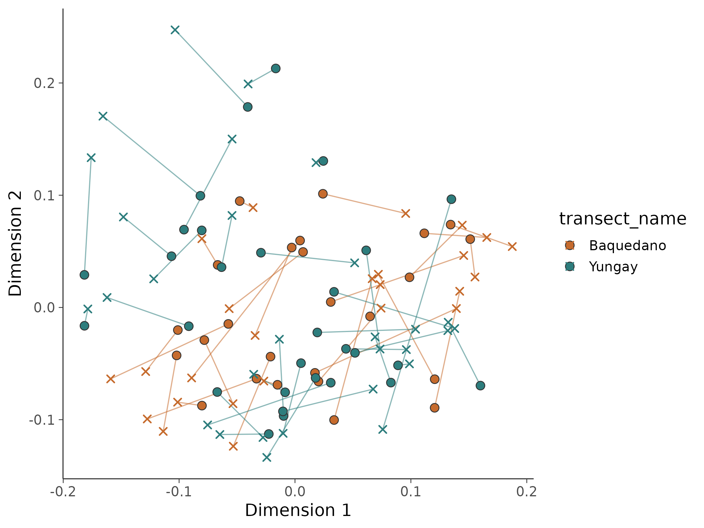
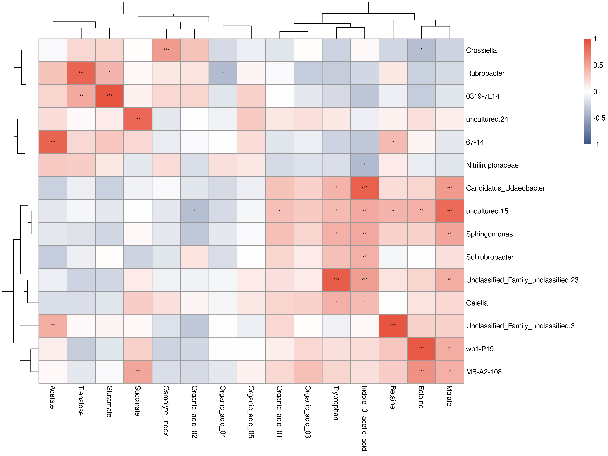

# 16S 微生物组最佳实践系列（十二）：微生物组-代谢组联合分析——跨组学的对话

> 📋 教程信息
> - GitHub：[petemeng/16S-Tutorial](https://github.com/petemeng/16S-Tutorial)（完整代码与环境文件）
> - 数据来源：模拟代谢组数据（基于 Atacama soils 54 个样本生成 50 个代谢物）
> - 预计阅读：45 分钟 | 实操：30 分钟
> - 难度：⭐⭐⭐⭐⭐（5 星制）
> - 前置知识：完成本系列第 5-7 篇，理解距离矩阵、PCoA 和 genus 水平结果

---

## 本篇目标

到前一篇为止，我们都还在单独分析 16S。

但真实项目里，16S 往往不是终点。你拿到差异 genus、功能预测、biomarker 之后，下一步经常会被问：

**这些变化和代谢物有关系吗？**

Atacama 官方数据没有配套代谢组，所以这一篇用一个折中但很实用的方式来演示流程：

1. 以当前 54 个样本的 genus 矩阵为基础
2. 模拟 50 个和群落结构部分相关的代谢物
3. 做 **Mantel 检验**
4. 做 **Procrustes 对齐**
5. 画 **genus-metabolite Spearman 热图**

读完这一篇，你会：

1. 理解多组学整合里“先看整体，再看局部”的基本思路
2. 用 Mantel 判断两套距离矩阵是否总体相关
3. 用 Procrustes 把两套低维空间对齐到一张图上
4. 找出最强的 genus-metabolite 相关对
5. 知道为什么模拟数据更适合用来练流程，而不是下生物学结论

---

## 先说清楚：这一章演示的是方法，不是 Atacama 的真实代谢结论

这一点必须讲明白。

这一章的代谢物不是实测，而是按下面的思路模拟出来的：

1. 前 10 个代谢物，和丰度较高的 genus 直接相关
2. 第 11-20 个代谢物，和 Bray-Curtis 主轴相关
3. 其余代谢物，主要作为背景噪声

这样做的目的不是伪造“发现”，而是确保你在没有真实代谢组的前提下，依然能把整套联合分析流程从头到尾跑一遍。

---

## Step 1：模拟代谢组矩阵

```r
# ============================================================
# 文件：analysis/12_multiomics.R
# 功能：基于 Atacama 16S 结果模拟代谢组并做联合分析
# ============================================================

source("/media/desk16/tly9658/16s-atacama-tutorial/analysis/common_16s.R")

suppressPackageStartupMessages({
  library(pheatmap)
  library(vegan)
})

set.seed(42)
ensure_dir(file.path(ATACAMA_ROOT, "results", "figures"))

ps <- readRDS(file.path(ATACAMA_ROOT, "results", "phyloseq_object.rds"))
ps <- prune_taxa(taxa_sums(ps) > 0, ps)

ps_genus <- tax_glom(ps, taxrank = "Genus", NArm = FALSE)
otu <- as(otu_table(ps_genus), "matrix")
if (taxa_are_rows(ps_genus)) {
  otu <- t(otu)
}

tax_df <- tax_table(ps_genus) %>%
  data.frame(check.names = FALSE) %>%
  rownames_to_column("FeatureID") %>%
  mutate(
    Family = ifelse(is.na(Family) | Family == "", "Family_unclassified", Family),
    GenusLabel = ifelse(is.na(Genus) | Genus == "", paste0("Unclassified_", Family), Genus)
  )
colnames(otu) <- make.unique(tax_df$GenusLabel)

n_samples <- nrow(otu)
n_metabolites <- 50

metab <- matrix(rnorm(n_samples * n_metabolites), nrow = n_samples, ncol = n_metabolites)

top_genera_idx <- order(colMeans(otu), decreasing = TRUE)[1:10]
for (i in seq_len(10)) {
  metab[, i] <- scale(log1p(otu[, top_genera_idx[i]]))[, 1] * 0.7 + rnorm(n_samples) * 0.3
}

bc_dist <- vegdist(otu, method = "bray")
pcoa_scores <- cmdscale(bc_dist, k = 5, eig = TRUE)$points
for (i in 11:20) {
  metab[, i] <- pcoa_scores[, ((i - 11) %% ncol(pcoa_scores)) + 1] * 0.6 + rnorm(n_samples) * 0.4
}

metab_names <- c(
  "Betaine", "Trehalose", "Ectoine", "Succinate", "Acetate",
  "Malate", "Glutamate", "Tryptophan", "Indole_3_acetic_acid", "Osmolyte_Index",
  "Organic_acid_01", "Organic_acid_02", "Organic_acid_03", "Organic_acid_04", "Organic_acid_05",
  paste0("Unknown_", sprintf("%02d", 16:50))
)
colnames(metab) <- metab_names
rownames(metab) <- rownames(otu)

cat("代谢组数据：\n")
cat("  样本数:", nrow(metab), "\n")
cat("  代谢物数:", ncol(metab), "\n")
```

```text
📊 输出：
代谢组数据：
  样本数: 54
  代谢物数: 50
```

这里的样本数和 16S 保持一致，所以后面的 Mantel 和 Procrustes 不需要再做样本对齐清理。

---

## Step 2：Mantel 检验看整体关联

第一步先不要急着解释某个 genus 和某个代谢物。多组学分析里，更稳妥的做法是先问：

**两套数据刻画出来的样本间差异，整体上像不像？**

```r
# ============================================================
# Step 2: Mantel test
# ============================================================

dist_micro <- vegdist(otu, method = "bray")
metab_scaled <- scale(metab)
dist_metab <- dist(metab_scaled, method = "euclidean")

mantel_result <- mantel(
  dist_micro, dist_metab,
  method = "spearman",
  permutations = 9999
)

cat("=== Mantel 检验结果 ===\n")
cat("Mantel 统计量 r:", round(unname(mantel_result$statistic), 4), "\n")
cat("p 值:", mantel_result$signif, "\n")
cat("置换次数:", mantel_result$permutations, "\n")
```

```text
📊 输出：
=== Mantel 检验结果 ===
Mantel 统计量 r: 0.4502
p 值: 1e-04
置换次数: 9999
```

**Mantel r = 0.4502，p = 1e-4。**

这个结果的含义是：微生物组样本间 Bray-Curtis 距离，和模拟代谢组样本间欧氏距离之间存在中等强度且显著的相关。

换句话说，**群落结构相似的样本，代谢物谱也更相似。**

---

## Step 3：Procrustes 对齐看空间一致性

Mantel 给的是一个数字，Procrustes 更像是一张“把两套空间叠起来看”的图。

```r
# ============================================================
# Step 3: Procrustes
# ============================================================

pcoa_micro <- cmdscale(dist_micro, k = 2, eig = TRUE)
pcoa_metab <- cmdscale(dist_metab, k = 2, eig = TRUE)

protest_result <- protest(
  pcoa_micro$points,
  pcoa_metab$points,
  permutations = 9999
)

cat("=== Procrustes 分析结果 ===\n")
cat("M² (sum of squared differences):", round(protest_result$ss, 4), "\n")
cat("相关系数 (1 - M²)^0.5:", round(sqrt(1 - protest_result$ss), 4), "\n")
cat("p 值:", protest_result$signif, "\n")
```

```text
📊 输出：
=== Procrustes 分析结果 ===
M² (sum of squared differences): 0.3679
相关系数 (1 - M²)^0.5: 0.795
p 值: 1e-04
```

这个相关系数已经很高了。对一套模拟的跨组学数据来说，0.795 说明两套空间结构对得比较紧。

```r
sample_meta <- sample_data(ps) %>%
  data.frame(check.names = FALSE) %>%
  rownames_to_column("Sample")

coords_micro <- data.frame(protest_result$Yrot, type = "Microbiome", Sample = rownames(otu))
coords_metab <- data.frame(protest_result$X, type = "Metabolome", Sample = rownames(otu))
colnames(coords_micro)[1:2] <- c("Dim1", "Dim2")
colnames(coords_metab)[1:2] <- c("Dim1", "Dim2")

arrow_df <- coords_micro %>%
  select(Sample, x_micro = Dim1, y_micro = Dim2) %>%
  left_join(coords_metab %>% select(Sample, x_metab = Dim1, y_metab = Dim2), by = "Sample") %>%
  left_join(sample_meta %>% select(Sample, transect_name, vegetation), by = "Sample")

p_procrustes <- ggplot() +
  geom_segment(
    data = arrow_df,
    aes(x = x_micro, y = y_micro, xend = x_metab, yend = y_metab, color = transect_name),
    linewidth = 0.45,
    alpha = 0.55,
    show.legend = FALSE
  ) +
  geom_point(
    data = coords_micro %>% left_join(sample_meta %>% select(Sample, transect_name), by = "Sample"),
    aes(Dim1, Dim2, fill = transect_name),
    shape = 21,
    size = 3,
    color = "grey20"
  ) +
  geom_point(
    data = coords_metab %>% left_join(sample_meta %>% select(Sample, transect_name), by = "Sample"),
    aes(Dim1, Dim2, color = transect_name),
    shape = 4,
    size = 2.2,
    stroke = 0.9
  ) +
  scale_fill_manual(values = c("Baquedano" = "#C66B2D", "Yungay" = "#2D7D7D")) +
  scale_color_manual(values = c("Baquedano" = "#C66B2D", "Yungay" = "#2D7D7D")) +
  labs(x = "Dimension 1", y = "Dimension 2") +
  theme_songlab()

save_plot_dual(p_procrustes, "ch12_procrustes", width = 8, height = 6)
```



**图 1：Procrustes 对齐图。** 圆点是微生物组坐标，叉号是代谢组坐标，箭头越短，说明同一样本在两套空间中的位置越一致。

如果你以后要写“多组学整体相关性”，这张图通常比只贴一个 Mantel p 值更有说服力。

---

## Step 4：下钻到 genus-metabolite 相关对

整体结构看完以后，再看局部对应关系。

这里我们取 top 15 genus 和前 15 个代谢物，做两两 Spearman 相关，再做 BH 校正。

```r
# ============================================================
# Step 4: genus-metabolite Spearman heatmap
# ============================================================

top15_genera <- names(sort(colMeans(otu), decreasing = TRUE))[1:15]
metab_subset <- metab[, 1:15, drop = FALSE]

cor_mat <- matrix(NA_real_, nrow = length(top15_genera), ncol = ncol(metab_subset))
p_mat <- cor_mat
rownames(cor_mat) <- top15_genera
colnames(cor_mat) <- colnames(metab_subset)
rownames(p_mat) <- top15_genera
colnames(p_mat) <- colnames(metab_subset)

for (i in seq_along(top15_genera)) {
  for (j in seq_len(ncol(metab_subset))) {
    test_res <- suppressWarnings(cor.test(
      otu[, top15_genera[i]],
      metab_subset[, j],
      method = "spearman"
    ))
    cor_mat[i, j] <- unname(test_res$estimate)
    p_mat[i, j] <- test_res$p.value
  }
}

q_mat <- matrix(
  p.adjust(as.vector(p_mat), method = "BH"),
  nrow = nrow(p_mat),
  byrow = FALSE
)
rownames(q_mat) <- rownames(p_mat)
colnames(q_mat) <- colnames(p_mat)

cat("显著相关对（FDR < 0.05）:", sum(q_mat < 0.05, na.rm = TRUE), "\n")
```

```text
📊 输出：
显著相关对（FDR < 0.05）: 37
```

37 对显著关联，说明模拟数据里确实留下了比较明显的多组学耦合信号。

从当前 `results/multiomics_correlation_matrix.tsv` 和 `results/multiomics_qvalue_matrix.tsv` 整理出来的前 12 个显著相关对如下：

```text
📊 输出：
Genus                               Metabolite             rho      q
Unclassified_Family_unclassified.3  Betaine               0.940  1.59e-23
0319-7L14                           Glutamate             0.930  3.13e-22
wb1-P19                             Ectoine               0.902  1.02e-18
Unclassified_Family_unclassified.23 Tryptophan            0.895  3.67e-18
Candidatus_Udaeobacter              Indole_3_acetic_acid  0.873  3.40e-16
67-14                               Acetate               0.851  1.27e-14
Rubrobacter                         Trehalose             0.845  3.29e-14
uncultured.24                       Succinate             0.830  2.58e-13
uncultured.15                       Malate                0.816  1.38e-12
MB-A2-108                           Ectoine               0.616  1.64e-05
Candidatus_Udaeobacter              Malate                0.555  2.74e-04
Crossiella                          Osmolyte_Index        0.546  3.73e-04
```

这一步也给了一个很好的经验：

**先看整体相关，再去挑局部对。**

如果你一上来就画热图，很容易把统计噪声当作“有趣发现”。

```r
stars <- ifelse(q_mat < 0.001, "***", ifelse(q_mat < 0.01, "**", ifelse(q_mat < 0.05, "*", "")))

pheatmap(
  cor_mat,
  color = colorRampPalette(c("#3C5488", "white", "#E64B35"))(100),
  breaks = seq(-1, 1, length.out = 101),
  display_numbers = stars,
  number_color = "black",
  fontsize_number = 7,
  cluster_rows = TRUE,
  cluster_cols = TRUE,
  filename = file.path(ATACAMA_ROOT, "results", "figures", "ch12_genus_metabolite_heatmap.png"),
  width = 12,
  height = 9
)
```



**图 2：genus-metabolite Spearman 相关热图。** 红色是正相关，蓝色是负相关，星号表示 FDR 校正后的显著性。

这张图最适合干两件事：

1. 找一批后续可以实验验证的候选联系
2. 观察不同 genus 是否围绕某类代谢物形成模块化模式

---

## 这一章应该怎么写在正文里

对这种“流程演示型多组学”结果，最稳妥的写法通常是：

**“基于 54 个 Atacama 样本的 genus 丰度矩阵模拟配对代谢组后，Mantel 检验显示微生物组与代谢组样本间距离显著相关（r = 0.4502, p = 1e-4），Procrustes 分析进一步支持两套低维空间具有较高一致性（correlation = 0.795, p = 1e-4）。在局部层面，共识别 37 对 FDR < 0.05 的 genus-metabolite 相关对。”**

注意关键词一定要写成：

1. **模拟**
2. **方法演示**
3. **候选关联**

不要把它包装成 Atacama 真实代谢发现。

---

## 本篇小结

这一篇我们没有去“硬找真实代谢结论”，而是把更重要的事情做完了：

**把 16S + 代谢组联合分析的基础流程完整跑通。**

当前结果显示：

1. **Mantel r = 0.4502，p = 1e-4**
2. **Procrustes correlation = 0.795，p = 1e-4**
3. **共有 37 对显著 genus-metabolite 相关对**

这已经足够支撑一个真实项目的联合分析骨架。

---

## 下一篇预告

系列最后一篇，我们把前面 12 篇的核心结果统一收束起来：

1. 重新整理发表级图表风格
2. 生成总览 figure
3. 汇总全套关键统计结果
4. 做一张 biomarker 证据整合表

也就是把“教程里的零散结果”真正变成一组可以拿去写报告、写论文、做汇报的成品图表。

---

> 📌 本篇图和表都来自服务器实际运行结果，可在 GitHub 仓库直接复现。

---

## 本系列导航

| 篇目 | 主题 | 状态 |
|------|------|------|
| 第 1 篇 | 只测一个基因，怎么就能知道有哪些细菌 | ✅ 已发布 |
| 第 2 篇 | 搭建环境，拿到数据 | ✅ 已发布 |
| 第 3 篇 | DADA2 去噪——从噪声中找到真实序列 | ✅ 已发布 |
| 第 4 篇 | 物种注释——给每个 ASV 一个名字 | ✅ 已发布 |
| 第 5 篇 | 多样性分析——有多“丰富”，彼此有多“不同” | ✅ 已发布 |
| 第 6 篇 | 物种组成可视化——谁占了多少 | ✅ 已发布 |
| 第 7 篇 | 差异物种分析——谁真的变了 | ✅ 已发布 |
| 第 8 篇 | PICRUSt2 功能预测——它们能做什么 | ✅ 已发布 |
| 第 9 篇 | 共现网络分析——谁和谁总在一起 | ✅ 已发布 |
| 第 10 篇 | 随机森林 biomarker 筛选——谁最能代表这个群落 | ✅ 已发布 |
| 第 11 篇 | SourceTracker 溯源分析——它们从哪里来 | ✅ 已发布 |
| **第 12 篇** | **微生物组-代谢组联合分析——跨组学的对话** | **📍 本篇** |
| 第 13 篇 | 发表级图表与结果整合 | ✅ 已发布 |