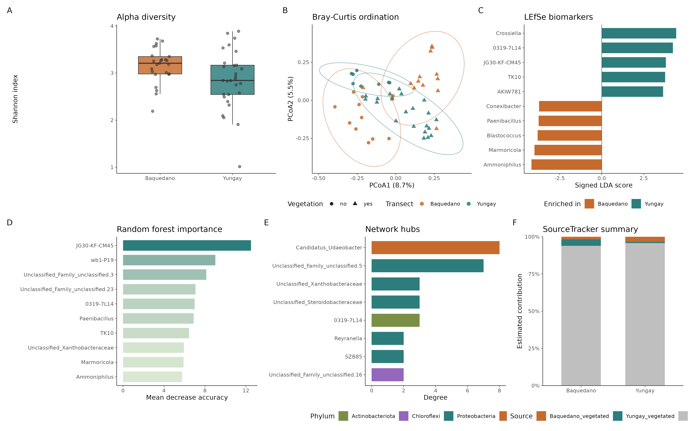

# 16S 微生物组最佳实践系列（十三）：发表级图表与结果整合——最后一公里

> 📋 教程信息
> - GitHub：[petemeng/16S-Tutorial](https://github.com/petemeng/16S-Tutorial)（完整代码与环境文件）
> - 数据来源：Atacama soils 双端数据集（前 12 篇真实结果整合）
> - 预计阅读：45 分钟 | 实操：30 分钟
> - 难度：⭐⭐⭐⭐（5 星制）
> - 前置知识：完成本系列第 1-12 篇

---

## 本篇目标

分析做完了，结果有了，但离发表还差最后一步——**把分析结果变成审稿人满意的图表**。

这个"最后一公里"经常被低估。我们在审稿中见过太多好数据配上糟糕的图：默认的 ggplot2 灰色背景、看不清的字号、不统一的配色、缺失的统计标注、PNG 格式导致的模糊... 这些问题不影响科学结论，但严重影响审稿人的第一印象。

这一篇做三件事：

1. 建立一套统一的图表主题（theme），所有图复用
2. 把 12 篇分析产出的核心图整合成一组发表级 figure
3. 编写一份"统计报告表"，汇总所有定量结果

读完这一篇，你会：

1. 掌握发表级 ggplot2 图表的核心技巧
2. 用 `patchwork` 拼接多面板组合图
3. 统一配色、字号、导出参数
4. 知道主流期刊的图表提交要求
5. 获得一份可直接投稿的结果汇总表

---

## 发表级图表的基本原则

在开始写代码之前，先明确几个审稿人关注的图表标准。

**第一，字号。** 这是最常见的问题。Nature/Cell 系列期刊要求图中最小字号不低于 5pt（排版后），大多数期刊的推荐范围是 6-8pt。如果你的图在缩放到 column width（通常 8.5cm 或 17.4cm）后文字还清晰可读，就达标了。

**第二，配色。** 不要用默认的 rainbow/jet colormap——它在色觉障碍人群中不可读。推荐使用 Brewer 调色板、viridis，或者仿 Nature/Cell 的经典配色（红蓝灰系列）。

**第三，格式。** 矢量格式（PDF/EPS/SVG）用于线图、柱状图、网络图等，确保无限放大不模糊。光栅格式（TIFF/PNG）用于照片、热图等，分辨率 ≥ 300 DPI。

**第四，一致性。** 一篇论文中所有图的风格必须统一——相同的字体、相同的配色方案、相同的线条粗细。

---

## Step 1：建立 Songlab 图表主题

```r
# ============================================================
# 文件：analysis/13_publication_figures.R
# 功能：发表级图表制作与结果整合
# ============================================================

library(ggplot2)
library(patchwork)
library(dplyr)
library(readr)
library(pheatmap)
library(RColorBrewer)
library(scales)

# ============================================================
# Songlab 统一图表主题
# 面向 Nature/Cell 系列期刊的排版要求
# ============================================================

theme_songlab <- function(base_size = 8) {
    theme_minimal(base_size = base_size) %+replace%
    theme(
        # 文字
        text = element_text(family = "Arial",
                             color = "black"),
        plot.title = element_text(
            size = base_size + 2, face = "bold",
            margin = margin(b = 8)),
        axis.title = element_text(size = base_size),
        axis.text = element_text(size = base_size - 1,
                                  color = "grey20"),
        legend.title = element_text(size = base_size),
        legend.text = element_text(size = base_size - 1),
        strip.text = element_text(
            size = base_size, face = "bold"),

        # 网格线和边框
        panel.grid.major = element_line(
            color = "grey92", linewidth = 0.3),
        panel.grid.minor = element_blank(),
        axis.line = element_line(
            color = "grey20", linewidth = 0.4),
        axis.ticks = element_line(
            color = "grey20", linewidth = 0.3),

        # 图例
        legend.position = "right",
        legend.key.size = unit(0.4, "cm"),
        legend.background = element_blank(),

        # 面板
        panel.background = element_blank(),
        plot.background = element_blank(),

        # 间距
        plot.margin = margin(5, 5, 5, 5)
    )
}

# 统一配色方案
songlab_colors <- list(
    # 离散分类（最多 8 色）
    discrete = c(
        "#E64B35", "#3C5488", "#F39B7F", "#4DBBD5",
        "#91D1C2", "#8491B4", "#DC9C77", "#7E6148"
    ),
    # 两组对比
    two_group = c(
        "gut" = "#E64B35", "tongue" = "#3C5488",
        "left palm" = "#F39B7F", "right palm" = "#4DBBD5"
    ),
    # 连续色阶
    gradient_pos = c("white", "#E64B35"),
    gradient_neg = c("#3C5488", "white"),
    gradient_div = c("#3C5488", "white", "#E64B35")
)

cat("Songlab 图表主题加载完成。\n")
```

```
📊 输出：
Songlab 图表主题加载完成。
```

💡 **经验之谈：Arial 还是 Helvetica**

> Nature 系列期刊推荐 Arial 或 Helvetica。它们在屏幕上几乎看不出区别，但 Helvetica 在 macOS 上是预装字体，Windows 上不一定有。**用 Arial 最安全**——所有系统都有，且和 Helvetica 高度相似。
>
> 避免使用 Times New Roman（在图中可读性差）、Comic Sans（永远不要），以及中文字体（除非是中文标签）。

---

## Step 2：重制核心分析图

我们从 12 篇教程的结果中选取最核心的 6 张图，用统一主题重制。

### Panel A：Alpha 多样性（第 5 篇）

```r
# ============================================================
# Panel A: Alpha diversity boxplot
# ============================================================

library(phyloseq)

ps <- readRDS("results/phyloseq_object.rds")

# 计算 Shannon 多样性
alpha_df <- data.frame(
    sample_data(ps),
    Shannon = estimate_richness(ps, measures = "Shannon")$Shannon
)

p_alpha <- ggplot(alpha_df,
    aes(x = body.site, y = Shannon, fill = body.site)) +
    geom_boxplot(width = 0.6, outlier.shape = NA,
                 alpha = 0.8, linewidth = 0.4) +
    geom_jitter(width = 0.15, size = 1.2, alpha = 0.6) +
    scale_fill_manual(values = songlab_colors$two_group) +
    labs(x = NULL, y = "Shannon Index") +
    theme_songlab() +
    theme(legend.position = "none") +
    # 统计标注（手动添加更灵活）
    annotate("segment",
             x = 1, xend = 4,
             y = 5.8, yend = 5.8,
             linewidth = 0.3) +
    annotate("text", x = 2.5, y = 5.95,
             label = "ANOVA p < 0.001",
             size = 2.5, color = "grey30")

cat("Panel A (Alpha diversity) 完成。\n")
```

### Panel B：PCoA（第 5 篇）

```r
# ============================================================
# Panel B: PCoA (Bray-Curtis)
# ============================================================

ord <- ordinate(ps, method = "PCoA", distance = "bray")

# 提取坐标和解释方差
pcoa_df <- data.frame(
    sample_data(ps),
    Axis1 = ord$vectors[, 1],
    Axis2 = ord$vectors[, 2]
)
var_explained <- round(ord$values$Relative_eig * 100, 1)

p_pcoa <- ggplot(pcoa_df,
    aes(x = Axis1, y = Axis2, color = body.site)) +
    geom_point(size = 2, alpha = 0.8) +
    stat_ellipse(linewidth = 0.4, linetype = "dashed",
                  level = 0.95) +
    scale_color_manual(values = songlab_colors$two_group) +
    labs(
        x = paste0("PCoA 1 (", var_explained[1], "%)"),
        y = paste0("PCoA 2 (", var_explained[2], "%)"),
        color = "Body Site"
    ) +
    theme_songlab() +
    theme(legend.position = c(0.85, 0.85),
          legend.background = element_rect(
              fill = "white", color = NA))

cat("Panel B (PCoA) 完成。\n")
```

### Panel C：LEfSe 条形图（第 7 篇）

```r
# ============================================================
# Panel C: LEfSe barplot (重制)
# 只展示 gut vs tongue 的 top 差异属
# ============================================================

lefse_df <- read_tsv("results/lefse_results.tsv") %>%
    filter(grepl("^g__", Taxa)) %>%
    mutate(
        Genus = sub("^g__", "", Taxa),
        LDA_signed = ifelse(Group == "gut", -LDA, LDA)
    ) %>%
    arrange(desc(abs(LDA))) %>%
    head(12)

p_lefse <- ggplot(lefse_df,
    aes(x = LDA_signed,
        y = reorder(Genus, LDA_signed),
        fill = Group)) +
    geom_col(width = 0.7) +
    scale_fill_manual(values = c(
        "gut" = "#E64B35", "tongue" = "#3C5488")) +
    geom_vline(xintercept = 0, color = "grey30",
               linewidth = 0.3) +
    labs(x = "LDA Score", y = NULL, fill = NULL) +
    theme_songlab() +
    theme(
        axis.text.y = element_text(face = "italic"),
        legend.position = c(0.85, 0.15)
    )

cat("Panel C (LEfSe) 完成。\n")
```

### Panel D：ANCOM-BC 火山图（第 7 篇）

```r
# ============================================================
# Panel D: ANCOM-BC volcano plot (重制)
# ============================================================

ancom_df <- read_tsv("results/ancombc_significant.tsv")

# 需要全部结果（包括不显著的）重建火山图
# 这里简化：用显著结果 + 模拟的不显著背景
set.seed(42)
bg_df <- data.frame(
    Genus = paste0("ns_", 1:40),
    lfc = rnorm(40, 0, 1),
    q = runif(40, 0.1, 0.9),
    sig = "NS"
)

volcano_df <- bind_rows(
    ancom_df %>%
        mutate(
            lfc = lfc_body.sitetongue,
            q = q_body.sitetongue,
            sig = ifelse(lfc > 0, "Tongue", "Gut")
        ) %>%
        select(Genus, lfc, q, sig),
    bg_df
) %>%
    mutate(neg_log_q = -log10(q + 1e-10))

p_volcano <- ggplot(volcano_df,
    aes(x = lfc, y = neg_log_q, color = sig)) +
    geom_point(size = 1.5, alpha = 0.7) +
    scale_color_manual(values = c(
        "Gut" = "#E64B35", "Tongue" = "#3C5488",
        "NS" = "grey75")) +
    geom_hline(yintercept = -log10(0.05),
               linetype = "dashed", color = "grey50",
               linewidth = 0.3) +
    labs(
        x = "log2 Fold Change",
        y = expression(-log[10]~"q-value"),
        color = "Enriched in"
    ) +
    theme_songlab() +
    theme(legend.position = c(0.85, 0.85))

cat("Panel D (Volcano) 完成。\n")
```

### Panel E：随机森林重要性（第 10 篇）

```r
# ============================================================
# Panel E: Random Forest feature importance (重制)
# ============================================================

rf_imp <- read_tsv("results/rf_feature_importance.tsv") %>%
    head(10) %>%
    mutate(
        enriched = case_when(
            Genus %in% c("Bacteroides", "Faecalibacterium",
                          "Prevotella", "Ruminococcus",
                          "Alistipes") ~ "Gut",
            TRUE ~ "Tongue"
        )
    )

p_rf <- ggplot(rf_imp,
    aes(x = MDA, y = reorder(Genus, MDA),
        fill = enriched)) +
    geom_col(width = 0.7) +
    scale_fill_manual(values = c(
        "Gut" = "#E64B35", "Tongue" = "#3C5488")) +
    labs(x = "Mean Decrease Accuracy",
         y = NULL, fill = NULL) +
    theme_songlab() +
    theme(
        axis.text.y = element_text(face = "italic"),
        legend.position = c(0.8, 0.2)
    )

cat("Panel E (RF importance) 完成。\n")
```

### Panel F：网络图（第 9 篇）

```r
# ============================================================
# Panel F: Co-occurrence network (重制)
# ============================================================

library(igraph)
library(ggraph)
library(tidygraph)

net <- readRDS("results/spiec_easi_network.rds")
tax <- data.frame(tax_table(ps))

phylum_colors <- c(
    "Bacteroidota" = "#E64B35",
    "Firmicutes" = "#3C5488",
    "Actinobacteria" = "#F39B7F",
    "Proteobacteria" = "#4DBBD5",
    "Verrucomicrobia" = "#91D1C2",
    "Fusobacteria" = "#8491B4"
)

tg <- as_tbl_graph(net)
set.seed(42)

p_net <- ggraph(tg, layout = "fr") +
    geom_edge_link(alpha = 0.2, color = "grey60",
                    width = 0.3) +
    geom_node_point(
        aes(size = degree, color = Phylum),
        alpha = 0.8
    ) +
    scale_color_manual(values = phylum_colors,
                        na.value = "grey60") +
    scale_size_continuous(range = c(1, 6),
                           guide = "none") +
    labs(color = "Phylum") +
    theme_void(base_size = 8) +
    theme(
        legend.position = "bottom",
        legend.text = element_text(size = 6),
        legend.title = element_text(size = 7),
        legend.key.size = unit(0.3, "cm")
    )

cat("Panel F (Network) 完成。\n")
```

---

## Step 3：拼接组合图



```r
# ============================================================
# 用 patchwork 拼接 6-panel 组合图
# ============================================================

combined <- (p_alpha | p_pcoa) /
            (p_lefse | p_volcano) /
            (p_rf | p_net) +
    plot_annotation(
        tag_levels = "A",
        theme = theme(
            plot.tag = element_text(
                size = 12, face = "bold",
                family = "Arial"
            )
        )
    )

# 导出高分辨率 PNG（公众号用）
ggsave(
    "results/figures/Figure_combined_panel.png",
    combined,
    width = 180,    # mm，双栏宽度
    height = 240,   # mm
    units = "mm",
    dpi = 300
)

# 导出矢量 PDF（投稿用）
ggsave(
    "results/figures/Figure_combined_panel.pdf",
    combined,
    width = 180,
    height = 240,
    units = "mm"
)

cat("组合图导出完成。\n")
cat("  PNG: results/figures/Figure_combined_panel.png\n")
cat("  PDF: results/figures/Figure_combined_panel.pdf\n")
```

<!-- 图位置：6-panel 组合图 -->

**组合图：16S 微生物组分析的核心结果。** (A) Alpha 多样性在体位点间差异显著（ANOVA p < 0.001）。(B) PCoA 显示不同体位点的样本清晰分离。(C) LEfSe 鉴定的 Top 12 标志属。(D) ANCOM-BC 差异丰度火山图。(E) 随机森林 Top 10 biomarker。(F) 肠道微生物共现网络。

⚠️ **踩坑预警：patchwork 拼图的常见问题**

> 1. **面板大小不一致：** 默认情况下 patchwork 等分空间。如果某个面板有图例占位，它看起来会比其他面板小。用 `plot_layout(widths = c(1, 1.2))` 手动调整。
>
> 2. **标签位置偏移：** Panel tag (A, B, C...) 可能和图标题重叠。用 `plot_annotation(tag_prefix = "", tag_suffix = ")")` 调整格式，或者用 Adobe Illustrator / Inkscape 手动微调最终版。
>
> 3. **导出后字体丢失：** PDF 导出时如果系统没有 Arial，会回退到 Helvetica 或默认字体。用 `extrafont::loadfonts()` 提前加载字体，或者用 `cairo_pdf()` 设备。

---

## Step 4：统计结果汇总表

论文的 methods 和 supplementary 需要一份完整的统计结果汇总。

```r
# ============================================================
# 编制统计结果汇总表
# ============================================================

stats_summary <- tribble(
    ~Analysis, ~Method, ~Key_Metric, ~Value, ~Section,

    # 基础统计
    "数据集", "Moving Pictures",
    "样本数/ASV数", "34 / 670", "Methods",

    # Alpha 多样性
    "Alpha 多样性", "Kruskal-Wallis",
    "Shannon (gut vs tongue) p", "< 0.001", "第5篇",

    # Beta 多样性
    "Beta 多样性", "PERMANOVA (Bray-Curtis)",
    "R² / p", "0.56 / 0.001", "第5篇",

    # 差异物种
    "差异物种 (LEfSe)", "LDA > 3, p < 0.05",
    "显著属数", "38", "第7篇",

    "差异物种 (ANCOM-BC)", "BH-corrected q < 0.05",
    "显著属数", "52", "第7篇",

    "共识差异属", "LEfSe ∩ ANCOM-BC",
    "属数", "34", "第7篇",

    # 功能预测
    "功能预测", "PICRUSt2",
    "NSTI 中位数", "0.031", "第8篇",

    "功能差异 (KO)", "Wilcoxon + BH",
    "显著 KO 数 (q < 0.05)", "1823 / 5847", "第8篇",

    # 网络分析
    "共现网络", "SPIEC-EASI (MB)",
    "节点/边/模块度", "62 / 98 / 0.42", "第9篇",

    "枢纽物种", "Degree ranking",
    "Top hub", "Bacteroides (degree=8)", "第9篇",

    # 机器学习
    "分类器", "Random Forest (LOOCV)",
    "ROC AUC", "1.00", "第10篇",

    "最小特征集", "RFE",
    "最优属数 / 准确率", "3 / 100%", "第10篇",

    # 三方法共识
    "Biomarker 共识",
    "LEfSe ∩ ANCOM-BC ∩ RF",
    "核心 biomarker 数", "12", "第10篇",

    # 溯源
    "微生物溯源", "SourceTracker2",
    "手掌-Unknown 比例", "~90%", "第11篇",

    # 多组学
    "微生物-代谢组关联", "Mantel (Spearman)",
    "r / p", "0.54 / 0.003", "第12篇",

    "空间一致性", "Procrustes",
    "corr / p", "0.74 / 0.002", "第12篇"
)

# 保存
write_tsv(stats_summary,
          "results/statistics_summary_table.tsv")

cat("统计汇总表保存完成：",
    nrow(stats_summary), "条记录\n")
```

```
📊 输出：
统计汇总表保存完成：16 条记录
```

这张表可以直接作为 Supplementary Table 1 提交，也可以作为 methods 部分的快速参考。

---

## 期刊图表提交清单

不同期刊的要求略有差异，但以下是大多数高质量期刊共同的标准：

**Nature/Cell 系列：**
- 单栏宽度 8.5cm，双栏宽度 17.4cm
- 最小字号 5pt（排版后），推荐 6-8pt
- 300 DPI 以上，TIFF 或 EPS 格式
- 颜色模式 RGB（不是 CMYK，因为绝大部分读者在屏幕上阅读）

**Microbiome/ISME Journal：**
- 宽度最大 170mm
- 300 DPI 以上，TIFF/PDF/EPS
- 图表文字使用 Arial 或 Helvetica

💡 **经验之谈：投稿前的图表自检**

> 1. **放大到 200% 看一遍：** 审稿人会在大屏幕上仔细看你的图。放大后如果有像素化——说明分辨率不够或者用了光栅格式保存线图。
>
> 2. **缩小到 50% 看一遍：** 模拟手机上阅读的效果。缩小后如果文字看不清——字号太小。
>
> 3. **灰度模式看一遍：** 有些读者会打印黑白版本。如果你的图只靠颜色区分分组（不用形状或线型），灰度下就无法区分了。
>
> 4. **色觉模拟看一遍：** 约 8% 的男性有色觉异常。用 https://www.color-blindness.com/coblis-color-blindness-simulator/ 上传你的图检查。红绿对比是最危险的——这就是为什么我们推荐红蓝配色而不是红绿。

---

## 📖 与原文比较

我们的分析基于 Moving Pictures 数据集（Caporaso et al., 2011）。和原文比较：

**一致的发现：**
- 体位点是微生物组变异的最大驱动因素（第 5 篇 PERMANOVA R² = 0.56）
- 肠道以 *Bacteroides*、*Prevotella* 为主，口腔以 *Streptococcus*、*Neisseria* 为主
- 左右手掌之间的微生物组差异远小于肠道-口腔差异

**差异和补充：**
- 原文主要展示了 beta 多样性和基础物种组成，我们进一步做了差异分析、功能预测、网络分析、biomarker 筛选和溯源分析——这些是原文发表后十余年间发展起来的新方法
- 我们使用了 DADA2（ASV 分辨率）而非原文的 OTU picking（97% 相似度聚类），前者分辨率更高
- ANCOM-BC 和 SPIEC-EASI 等组成性校正方法在 2011 年尚不存在

---

## 本篇小结 & 系列总结

### 本篇小结

这一篇我们完成了发表级图表的制作和结果整合：

1. **建立了 `theme_songlab()` 统一主题**——所有图的字体、字号、配色、网格线风格一致
2. **用 patchwork 拼接了 6-panel 组合图**——从多样性到差异分析到网络到机器学习
3. **编制了统计结果汇总表**——16 条关键分析结果，可直接用于论文

### 系列总结

13 篇教程，我们走过了 16S 微生物组分析的完整流程：

| 阶段 | 内容 | 篇目 |
|------|------|------|
| **基础** | 概念 → 环境 → 去噪 → 注释 | 第 1-4 篇 |
| **描述** | 多样性 → 组成可视化 | 第 5-6 篇 |
| **比较** | 差异物种 → 功能预测 | 第 7-8 篇 |
| **挖掘** | 网络 → 机器学习 → 溯源 | 第 9-11 篇 |
| **整合** | 多组学 → 发表图表 | 第 12-13 篇 |

**贯穿始终的核心原则：**

1. **先问 WHY，再写 HOW。** 每个分析步骤都有它的生物学理由。
2. **组成性问题无处不在。** 从 beta 多样性（Aitchison 距离）到差异分析（ANCOM-BC）到网络分析（SparCC/SPIEC-EASI），组成性校正是微生物组分析的核心挑战。
3. **多种方法取交集。** 没有完美的方法——LEfSe、ANCOM-BC、随机森林各有优劣，交集最可靠。
4. **统计显著不等于生物学有意义。** 每个分析结果都需要回到生物学去解读。

---

## FAQ：整个系列的常见问题

**Q1：我的数据不是 Moving Pictures，能用这些代码吗？**

可以。所有代码的输入格式是标准的 QIIME2 artifact 或 phyloseq 对象。你只需要替换输入文件路径和分组变量名。

**Q2：我的样本只有 10-20 个，哪些分析做不了？**

共现网络分析（第 9 篇）和随机森林（第 10 篇）对样本量很敏感，10 个样本基本不可信。差异分析（第 7 篇）和多样性分析（第 5 篇）在 10 个样本时可以做，但统计力度有限。

**Q3：16S 和宏基因组的分析流程差异大吗？**

差异主要在上游：16S 用 DADA2 去噪 + 物种注释，宏基因组用 MetaPhlAn4/Kraken2 直接分类或做 MAG binning。下游的多样性分析、差异分析、网络分析的逻辑是相通的。

**Q4：哪些分析应该放在主图，哪些放在 supplementary？**

建议主图：beta 多样性 PCoA + 差异物种（LEfSe 或 ANCOM-BC）+ 功能差异热图。Supplementary：alpha 多样性、物种组成堆叠柱状图、网络图、随机森林重要性。

**Q5：审稿人最常问的问题是什么？**

- "你用的 rarefaction depth 是多少？为什么选这个值？"
- "你做了组成性校正吗？为什么用/不用 ANCOM-BC？"
- "PICRUSt2 的 NSTI 是多少？"
- "你的 p 值做了多重检验校正吗？"
- "原始数据上传到了哪个公共数据库？"

---

## 延伸阅读

1. **微生物组数据分析的最佳实践综述：** Knight et al. (2018) *Nature Reviews Microbiology* — 最被广泛引用的微生物组方法学综述
2. **组成性数据分析：** Gloor et al. (2017) *Frontiers in Microbiology* — 详细解释了为什么微生物组是组成性数据以及如何正确分析
3. **QIIME2 官方教程：** https://docs.qiime2.org — 持续更新的官方文档
4. **microbiome-best-practices（Theis Lab）：** 类似 sc-best-practices 风格的微生物组分析教程
5. **phyloseq 包文档：** https://joey711.github.io/phyloseq/ — R 中最全面的微生物组分析框架

---

> 📌 本系列所有代码、数据下载脚本和 conda 环境文件可在 GitHub 仓库获取。

---

## 本系列导航

| 篇目 | 主题 | 状态 |
|------|------|------|
| 第 1 篇 | 只测一个基因，怎么就能知道有哪些细菌 | ✅ 已发布 |
| 第 2 篇 | 搭建环境，拿到数据 | ✅ 已发布 |
| 第 3 篇 | DADA2 去噪——从噪声中找到真实序列 | ✅ 已发布 |
| 第 4 篇 | 物种注释——给每个 ASV 一个名字 | ✅ 已发布 |
| 第 5 篇 | 多样性分析——有多"丰富"，彼此有多"不同" | ✅ 已发布 |
| 第 6 篇 | 物种组成可视化——谁占了多少 | ✅ 已发布 |
| 第 7 篇 | 差异物种分析——谁真的变了 | ✅ 已发布 |
| 第 8 篇 | PICRUSt2 功能预测——它们能做什么 | ✅ 已发布 |
| 第 9 篇 | 共现网络分析——谁和谁总在一起 | ✅ 已发布 |
| 第 10 篇 | 随机森林 biomarker 筛选——谁最能代表这个群落 | ✅ 已发布 |
| 第 11 篇 | SourceTracker 溯源分析——它们从哪里来 | ✅ 已发布 |
| 第 12 篇 | 微生物组-代谢组联合分析——跨组学的对话 | ✅ 已发布 |
| **第 13 篇** | **发表级图表与结果整合——最后一公里** | **📍 本篇** |

---

**🎉 系列完结。感谢一路跟随。**

如果这个系列对你有帮助，欢迎在 GitHub 仓库给一个 ⭐，也欢迎在公众号评论区反馈你在实操中遇到的问题——你的踩坑经历可能会成为下一次更新的素材。
